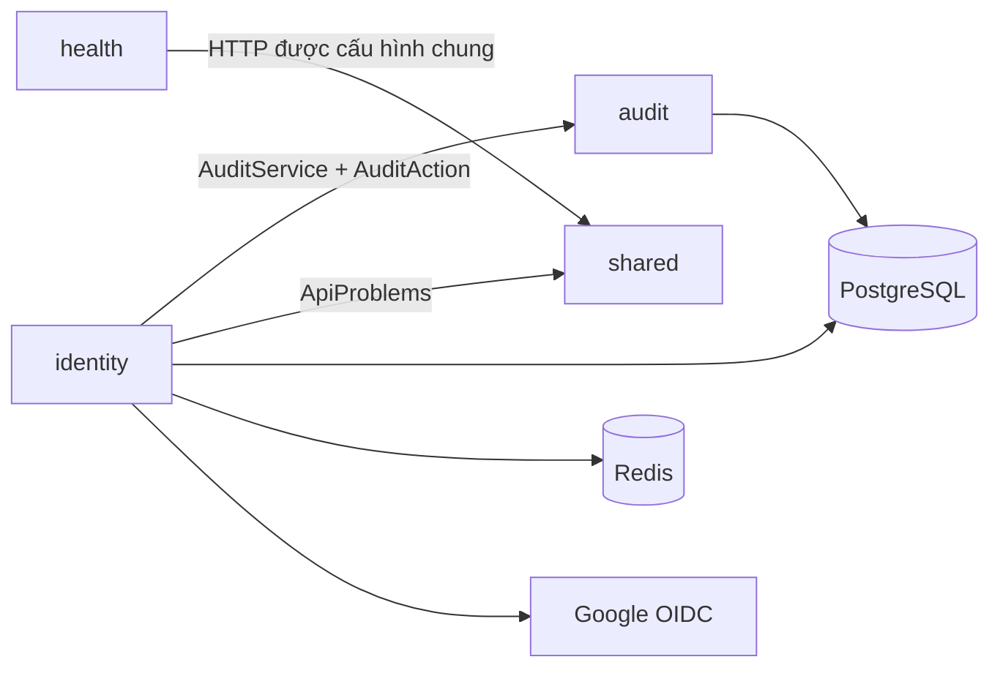

# Cấu trúc package backend

Learnova giữ kiến trúc modular monolith, package theo business capability. Bên trong
module, class được nhóm theo trách nhiệm. Quy ước này áp dụng khi thêm feature hoặc
refactor; không yêu cầu mỗi module có đủ mọi nhóm.

## Cấu trúc hiện tại

```text
com.learnova
├── LearnovaBackendApplication
├── identity
│   ├── controller       AuthController, GoogleController, AuthExceptionHandler
│   ├── dto              AuthDtos
│   ├── service          IdentityService, GoogleAccounts, ParticipantDirectory
│   ├── entity           User, AuthIdentity
│   ├── repository       UserRepository, AuthIdentityRepository
│   ├── security         AccessTokens, RefreshSessions
│   │   └── google       GoogleFlowStore, GoogleAuthorizationRequests
│   ├── config           AuthConfiguration, GoogleOAuthConfiguration
│   └── exception        AuthFailure
├── classroom
│   ├── controller       ClassroomController, ClassroomExceptionHandler
│   ├── dto              ClassroomDtos
│   ├── service          ClassroomService
│   ├── entity           Classroom, ClassroomMembership, ClassroomJoinCode
│   ├── repository       JPA repositories và ClassroomQueries
│   ├── exception        ClassroomFailure
│   └── enums            MembershipStatus
├── question
│   ├── controller       QuestionController, QuestionExceptionHandler
│   ├── dto              QuestionDtos
│   ├── service          QuestionService, QuestionValidation
│   ├── entity           Question và AnswerOption
│   ├── repository       QuestionRepository
│   ├── exception        QuestionFailure
│   └── enums            QuestionType, QuestionStatus, Difficulty
├── audit
│   ├── service          AuditService
│   ├── entity           AuditRecord
│   └── enums            AuditAction
├── health
│   └── controller       HealthController
└── shared
    ├── api              Error handling và pagination dùng chung
    └── config           SecurityConfiguration, TimeConfiguration, WebConfiguration
```

## Chọn nơi đặt class

| Package trong module | Trách nhiệm |
|---|---|
| `controller` | HTTP endpoint, controller advice và chuyển đổi lỗi sang HTTP |
| `dto` | Request/response DTO; giữ nested record nếu đang cùng một contract |
| `service` | Điều phối use case, business rule và transaction |
| `entity` | JPA entity thuộc module |
| `repository` | Truy vấn và persistence của module |
| `security` | Token, session và thành phần xác thực; nhóm provider con khi có nhu cầu |
| `config` | Spring bean và cấu hình kỹ thuật riêng của module |
| `exception` | Exception biểu diễn lỗi của module |
| `enums` | Enum nghiệp vụ độc lập, chẳng hạn `AuditAction` |

- Bắt đầu bằng module sở hữu nghiệp vụ rồi chọn nhóm trách nhiệm; không tạo
  `com.learnova.service` hoặc `com.learnova.repository` chung toàn ứng dụng.
- Chỉ tạo package có code thực tế. Không tạo interface/implementation, mapper hoặc
  abstraction chỉ để đủ cấu trúc. Không gom mọi class vào package gốc module.
- `shared` chỉ chứa hạ tầng ổn định dùng chung, không chứa entity hoặc rule nghiệp vụ.
- Giữ package-private khi đủ dùng; chỉ mở class, constructor, method hoặc nested type
  cần truy cập xuyên package. Dùng accessor tối thiểu thay vì public mutable field.
- Java `public` không đồng nghĩa public API liên module. Module khác gọi service/contract
  có chủ đích; không truy cập repository/entity nội bộ. Hiện `identity` dùng
  `audit.service.AuditService` và `audit.enums.AuditAction` để ghi audit.
- `classroom` dùng contract `identity.service.IdentityService` / `ParticipantDirectory`
  để kiểm tra actor và tìm Participant, cùng audit service để ghi lịch sử. Read projection
  có thể join tên/email từ users qua JDBC mà không expose identity entity/repository.
- Integration test có thể nằm ở package gốc module; test hỗ trợ provider vẫn chỉ ở
  test classpath. Không đổi assertion để thích nghi với lỗi do refactor.

## Quan hệ module hiện tại

F09 bổ sung module `exam` với controller, dto, entity, enums, exception, repository và service.
Module gọi IdentityService, QuestionService.copyActiveForExam, QuestionValidation và AuditService;
không truy cập entity/repository nội bộ của Question Bank. Xem [kiến trúc F09](f09-exam-builder-versioning.md)
cho snapshot JSONB, thứ tự khóa và transaction publish.



Đây là sơ đồ quan hệ module và hạ tầng, không áp đặt layer mới. Các liên kết bên trong
module hiện có được giữ nguyên, gồm OAuth configuration gọi callback của controller
và service sử dụng DTO/flow record. Không thêm facade hoặc đổi luồng xử lý chỉ để
di chuyển package.

## Kiểm tra khi tổ chức lại package

- Cập nhật package, import và tham chiếu tên class đầy đủ trong code/test/cấu hình.
- Giữ nguyên endpoint, JSON, bean name, annotation, transaction, JPA mapping/query,
  Redis key/script, cookie, security policy và business rule.
- Không cần Flyway migration hoặc đổi OpenAPI khi chỉ chuyển Java package.
- Chạy baseline rồi `./mvnw -B clean verify` trong `backend` (Windows:
  `.\mvnw.cmd -B clean verify`) với Java 21 và Docker cho Testcontainers. Clean build
  loại class cũ, giúp phát hiện vấn đề component/entity/repository scanning.
- Review diff để xác nhận chỉ đổi cấu trúc, import, visibility/accessor cần thiết
  và tài liệu; không thêm dependency cho refactor package.


F11 bổ sung module `session` (controller/dto/service/entity/enums/repository/exception/config).
Module gọi contract ExamService, ClassroomService, IdentityService, ParticipantDirectory và AuditService;
JDBC read projections không expose entity nội bộ. `SessionAdmission` là contract transaction cho F13,
không tạo dependency ngược từ Session sang Attempt. Xem [F11](f11-exam-session.md).

F12 bổ sung DiscoveryController/Service/Queries và DTO Participant trong module session.
Read projection join Attempt metadata không tạo service dependency ngược; F13 tiếp tục sở hữu
write flow Attempt. Xem [F12](f12-participant-exam-discovery.md).

F13 bổ sung module `attempt` (controller/dto/service/repository/exception), ghi Attempt
và answer bằng JdbcClient trong transaction. Module dùng contract SessionAdmission,
ExamService.takingQuestions và IdentityService; không truy cập entity/repository module khác.
DTO lấy nội dung PUBLISHED an toàn, không chứa grading metadata. Khóa Session bảo vệ Start;
khóa Attempt bảo vệ save và dành điểm đồng bộ cho finalize F14.
Xem [F13](f13-attempt-autosave.md).
