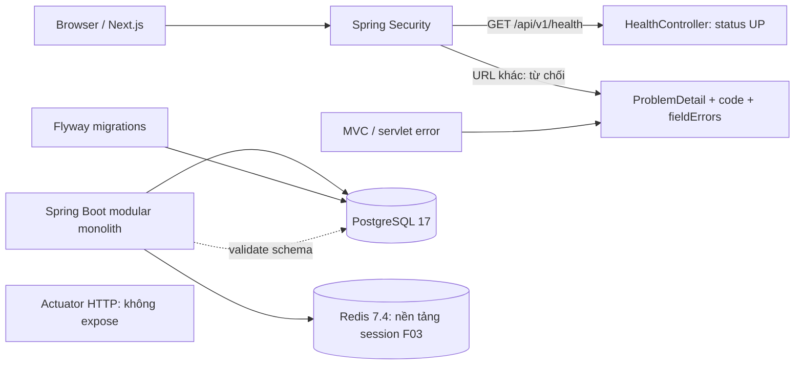
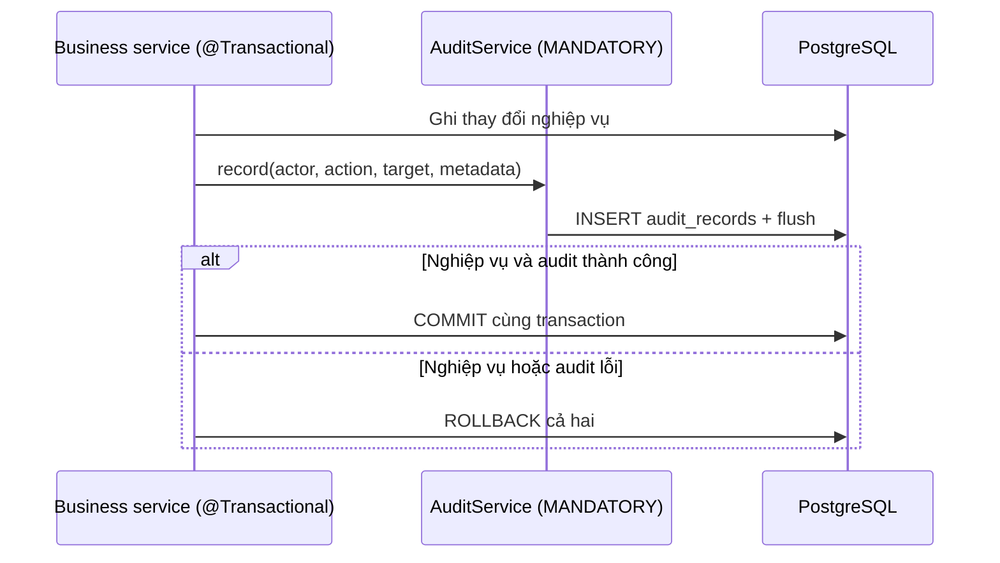

# F01 — Nền tảng backend và môi trường local

## Ranh giới hiện tại

F01 cung cấp health HTTP, lỗi API, pagination, Redis connection và persistence audit.
Không triển khai authentication, Session/Attempt hay giao diện. Workflow UI/UX theo
từng feature giữ nguyên; F02 thiết kế app shell và tạo Master.

Health chỉ xác nhận HTTP liveness. Không tổng hợp database/cache readiness hoặc trả
dependency details. Actuator HTTP/JMX exposure tắt; Security cũng deny `/actuator/**`,
kể cả principal ADMIN. Chưa có form login, HTTP Basic hay generated user.
Session HTTP stateless; CSRF vẫn bật, policy cookie/CORS được triển khai ở F03.
Chỉ ERROR dispatch được đi đến error renderer mà không bị che bởi lỗi authentication.

## API conventions

Nguồn contract: [OpenAPI](../api/openapi.yaml).

- MVC advice, Security entry point/access denied/firewall và servlet `/error` dùng cùng
  `ApiProblems`. Response không đưa query string, exception message, SQL, rejectedValue
  hoặc stack trace ra client. Lỗi bất ngờ chỉ log loại exception, không log payload.
- `detail` là thông báo người dùng; client điều khiển hành vi theo `code`, không parse text.
  `fieldErrors` luôn là danh sách; lỗi validation dùng `{field, message}`.
- Pagination: controller nhận `PageQuery` trực tiếp, không gắn `@ModelAttribute`;
  resolver đọc `page`/`size`, trả 400 nếu rỗng, lặp, sai kiểu hoặc ngoài giới hạn.
  Mặc định `page=0`, `size=20`, size tối đa 100.
- Service dùng `query.toPageable(sort)` với sort cố định hoặc whitelist của endpoint;
  query database trước rồi trả `PageResponse.from(pageOfDtos)`. Không trả Page<Entity>
  hoặc load toàn bộ dữ liệu để phân trang bằng Java. Endpoint tự chọn thứ tự ổn định
  với ID làm tie-breaker khi cần.
- Các URL chưa mở bị Security chặn trước routing, nên anonymous có thể nhận 401
  thay vì 404/405. Test MVC dùng endpoint chỉ có trong test để kiểm chứng lỗi routing.

## Audit và transaction

Module nghiệp vụ gọi `AuditService.record(actorUserId, action, targetType, targetId, metadata)`
trong transaction ghi. Actor lấy từ principal đã xác thực, không từ request body;
`null` dành cho System. Action dùng `AuditAction`; module bổ sung action khi có requirement.
Không gọi từ read-only transaction hoặc sau commit. Không catch rồi bỏ qua lỗi audit.

`audit_records` gồm UUID ID, actor ID nullable (128 ký tự), action/target type (64),
target ID (128), metadata JSONB object và `occurred_at` timestamptz từ server `Clock`.
Actor/target dùng chuỗi để chưa áp đặt loại ID cho các module chưa tồn tại.
Không có foreign key/cascade đến resource; việc archive/lock không xóa audit.
Index theo thời gian, actor, action và target phục vụ truy vấn F19.

Public API chỉ append, entity giữ nội bộ module và không có API sửa/xóa audit.
Đây không phải cơ chế chống sửa dữ liệu bởi database administrator.
Metadata là `Map<String, String>`: caller chỉ chọn giá trị an toàn cần thiết
(ví dụ oldEndTime/newEndTime dạng ISO-8601), không serialize request/entity, secret,
token, password hoặc câu trả lời. Không tự thu thập IP/User-Agent hay audit GET.
Audit UI/query API thuộc F19; không thêm broker hoặc outbox trong F01.

## Schema và kiểm chứng

`V1__create_audit_records.sql` là migration đầu tiên, Hibernate `ddl-auto=validate`.
Không auto-baseline schema có sẵn; cách chạy local và xử lý database cũ xem
[README](../../README.md). Compose/Testcontainers cùng dùng PostgreSQL `17-alpine`
và Redis `7.4-alpine`; đây là pin major/minor, không phải pin digest.

Test API kiểm tra public health, deny Actuator, validation, malformed JSON,
HTTP status/header, fallback error, pagination và không lộ dữ liệu nội bộ.
Integration test chạy migration, validate schema, Redis PING, audit commit/rollback
cùng thay đổi nghiệp vụ, lỗi audit làm rollback và từ chối ghi ngoài transaction.
