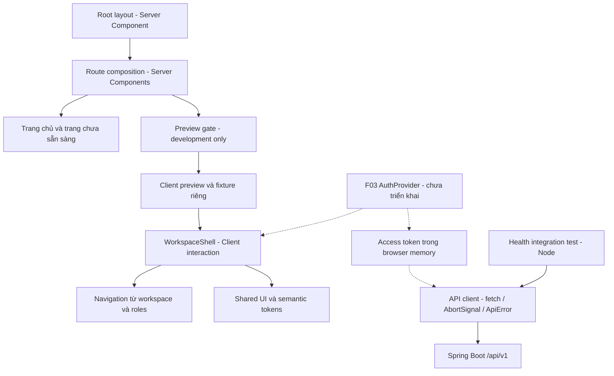

# F02 — Frontend foundation và workspace shell

## Phạm vi

F02 bổ sung design system, reusable workspace shell, trạng thái UI và API transport.
Authentication vẫn thuộc F03. Route nghiệp vụ chưa có API hiển thị “Tính năng đang
được hoàn thiện”, không hiển thị dữ liệu giả hoặc trạng thái rỗng có vẻ đã fetch.

## Tổ chức và interface

- `app` chứa routes, metadata, server composition và error/not-found boundaries.
- `features/workspace` chứa role collection, navigation và shell. Shell nhận workspace,
  roles, user display props, pathname, children và callback switch/logout; không tự fetch user.
- `components/ui` chứa Button, LinkButton, Input, Badge, PageState và Skeleton.
- `lib/api` chứa transport và type bám OpenAPI. Không có token singleton dùng chung server.
- Root layout vẫn là Server Component. Preview import động sau server environment gate;
  production trả 404 trước streaming. Không đặt root loading boundary bao quanh gate này.

Preview: `/dev/workspace-preview?roles=multi&workspace=CREATOR&state=unavailable`.
Tập fixture: participant, creator, multi, admin, all. Workspace/role lạ không cấp quyền;
workspace không được phép hiển thị forbidden và shell của role hợp lệ.
Các state minh họa: unavailable, loading, empty, validation, forbidden, not-found, network, error.
Logout chỉ thoát preview, không gọi logout thật. Các placeholder thật không import fixture.

Navigation bám Screen Flow; chỉ dashboard có link hoạt động trong preview. Mục chưa triển
khai bị disable. Monitoring/Reports chưa có URL độc lập, chờ Session/Reporting.
Sidebar desktop và drawer dùng cùng metadata; ADMIN không kế thừa role nghiệp vụ.

## API client

`createApiClient({ baseUrl, getAccessToken?, fetcher? })` trả `request<T>(path, options)`.
`createBrowserApiClient(getAccessToken?)` đọc `NEXT_PUBLIC_API_URL` (origin, không gồm `/api/v1`).
Request nhận đường dẫn `/api/v1/...`, `json`, `authenticated`, `signal`, headers và options fetch.
Default: bearer từ callback tại thời điểm gọi, credentials include, cache no-store,
redirect error. Request công khai đặt authenticated false và credentials omit nếu cần.
Chặn URL ngoài origin/namespace trước khi gửi credential. Không ghi log payload/token.

JSON response được parse; generic T là type compile-time, không thay thế validation DTO
ở từng feature. Response 204 trả undefined. `ApiError` phân biệt http/network/invalid-response;
ProblemDetail giữ `detail`, `code`, `fieldErrors: FieldError[]` (không làm mất lỗi cùng field).
Message UI map theo code/status bằng tiếng Việt; lỗi HTML/raw exception không được expose.
Abort giữ nguyên cancellation để caller bỏ qua. Chưa có refresh/retry/redirect tự động.

F03 sẽ cung cấp AuthProvider, bootstrap/refresh mutex, retry tối đa một lần, guard và callback
logout thật. Không đổi sang BFF; không lưu access token trong localStorage/sessionStorage.
Backend CORS/CSRF/cookie vẫn triển khai cùng auth ở F03. Health smoke chạy qua Node để kiểm
chứng transport thật, không chứng minh browser cross-origin credentials đã hoạt động.

## Kiểm chứng

- 28 unit test: role isolation, active navigation, bearer mới mỗi request, credentials,
  JSON/204, ProblemDetail, lỗi HTTP/network, response sai định dạng, abort và URL confinement.
- 8 browser test trên Edge: switch, ADMIN isolation, menu Escape/focus, drawer,
  validation, skip link, reduced motion và 375/768/1024/1440px.
- Production test: preview 404, route lạ 404, bảy entry thật không có fixture.
- Health integration: backend local thật trả đúng `{status: "UP"}`.
- Lint, typecheck và production build; review ảnh desktop/mobile và contrast trong Master.

Viewport 640x450 kiểm tra reflow tương đương diện tích CSS khi zoom 200% trên 1280x900;
không tuyên bố đã kiểm tra toàn bộ browser zoom hoặc screen reader. Local dùng Windows,
Node 24 và Edge; CI cấu hình Node 22/Chromium, chưa chạy remote trong phiên triển khai.
Test artifacts nằm trong `frontend/test-results`, bị Git ignore.

## Chạy kiểm tra

Trong frontend: `npm test`, `npm run lint`, `npm run typecheck`, `npm run test:e2e`,
`npm run build`, `npm run test:production`. Browser local mặc định Edge;
CI tải Chromium bằng `npx playwright install --with-deps chromium`.
`npm run test:health` cần backend theo README đang chạy tại NEXT_PUBLIC_API_URL hoặc localhost:8080.
Lệnh health trong Node đọc biến môi trường process; không tự đọc `.env.local`.
