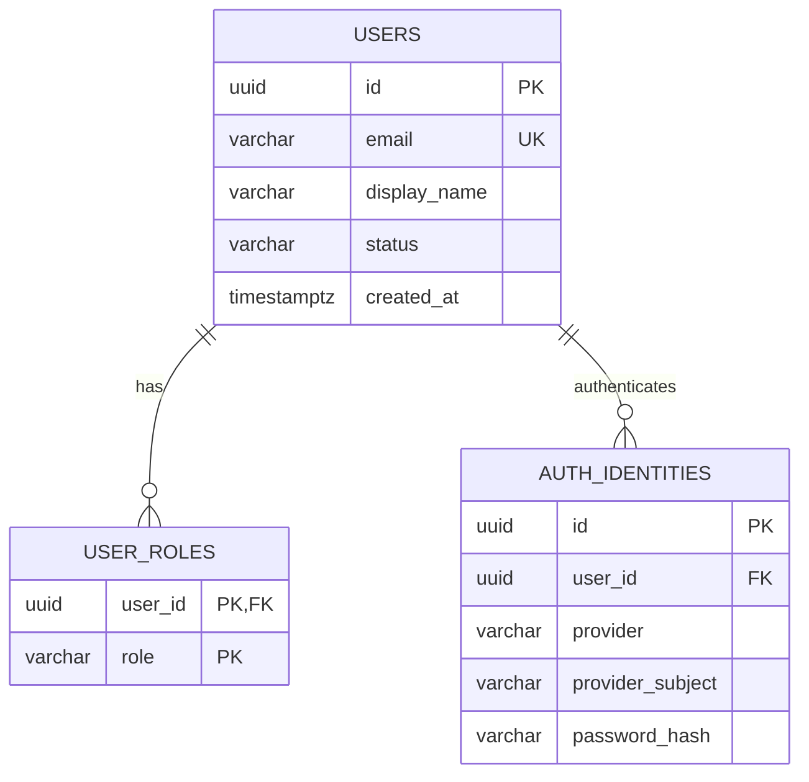
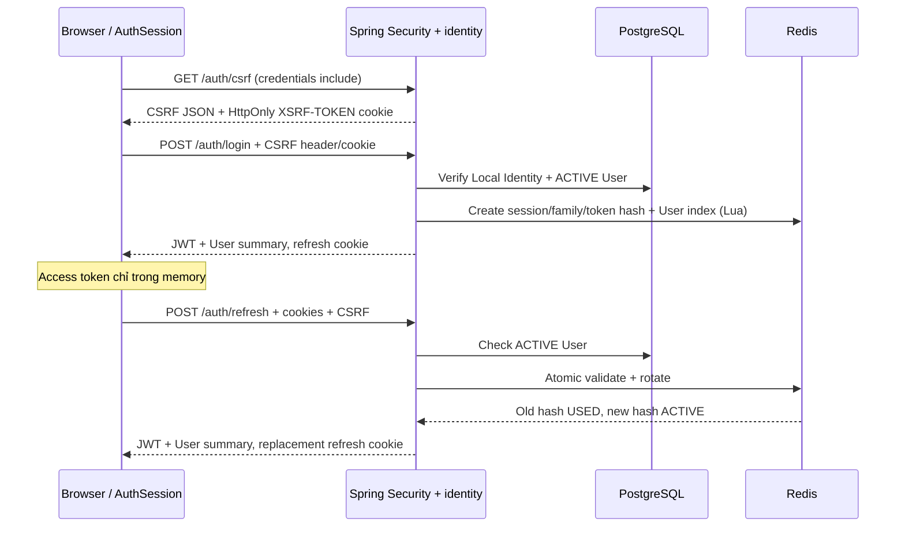
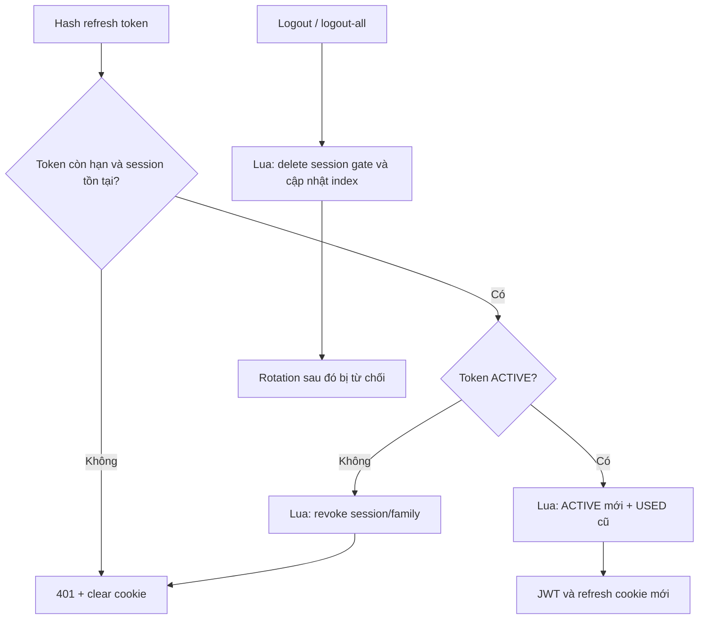

# F03 — Local authentication và multi-role

## Phạm vi và dữ liệu

UC-AUTH-01, 02, 04, 05, 06. F03 cung cấp register, login, refresh, logout,
logout-all, User hiện tại và workspace resolution. Google Login thuộc F04,
profile/password thuộc F05; bootstrap ADMIN thuộc F19.

Migration V2 thêm ba bảng, giữ V1 và audit history. Email strip/lowercase
(`Locale.ROOT`), không bỏ dấu chấm hoặc `+tag`; unique constraint bảo vệ race.
Transaction đăng ký bao gồm User, roles và Local Identity. Roles là danh sách
1–2 phần tử không trùng PARTICIPANT/CREATOR; reject ADMIN. ADMIN không suy ra role khác.
AuthIdentity có unique `(provider, provider_subject)` và `(user_id, provider)`.

Mật khẩu 12–128 Unicode code point, giữ nguyên Unicode/khoảng trắng, không ép composition.
PBKDF2-HMAC-SHA256: random salt 16 byte, 600.000 vòng, hash 256 bit, encoder prefix
`{pbkdf2-sha256-600k}`. Login dùng dummy hash khi không có Local Identity;
chỉ trả locked/disabled sau khi password đúng. DTO không expose hash.

## Login và rotation

JWT HS256 chứa issuer, audience `learnova-api`, subject UUID, roles, sid, iat và exp.
TTL 900 giây, clock skew bằng 0. Secret base64 tối thiểu 32 random bytes từ môi trường;
thiếu/sai cấu hình làm startup thất bại. Clocks máy chủ cần đồng bộ. Spring Security
chuyển roles thành `ROLE_*` authorities. GET `/auth/me` đọc roles/status hiện tại từ DB.
Endpoint chưa khai báo vẫn deny; feature sau phải thêm policy riêng khi mở endpoint.

Refresh token là 32 random bytes base64url. Redis key chứa SHA-256, giá trị chỉ có
userId, sessionId, familyId, createdAt, expiresAt, status. Một login tạo một session/family.
Deadline cố định 7 ngày từ login, rotation không gia hạn; USED tokens giữ tới cùng deadline.

Lookup không cấp quyền rotate: Lua revalidate expiry/status/session trước khi ghi.
Hai request cùng token: một rotate thành công, request còn lại revoke family kể cả token
vừa sinh. Không có grace window hoặc lưu lại raw token. Logout với USED token vẫn revoke
session hiện tại. Logout-all dùng sorted-set index User, không quét toàn Redis.
Các operation atomic trên Redis standalone; chưa hỗ trợ Redis Cluster.

Logout/reuse không blacklist JWT: access token đã cấp còn hiệu lực đến expiry tối đa
15 phút. Use case cần state hiện tại phải kiểm tra backend; lock/revoke account thuộc F19.
Redis/database unavailable trả 503, không cấp token hoặc khẳng định logout thành công.
Timeout có thể có kết quả server không xác định; session client không nhận được tự hết hạn.
Mất response refresh sau rotate có thể yêu cầu login lại theo strict reuse policy.

## Cookie, CSRF và CORS

- Production frontend/API cùng site, HTTPS, CORS allowlist chính xác với credentials.
  Local dùng localhost khác port; không trộn localhost/127.0.0.1.
- `learnova_refresh`: host-only, HttpOnly, Secure production, SameSite=Lax,
  Path=/api/v1/auth. Max-Age là phần còn lại của session; xóa cùng thuộc tính/path.
- `XSRF-TOKEN`: host-only HttpOnly, SameSite=Lax, Secure theo cấu hình. GET `/auth/csrf`
  trả masked token và header `X-XSRF-TOKEN`; frontend không đọc cookie API origin.
- POST auth cần CSRF cookie/header thật. Không tạo JSESSIONID. Unsafe methods khác vẫn
  dùng Spring CSRF mặc định; API bearer-only tương lai cần policy explicit khi được mở.
- Auth responses no-store. Không bật body/token tracing hoặc Hibernate constraint-value
  logging. Password/token DTO `toString()` được che. Test secret không vào application JAR.

Contract: [OpenAPI](../api/openapi.yaml).

## Frontend và UX

Root layout là Server Component; Client AuthProvider chứa AuthSession và memory token.
Bootstrap CSRF → refresh → User summary. Protected UI chờ bootstrap; lỗi mạng/503 có retry.
Invalid/reused token hoặc account inactive chuyển unauthenticated.

API client dùng shared refresh Promise, retry 401 tối đa một lần, không refresh 403 hoặc
login/register. Request abort không replay. Session generation chặn response/retry cũ
sau logout/đổi tài khoản. Token không nằm trong browser storage hoặc URL.

Web Locks tuần tự hóa auth operations thay cookie trên cùng frontend origin;
BroadcastChannel đồng bộ logout/đổi tài khoản, không truyền token. Browser thiếu Web Locks
chỉ có mutex từng tab; concurrent refresh giữa tabs có thể yêu cầu login lại. Không thay
strict reuse policy. Không hỗ trợ nhiều frontend origin cùng điều khiển một cookie session.

Register thành công về `/login?registered=1`. Một role vào workspace tương ứng;
nhiều role dùng preference hợp lệ hoặc `/workspaces`. Preference lưu tại
`learnova.workspace.<userId>`, luôn đối chiếu roles hiện tại. `returnTo` chỉ chấp nhận
route nội bộ có quyền, từ chối dot segments/encoded traversal/URL ngoài. Guard frontend
phục vụ UX, không cấp quyền backend. Mục nghiệp vụ chưa triển khai giữ “Sắp có”.

Logout-all có dialog xác nhận, Escape trả focus về menu trigger. Khi lỗi logout,
memory được xóa nhưng UI ghi rõ chưa xác nhận thu hồi server; retry giữ đúng thao tác.
F05 sẽ tái sử dụng logout-all tại Security. UI dùng Master F02, không thêm theme/dependency.

## Kiểm thử và vận hành

- Backend verify dùng Testcontainers PostgreSQL 17/Redis 7.4. Auth tests dùng CSRF
  cookie/header thật; không dùng helper làm thay repository CSRF.
- Unit frontend kiểm tra refresh sharing, generation, cancellation, preference và redirect.
- `npm run test:auth`: Spring Boot test-run + Testcontainers riêng tại 8081,
  Next dev tại 3104; Edge local, Chromium CI. Không cần `.env` hoặc dữ liệu production.
- Browser auth không mock fallback, không ghi trace chứa token/password. Chỉ screenshot
  form rỗng trong test-results (Git ignored). CI chạy auth integration cùng F02 checks.
- Production cần secret riêng, Secure cookie, allowlist HTTPS, Redis được bảo vệ và clocks đồng bộ.
  Google/password reset/email verification/rate limiting chưa triển khai trong F03.
  Không coi test pass là chứng nhận production-ready.

### Kết quả kiểm chứng local ngày 28/09/2026

- `mvnw.cmd -B verify`: 43 test pass, không fail/error/skip; PostgreSQL 17 và Redis 7.4 thật.
  Bao gồm 10 auth integration tests: duplicate email race, password Unicode, reject ADMIN,
  CSRF/CORS thật, refresh reuse/race, logout-all, logout-vs-refresh, expiry và Redis unavailable.
- Frontend lint, `tsc --noEmit`, build thành công; `npm test`: 44 test pass.
- `npm run test:auth`: 9 test pass; `npm run test:e2e`: 8 test pass;
  `npm run test:production`: 1 test pass; `npm run test:health`: 1 test pass.
- Browser Edge/Windows kiểm tra API thật, hai tab reload đồng thời, hai browser context,
  logout khi offline và retry, keyboard/focus, reduced motion, viewport 375/768/1024/1440px
  và 640x450px. Đã review ảnh form mobile. Không xác nhận mọi screen reader/browser zoom.
- OpenAPI parse thành công: 8 paths, 43 internal references resolve được; diff không có whitespace error.
- Local Java 21/Node 24; CI cấu hình Java 21/Node 22/Chromium/Linux, chưa xác nhận CI remote
  tại thời điểm ghi kết quả này. Chưa kiểm thử deployment HTTPS/cookie Secure thực tế.
