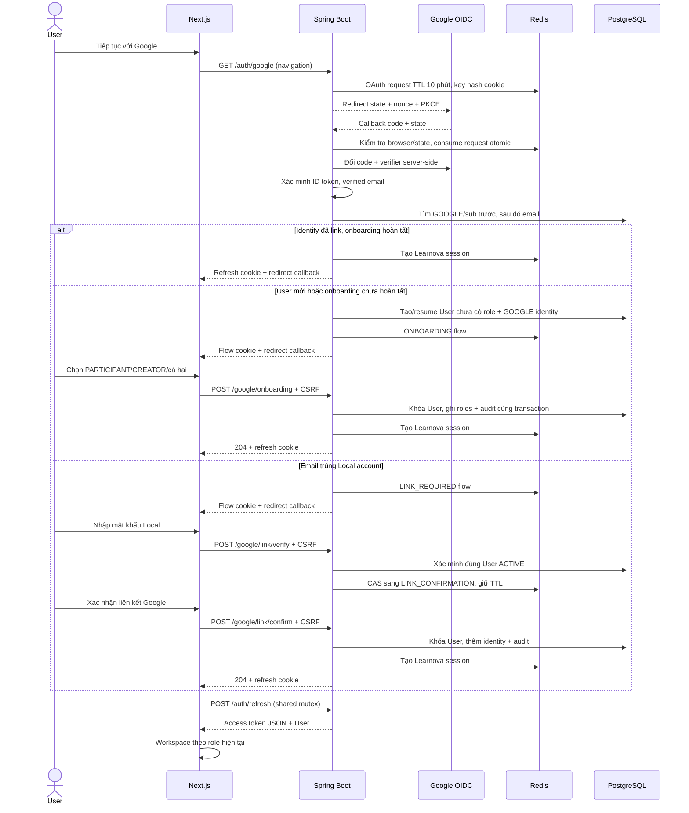

# F04 — Google Login, onboarding và liên kết tài khoản

## Phạm vi và cấu hình

UC-AUTH-03 mở rộng identity module của F03. Google OIDC chỉ xác minh danh tính;
Learnova tiếp tục dùng JWT 15 phút trong memory và opaque refresh cookie 7 ngày.
Spring Security OAuth2 Client xử lý authorization code, PKCE S256, state, nonce,
ID token signature/issuer/audience/expiry. Backend yêu cầu `email_verified=true`.
Google identity dùng `sub`, không dùng email làm provider subject.

`GOOGLE_AUTH_ENABLED=false` mặc định; Local Login vẫn hoạt động. Bật cần client ID,
client secret, redirect URI backend chính xác và frontend origin cố định. Scope chỉ
`openid email profile`; không yêu cầu offline access hoặc lưu Google token lâu dài.
Token exchange giới hạn connect/read timeout mỗi loại 5 giây.

## Luồng xác thực

## Trạng thái, concurrency và phục hồi

- Migration V3 thêm `onboarding_completed`, mặc định true cho User cũ/Local.
  Google User mới có giá trị false và roles rỗng. Không cấp session trước khi hoàn tất;
  `activeUser` cũng từ chối `/me` hoặc refresh của User chưa onboarding.
- Unique email, `(provider, provider_subject)` và `(user_id, provider)` đã có từ V2.
  Callback tạo trùng được đọc lại trong transaction mới. Link không chuyển identity
  giữa User; V1 mỗi User chỉ có một Google identity.
- Google email thay đổi không cập nhật email Learnova của identity đã link.
  Google subject khác nhưng trùng email của Google-only User bị từ chối.
- Flow Redis TTL 10 phút; cookie `learnova_google_flow` HttpOnly, host-only,
  SameSite=Lax, Path `/api/v1/auth/google`, Secure theo môi trường. Redis key là hash
  cookie; pending data không chứa mật khẩu/Google token. OAuth request tạm có nonce
  và PKCE verifier cần để xác minh callback; xóa khi tiêu thụ hoặc hết TTL.
- Bắt đầu OAuth mới hủy flow tạm cũ của browser. Pending cookie không cấp quyền
  nghiệp vụ. API flow chỉ trả state/email; mọi ID và subject lấy từ server.
- Verify tối đa 5 lần mỗi flow, giữ deadline cũ. Confirm và onboarding consume flow
  atomic trước ghi DB, sau đó khóa User; role đã hoàn tất không bị request cũ ghi đè.
- Audit link/onboarding cùng transaction. Account ACTIVE được kiểm tra lại trước
  cấp session; unique conflict, account locked và Redis unavailable không báo thành công.
- Nếu mất response, frontend tải lại trạng thái, sau đó refresh nếu flow đã kết thúc.
  Nếu flow mất mà session chưa được cấp, bắt đầu Google Login lại; DB đã commit vẫn
  giữ identity/roles và lần đăng nhập sau tiếp tục đúng User. Hủy không xóa User/identity.
- Frontend dùng cơ chế refresh Promise/Web Locks/BroadcastChannel của F03. Cookie
  mutation và refresh sau onboarding/link nằm cùng khóa; response cũ không được
  ghi đè session generation mới. Callback không đọc token từ URL.

## UI, bảo mật và kiểm thử

Các route frontend: `/auth/google/callback`, `/onboarding/roles`, `/auth/link-account`.
Callback lỗi chỉ nhận code an toàn; không hiển thị nguyên lỗi provider. Redirect chỉ
tới origin/route đã cấu hình, không nhận URL tùy ý từ browser. GET flow và response
auth không cache; các POST vẫn yêu cầu CSRF. Backend là authority cho flow và roles.

UI kế thừa Master: theme sáng, semantic tokens, input/label/error, focus vào lỗi hoặc
heading khi đổi bước, loading, cancel, retry, responsive và reduced motion. Đã tra cứu
UI/UX Pro Max về form error/focus, Next.js Client boundary và Tailwind responsive layout.
Không cần override riêng hoặc thư viện frontend mới.

`FakeGoogleProvider` chỉ có trong `src/test`; ký ID token RSA và kiểm tra PKCE khi đổi code.
Integration tests chạy với PostgreSQL 17/Redis 7.4 thật. Browser suite `npm run test:google`
khởi động backend test launcher + provider + Next.js riêng; không dùng mock fallback
trong production. Test launcher tắt DevTools restart để không tạo provider hai lần.
CI chạy bộ test này nhưng agent không tự push để kích hoạt CI.

Nghiệm thu Google thật/HTTPS cần OAuth client cấu hình thực tế và thao tác tài khoản
Google. Các test provider local không thay thế bước kiểm chứng đó. Kết quả chạy được
ghi trong checklist F04 của kế hoạch V1.
