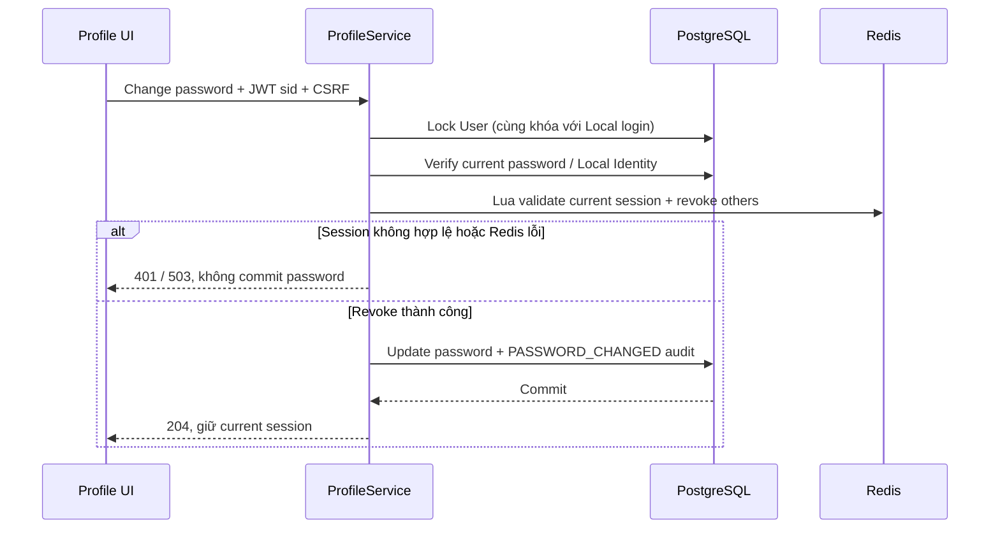

# F05 — Profile và bảo mật tài khoản

## API và dữ liệu

`GET/PUT /api/v1/auth/profile` đọc/sửa hồ sơ User từ JWT subject. Chỉ cho cập nhật
`displayName`, `avatarUrl`; DTO từ chối field lạ. User phải ACTIVE và hoàn tất onboarding,
áp dụng cho PARTICIPANT, CREATOR, ADMIN. `hasLocalIdentity` chỉ biểu đạt khả năng đổi mật khẩu.
Migration V4 thêm `users.avatar_url` nullable; giữ nguyên identity, role và credentials cũ.

`POST /api/v1/auth/change-password` xác minh Local Identity và password hiện tại. Password mới
giữ chính sách F03: 12–128 Unicode code point, không trim, PBKDF2 theo encoder hiện có.
JWT `sid` phải là session còn hoạt động của User. Endpoint không đổi refresh cookie.
Các mutation auth cần CSRF cookie/header kể cả khi có bearer; cấu hình CsrfFilter tường minh
để không áp dụng exemption bearer mặc định của Spring Resource Server.

## Transaction và cạnh tranh

Local login giữ khóa User từ trước verify đến sau tạo refresh session; không thể dùng hash
cũ tạo session sống sót sau một lần đổi mật khẩu đồng thời. Lua kiểm tra membership, expiry
và session key trong cùng operation revoke; refresh/logout race không khôi phục session mất.
Giữ expiry ban đầu, không gia hạn session. JWT đã cấp còn hiệu lực tối đa 15 phút.

PostgreSQL và Redis không có distributed transaction. Lỗi Redis ngăn commit password/audit,
nhưng timeout có thể đã thực thi revoke. Nếu DB rollback sau revoke, password cũ vẫn dùng được
và các phiên khác có thể phải đăng nhập lại. Không khôi phục session đã revoke. Audit không
chứa password/hash/token. Không retry command tự động khi chưa xác định kết quả.

## Frontend và UX

Route `/profile` giữ Server Component wrapper; phần tương tác ở feature client, dùng auth
in-memory và API client hiện có. Mutation refresh trước trong cùng khóa cookie, gửi CSRF,
chỉ cập nhật auth summary từ response thành công; generation check ngăn response cũ khôi phục
user sau logout. Không có mock fallback. Logout-all dùng hộp thoại chung của workspace.

Profile gồm thông tin cá nhân, roles, security; Google-only không có form đổi password.
Input có label/hint/inline error, error summary có focus, busy và success state rõ ràng.
Avatar HTTPS tải trực tiếp tại browser với no-referrer; ảnh lỗi dùng chữ cái tên, không dùng
server image optimizer. Không upload ảnh, không thêm dependency hay design override mới.

Đã tra cứu UI/UX Pro Max: `form error feedback` (ux), `client components` (nextjs),
`responsive layout` (html-tailwind); áp dụng phản hồi form, client boundary và responsive
gutter theo Master. Query `responsive form` không có kết quả, đã đổi sang query layout.

## Kiểm chứng

Backend integration bao phủ ownership/mass assignment, JWT/CSRF thật, trạng thái tài khoản,
Local/Google-only/linked identity, password Unicode, session revoke, race, Redis outage,
rollback và nâng schema V3→V4. Frontend unit kiểm tra server-confirmed profile và không replay
password command; E2E dùng backend thật cho profile/password/logout-all và Google test provider.
Kết quả chạy và giới hạn được ghi tại checklist F05 trong kế hoạch V1.
