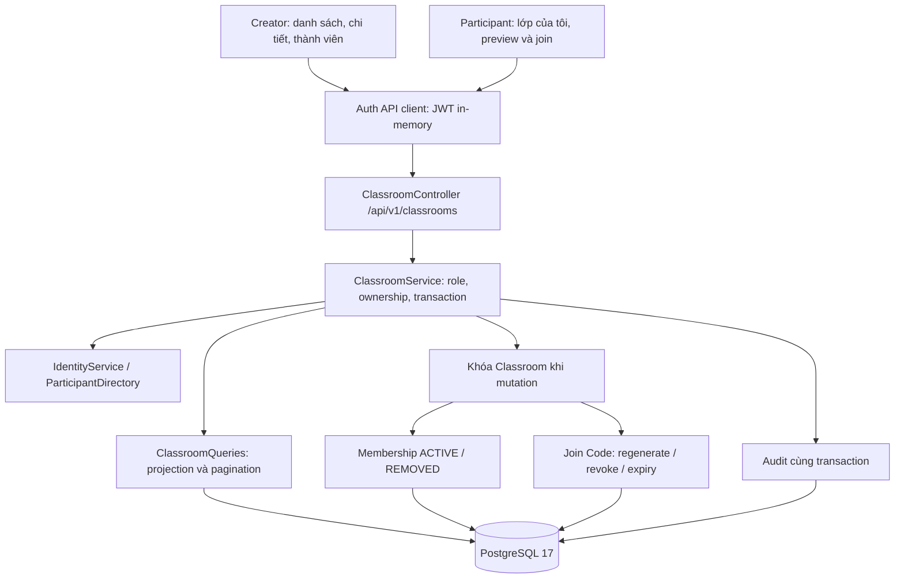

# F06 — Classroom và membership

## Phạm vi và luồng dữ liệu

Triển khai UC-CLASS-01..11 trên nền authentication F03–F05. Creator quản lý lớp
thuộc sở hữu của mình; Participant xem lớp đang tham gia, xem trước thông tin qua mã,
xác nhận tham gia và rời lớp. Một user có thể dùng cả hai workspace.

Không bổ sung dependency, broker hoặc Redis state riêng cho Classroom. Redis tiếp tục
phục vụ authentication. HTTP contract đầy đủ nằm trong [OpenAPI](../api/openapi.yaml).

## API và quyền truy cập

Các endpoint dưới `/api/v1/classrooms` yêu cầu bearer token, tài khoản ACTIVE,
onboarding hoàn tất và role hiện tại trong database. Cookie refresh không tự cấp quyền
gọi API nghiệp vụ; ADMIN không thay thế CREATOR/PARTICIPANT.
Classroom không yêu cầu CSRF header vì chỉ xác thực bằng bearer; endpoint auth dùng
cookie tiếp tục giữ CSRF protection. Không mở cookie authentication cho Classroom.

| Nhóm | Endpoint tương đối | Quyền |
|---|---|---|
| Danh sách/tạo lớp | `GET`, `POST /` | CREATOR; danh sách chỉ lớp sở hữu |
| Chi tiết/cập nhật | `GET`, `PUT /{id}` | CREATOR owner |
| Tìm Participant | `GET /{id}/participants/lookup?email=...` | CREATOR owner; email đầy đủ |
| Thành viên | `GET`, `POST /{id}/members` | CREATOR owner; POST nhận userId |
| Remove | `DELETE /{id}/members/{userId}` | CREATOR owner |
| Mã tham gia | `POST`, `DELETE /{id}/join-code` | CREATOR owner |
| Xem trước/tham gia | `POST /join-preview`, `POST /join` | PARTICIPANT |
| Lớp đang tham gia | `GET /joined` | PARTICIPANT; membership ACTIVE |
| Rời lớp | `POST /{id}/leave` | PARTICIPANT; membership của chính mình |

Lớp không tồn tại hoặc thuộc Creator khác trả cùng lỗi 404 `CLASSROOM_NOT_FOUND`.
Lookup không tìm gần đúng email và không trả tài khoản locked, chưa onboarding hoặc
không có role PARTICIPANT. Khi thêm bằng userId, backend kiểm tra lại điều kiện này.
Preview chỉ trả tên/mô tả lớp, tên Creator và trạng thái membership của người gọi;
không trả roster, email thành viên hoặc mã của lớp.

Request DTO từ chối field ngoài contract. Name tối đa 200 ký tự, description tối đa
2.000 ký tự. Danh sách dùng pagination chung; search escape `%`, `_`, `!` để ký tự
người dùng nhập không mở rộng thành wildcard SQL. Lỗi theo ProblemDetail chung,
có stable code và fieldErrors cho validation.

## Dữ liệu, concurrency và lịch sử

Migration V5 thêm `classrooms`, `classroom_memberships`, `classroom_join_codes`.
Foreign key liên kết users/classrooms; unique `(classroom_id, user_id)` ngăn membership
trùng. Không cascade delete lịch sử. Mỗi lớp có một bản ghi mã hiện tại, code unique.

Mọi mutation membership/mã khóa bản ghi Classroom bằng pessimistic lock trong
transaction. Join đọc classroomId từ mã, chờ khóa, rồi đọc và validate lại mã hiện tại.
Vì vậy mã bị regenerate/revoke trong lúc chờ không thể dùng để join. Trường hợp join
đã giữ khóa trước thì join hoàn tất trước thao tác đổi/thu hồi mã.

Join/add lặp khi ACTIVE trả membership hiện tại. Remove/leave chuyển REMOVED, retry
không tạo thêm transition. Rejoin/reactivate giữ nguyên membership id và joinedAt
ban đầu; updatedAt phản ánh thay đổi. Audit chỉ ghi transition thực tế, ngoại trừ
command cập nhật thông tin lớp ghi nhận mỗi lần thực hiện; audit rollback cùng dữ liệu.

Mã gồm 16 ký tự do SecureRandom sinh từ alphabet bỏ các ký tự dễ nhầm; hiệu lực
7 ngày theo backend Clock. `now >= expiresAt` là hết hạn. Regenerate thay mã và hạn dùng;
revoke vô hiệu ngay. Chỉ owner nhận mã khi còn ACTIVE; không ghi mã vào audit/log.
Timestamp là Instant/timestamptz, chuẩn hóa microsecond theo độ chính xác PostgreSQL.

F13 phải kiểm thử liên module: remove/leave không chặn hoàn tất Attempt đã bắt đầu,
nhưng không cho bắt đầu Attempt mới dựa trên membership đã REMOVED. F06 chưa có
Attempt/Result để chứng minh invariant này end-to-end. Session trong lớp thuộc F11–F12;
notification CLASS_JOINED thuộc F18, không gửi thông báo giả trong F06.

## Frontend và UX

Route Creator: `/creator/classes`, `/creator/classes/new`, `/creator/classes/[classId]`.
Route Participant: `/participant/classes`, `/participant/classes/join`.
Page giữ composition server; feature component dùng client cho authenticated request
và interaction, tái sử dụng auth/API client F03. Không có mock fallback.

Danh sách Creator tìm theo tên; thành viên tìm tên/email, lọc ACTIVE/REMOVED/tất cả.
Thêm Participant qua dialog tìm email rồi xác nhận userId; sửa lớp inline. Participant
xem chi tiết bằng dialog. Preview không ghi dữ liệu; đổi mã nhập xóa preview cũ;
join thất bại xóa preview, không hiển thị thành công. Đã ACTIVE hiển thị link về lớp.

Query hủy request khi không còn liên quan, tránh response cũ ghi đè filter/route mới.
Mutation thành công refetch dữ liệu server. Remove/leave phần tử cuối của trang lùi
về trang trước. Có loading, empty, forbidden, not-found, lỗi mạng và retry.

Thiết kế kế thừa [Master](../../design-system/learnova/MASTER.md), không cần override.
Đã tra cứu UI/UX Pro Max theo keyboard/focus modal, Next.js client/server boundary
và Tailwind responsive layout. Dùng semantic token, native dialog trap focus/Escape,
return focus, label/error liên kết input và wrapping nội dung dài. Confirmation nêu
tác động remove/leave hoặc thay mã. Không áp dụng gợi ý native pt/dp cho web.

## Kiểm chứng

Kết quả và giới hạn kiểm chứng cuối cùng ghi tại
[checklist F06](../plans/v1-feature-implementation-plan.md#f06--classroom-và-membership).
Chạy backend `mvnw.cmd -B verify`; frontend lint, typecheck, unit, build,
`test:classroom` cùng regression auth/Google/workspace/production. Browser suite dùng
PostgreSQL/Redis/backend thật, không mock API nghiệp vụ. CI đã thêm suite Classroom;
không suy ra CI remote pass từ kết quả local.

### Regression reload hai tab

CI đã phát hiện test Participant đôi lúc về Login sau reload; lặp bản test cũ local
5 lần tái hiện 1 lần cùng lỗi. Test cũ reload ngay sau `goto`, trước khi tab mới hoàn tất
bootstrap. Việc ngắt refresh ban đầu là giả thuyết gây mất phiên; snapshot Login không
đủ chứng minh HTTP refresh nào thất bại.

Test hiện chờ URL danh sách và heading lớp trên cả hai tab trước khi reload đồng thời,
sau đó kiểm tra lại cả URL và heading của từng tab. Không tăng timeout, thêm sleep/retry
hoặc thay rotation/reuse detection để làm test pass. Khi Classroom test fail, fixture
ghi diagnostics refresh gồm path cố định, HTTP status, code lỗi và trạng thái request
thất bại; không ghi token, cookie, header hoặc body thành công. Diagnostics xuất vào
console CI và attachment Playwright, không cần bật trace chứa credential.

Phép thử này xác minh reload hai tab đã bootstrap xong. Reload giữa một request refresh
đang chạy là tình huống reliability riêng, chưa được bản sửa test này chứng minh đã xử lý.

### Bootstrap trước khi tạo lớp

CI sau bản sửa reload tiếp tục báo `REFRESH_REUSED`, lần này ở hai scenario gọi
`login()` rồi `create()` ngay lập tức. Helper login chỉ đợi `goto` tải document,
chưa đợi bootstrap trước khi helper create điều hướng tiếp. Scenario Creator có chờ
danh sách rỗng ở giữa nên không gặp cùng lỗi trong báo cáo CI. `INVALID_REFRESH_TOKEN`
ở bootstrap trước đăng nhập có thể là bình thường; cần xem thứ tự request để phân biệt.

Helper login hiện nhận heading đích mong đợi, chờ cả URL và heading trước khi trả về;
case forbidden/not-found chờ đúng trạng thái đó. Helper create đợi chi tiết lớp hiển thị
sau khi tạo. Diagnostics bổ sung thứ tự request/navigation, tab và giai đoạn; theo dõi
CSRF/login/refresh nhưng chỉ xuất pathname, status và code lỗi, không query/credential.

Regression giữ request refresh của trang đích rồi chuyển tiếp đến backend thật, kiểm tra
test chưa sang bước create trước khi bootstrap hoàn tất. Đối chứng tạm bỏ bước chờ mới
khiến regression fail do đã rời trạng thái loading trước khi gate được thả; khôi phục
bước chờ khiến regression pass. Không mock token/cookie hoặc thay authentication policy.
Kết quả này xác nhận lỗi đồng bộ helper; chưa chứng minh xử lý được mọi trường hợp người
dùng thực tế điều hướng trong lúc server đang rotate refresh token.

Kiểm chứng lại ngày 01/10/2026 trên Windows/Edge: lint, typecheck, 52 unit test,
6 Classroom test và 11 auth/profile browser test đều pass. Regression bootstrap và
scenario reload hai tab lặp 5 lần mỗi scenario đạt 10/10, không retry. Các browser test
dùng backend/PostgreSQL/Redis thật. Không chạy lại backend verify hoặc production build
cho thay đổi chỉ ở test/tài liệu; CI Linux/Chromium chưa được kiểm chứng remote.
