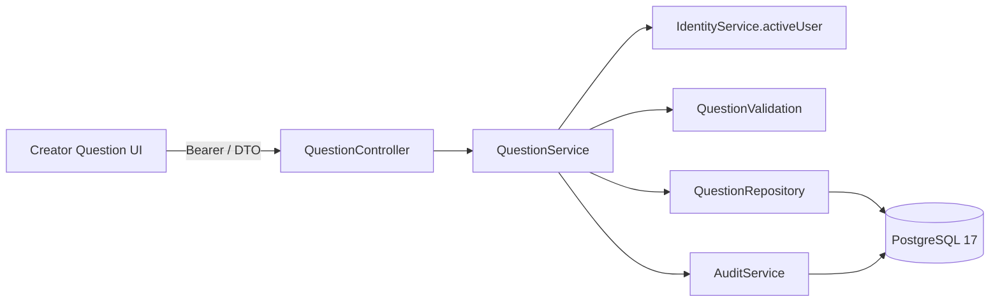
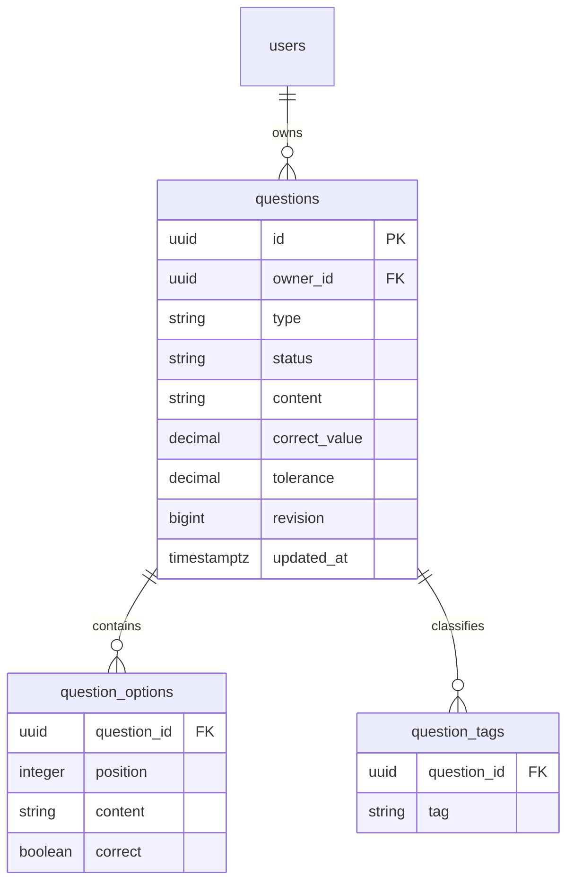
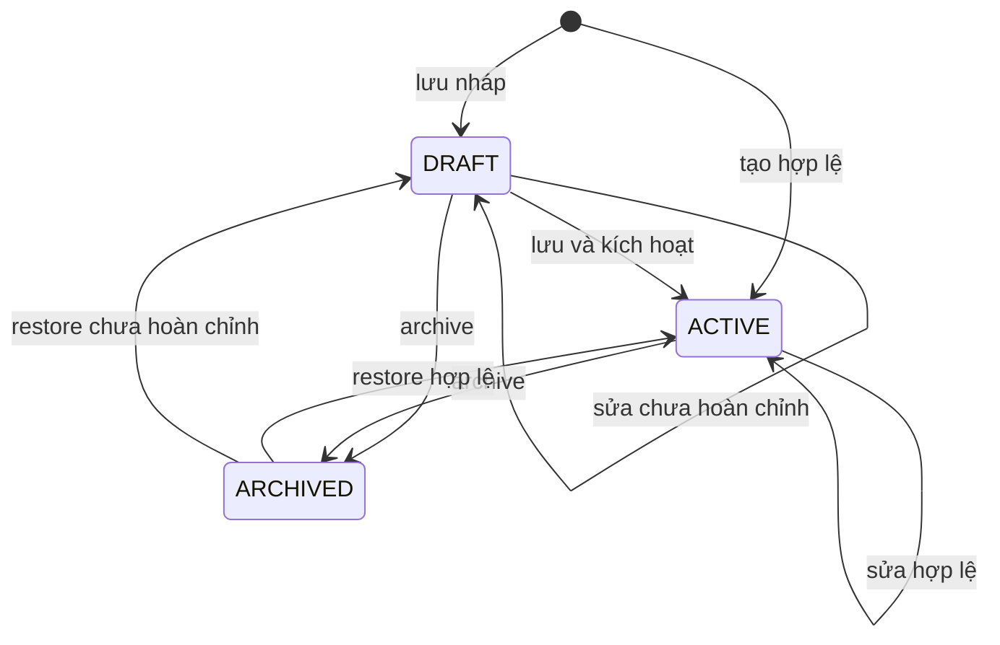

# F07 — Question Bank

Triển khai UC-QB-01..07 cho Creator, plain text, bốn loại câu hỏi. Import Excel thuộc F08;
snapshot/ExamVersion thuộc F09, không tạo quan hệ live làm thay đổi lịch sử đề.

## Luồng và ranh giới

Module question theo package-by-feature, nhóm controller/dto/service/entity/repository/enums/exception.
Không expose JPA entity. Tài khoản phải ACTIVE, hoàn tất onboarding và có CREATOR hiện tại;
không tin riêng role trong JWT. Owner lấy từ principal, mọi lookup có owner predicate.
404 cho resource không tồn tại hoặc của người khác; ADMIN không tự có business role.

API chỉ dùng bearer nên không yêu cầu CSRF; auth cookie API giữ nguyên CSRF protection.
List chỉ trả preview/metadata, không đáp án. Detail chỉ dành owner. DTO này không dùng
cho Participant/Attempt ở feature sau.

## Dữ liệu và concurrency

Flyway V6, Hibernate validate. FK bảo vệ owner và question; enum/check, tolerance >= 0,
option position 0–19, unique tag theo question; không endpoint hard delete.
Update/archive/restore khóa pessimistic row theo owner rồi kiểm tra revision. Chỉ một
request cùng revision được thay đổi dữ liệu; stale request trả 409. Audit cùng transaction,
chỉ ghi status/revision, không content/đáp án. Timestamp lấy Clock server.

Numeric là BigDecimal / numeric(30,10), JSON string; không dùng float để serialize/parse
trong frontend. Từ chối phần nguyên >20 chữ số, phần thập phân >10 và notation mũ;
không làm tròn input. Khi không nhập tolerance, lưu 0.
Form gửi `null` khi người dùng xóa trắng ô sai số để backend áp dụng mặc định này.

## Lifecycle và validation

Quyết định người dùng ngày 01/10/2026: nháp linh hoạt và restore fallback về DRAFT;
category text tùy chọn, tags/topic cùng danh sách nhãn, difficulty tùy chọn EASY/MEDIUM/HARD.
Validation cấu trúc/giới hạn chạy cả DRAFT; validation đủ đáp án chỉ khi ACTIVE. Restore
dùng cùng validator. ACTIVE không hạ về DRAFT; ARCHIVED không sửa trực tiếp.

## Giao diện và kiểm chứng

Routes list/new/detail/edit dưới `/creator/questions`, static composition ở Server Components;
auth interaction ở Client Components, `useSearchParams` nằm trong Suspense theo docs Next local.
Dùng Master F02; đã tra UI/UX Pro Max cho form validation, Next client/server và Tailwind
responsive layout. Không cần override design system hoặc dependency mới.

Filter URL gồm keyword/type/difficulty/category/tag/status/page; backend filter trước pagination,
default size 20, max 100; default bỏ ARCHIVED, sort updatedAt DESC/id DESC. Keyword escape
wildcard SQL. Category không phân biệt hoa/thường; tag exact có phân biệt hoa/thường.

Form giữ input khi lỗi, error summary liên kết field, archive modal quản lý focus/Escape,
trạng thái thành công sau server xác nhận. Chỉ nội dung đã lưu được phục hồi khi reload;
không lưu câu hỏi/token trong localStorage/sessionStorage. Conflict cho xem bản mới ở tab khác.

Backend integration kiểm tra bốn loại, numeric precision, lifecycle, role/ownership, filter,
concurrency, audit rollback và migration từ V5. Playwright dùng backend/PostgreSQL/Redis thật;
không mock fallback, trace tắt để tránh lưu credential. Kết quả chạy cụ thể ghi trong kế hoạch F07.
