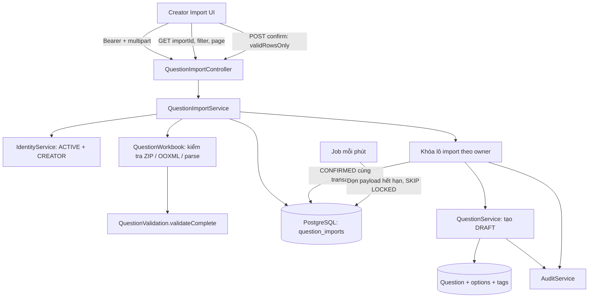
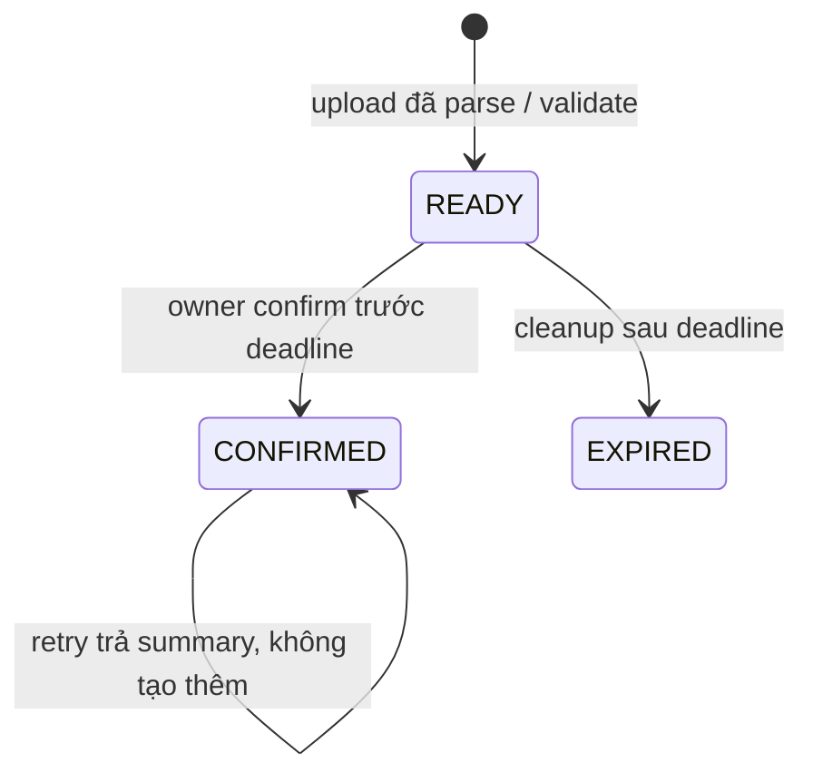

# F08 — Excel Import có preview

UC-QB-08..10, tiếp nối Question Bank F07. Creator upload, xem dữ liệu và lỗi trước khi
confirm; backend là nguồn quyết định quyền, validation, thời hạn và kết quả.

## Luồng và ranh giới

Các class nằm trong module `question`, phân theo controller/dto/service/repository/config.
JDBC repository chỉ lưu/query preview; Question tiếp tục dùng service/JPA của F07. Cùng datasource
và transaction manager giúp JDBC cập nhật batch và JPA tạo Question/audit commit hoặc rollback cùng nhau.
Parse workbook ngoài transaction ghi dữ liệu; upload chỉ insert preview, không tạo Question.

Không dùng Redis để giữ preview vì confirm cần transaction chung với Question. Không cần broker,
async job parse, object storage hay thư viện Excel phía frontend cho lô tối đa 1.000 câu.

## Template, validation và giới hạn

Apache POI `poi-ooxml:5.5.1` tạo template và đọc `.xlsx` thật. `Questions` là sheet dữ liệu;
`Instructions` là sheet hướng dẫn tùy chọn. Template để trống dữ liệu, ví dụ bốn loại chỉ nằm trong Instructions.
Header cố định: type, content, explanation, difficulty, category, tags, option1–option20,
correctOptions, correctBoolean, correctValue, tolerance. Không có owner/status/points.

Giữ terminology F07, plain text, max 20 lựa chọn liên tục và max 20 nhãn. Tags và chỉ số đáp án
phân cách bằng `;`, boolean TRUE/FALSE không phân biệt hoa thường. Numeric text dùng dấu chấm,
giới hạn BigDecimal/numeric(30,10) của F07; tolerance mặc định 0. Template định dạng Text để Excel
không mất precision; numeric cell được đọc trực tiếp từ giá trị XML, không chuyển qua double thêm lần nữa.
Không khôi phục được precision Excel đã làm tròn trước khi upload.

`validateComplete` kiểm tra đủ nội dung/đáp án độc lập với trạng thái lưu. Import tạo **DRAFT**
đủ nội dung, không thay đổi việc Creator được lưu nháp chưa hoàn chỉnh ở form F07.

Giới hạn:

| Tài nguyên | Giới hạn |
|---|---|
| File / multipart request | 5 MiB / 6 MiB |
| Câu hỏi không rỗng | 1.000 |
| Dòng vật lý được duyệt, kể cả header | 10.001 |
| ZIP entry | 100 |
| Dữ liệu giải nén | 20 MiB/entry, 50 MiB tổng |
| Nội dung ô preview | 10.000 ký tự; vượt giới hạn luôn là lỗi, không import phần cắt |
| Preview | 24 giờ; GET mặc định 20, tối đa 100 dòng/trang |

Kiểm tra ZIP bounded trước khi POI mở workbook; giữ kiểm tra tỷ lệ nén mặc định của POI.
Từ chối file hỏng/mã hóa, sai OOXML/header/sheet, macro và external workbook links. Không thực thi
formula; formula/error cell là lỗi theo field/dòng. Bỏ dòng hoàn toàn trống, giữ số dòng Excel thật.
Giá trị dài bị cắt chỉ để hiển thị lỗi preview; row đó không có normalized Question để import.
File gốc và tài nguyên POI được đóng sau xử lý; không lưu file upload lâu dài.

## Persistence, concurrency và thời hạn

Migration V7 thêm `question_imports`: UUID, owner FK, trạng thái, timestamps timestamptz,
total/valid counts và JSONB payload (cells, normalized input, errors). CHECK bảo vệ counts,
expiry, confirmed timestamp và payload bắt buộc khi READY; index phục vụ owner/cleanup.

Request tự kiểm tra `Clock` kể cả scheduler trễ. Preview READY quá hạn trả 410 ngay;
không phụ thuộc việc job đã chuyển EXPIRED hay chưa. CONFIRMED trả summary ngay cả sau expiry.

Confirm kiểm tra tài khoản/role hiện tại, khóa `SELECT ... FOR UPDATE` theo id + owner rồi kiểm tra
trạng thái. Mặc định chỉ nhận lô không lỗi; opt-in `validRowsOnly=true` nhập tất cả dòng hợp lệ,
ít nhất một dòng. Client không gửi rows/owner/nội dung; field thừa bị từ chối.
Revalidate dữ liệu chuẩn hóa trước khi tạo Question. Tạo Question, audit QUESTION_CREATED,
audit QUESTIONS_IMPORTED (chỉ counts) và CONFIRMED trong cùng transaction.

Retry hoặc confirm đồng thời cùng id nhận summary đã commit. Rollback không giữ câu hỏi/audit dở dang.
Mỗi upload mới là lô độc lập; không chống trùng nội dung giữa các lô hay cập nhật câu hỏi cũ.

Job mỗi 60 giây dọn tối đa 100 payload hết hạn bằng `FOR UPDATE SKIP LOCKED` để không tranh chấp
confirm. READY chuyển EXPIRED; CONFIRMED giữ trạng thái/counts/timestamp. Giữ metadata và audit,
không xóa Question. Hủy UI chỉ rời màn hình; lô chưa confirm hết hạn theo cùng cơ chế.

## API và UI

Contract: [OpenAPI](../api/openapi.yaml), nhóm `/api/v1/question-imports`:
GET template, POST multipart upload, GET `/{importId}` và POST `/{importId}/confirm`.
Tất cả yêu cầu bearer, tài khoản ACTIVE/onboarded có CREATOR hiện tại. ADMIN không tự có quyền.
Lookup người khác và id không tồn tại cùng trả 404; không trả preview cho Participant.

Frontend dùng route `/creator/questions/import?importId=...`, Server Component composition,
Suspense quanh query hook, Client Component cho auth/interaction. API client chung thêm FormData
và Blob, giữ same-origin guard, refresh một lần và auth-generation guard. Browser tự đặt multipart boundary.

UI theo Master F02 và tra cứu UI/UX Pro Max: chọn file có label/hint/error focus, summary theo lô,
lọc/phân trang, danh sách dòng responsive và disclosure nội dung/đáp án. Chỉ bật nhập dòng hợp lệ
sau checkbox rõ ràng. Không có inline edit preview hoặc mock fallback. Sau timeout/mất response confirm,
đọc lại trạng thái server trước khi cho retry. Request được hủy khi rời màn hình; không lưu token/file/preview
vào browser storage. Thành công dẫn tới danh sách DRAFT để rà soát và kích hoạt.

## Kiểm thử

Backend Testcontainers PostgreSQL 17/Redis: bốn loại, precision, row errors, mặc định confirm,
ownership/current role/tampering, double-confirm, rollback/audit, expiry/cleanup, khóa cleanup,
file hỏng/header/limits/formula và migration từ V6 có Question cũ.

Frontend unit kiểm tra multipart retry/boundary, binary/ProblemDetail và auth-generation guard.
Playwright dùng backend thật và fixture OOXML độc lập với parser: template, preview/reload,
confirm/DRAFT list, opt-in, quyền, file sai/mất mạng và mất response confirm sau server commit.
Có review ảnh và reflow 375/768/1024/1440px, viewport thấp 640×450, keyboard và reduced motion.

Kết quả chạy và giới hạn nghiệm thu được ghi tại [kế hoạch F08](../plans/v1-feature-implementation-plan.md#f08--excel-import-có-preview).
