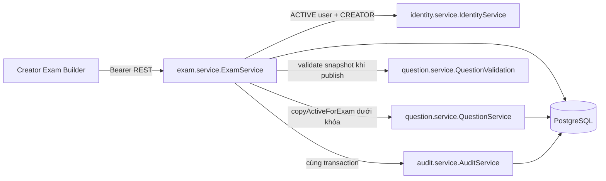
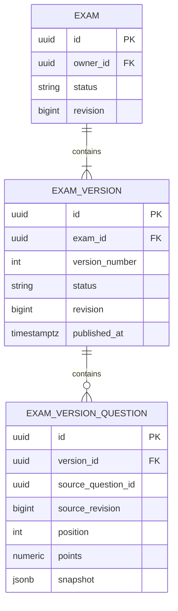

# F09 — Exam Builder và versioning

Áp dụng UC-EXAM-01..07, 09..11. API thật và UI Creator; không gồm ma trận F10 hoặc Session F11.

## Module và dữ liệu



Migration V8 bổ sung `exams`, `exam_versions`, `exam_version_questions`. Không thay migration cũ.
Exam giữ identity, owner, ACTIVE/ARCHIVED và revision. Version giữ số thứ tự, DRAFT/PUBLISHED,
revision, createdAt/updatedAt/publishedAt. Timestamp là Instant/timestamptz.



Snapshot JSONB có Java record riêng, gồm nội dung, loại câu, đáp án/lựa chọn, explanation,
phân loại, tags và numeric tolerance. Câu/lựa chọn có UUID ổn định trong version. Source ID
chỉ truy vết, không có FK/cascade từ bank để snapshot độc lập. Copy version giữ nội dung
nhưng cấp UUID câu/lựa chọn mới. Đây là DTO chỉ dành cho Creator; F13 phải tạo DTO Participant
không chứa đáp án/explanation, không tái sử dụng trực tiếp response này.

Points là numeric(30,10), BigDecimal và chuỗi decimal qua API. Mỗi câu >0, mặc định 1;
totalScore derive từ tổng points. UI dùng BigInt đơn vị 10^-10 để cộng/chia không mất precision.
Không thêm dependency. Chia đều phân bổ phần dư từ câu đầu, không tạo câu 0 điểm.

## Transaction, snapshot và concurrency

```mermaid
sequenceDiagram
    actor Creator
    participant UI as Builder
    participant API as ExamService
    participant Bank as QuestionService
    participant DB as PostgreSQL
    Creator->>UI: Thêm câu đã chọn
    UI->>API: source IDs/revisions + version revision
    API->>DB: Khóa Exam rồi Version; kiểm tra DRAFT/revision
    API->>Bank: Khóa nguồn theo UUID; ACTIVE + owner + revision
    Bank-->>API: Nội dung đầy đủ của nguồn
    API->>DB: Lưu snapshot, tăng revision, commit
    API-->>UI: Snapshot authoritative
    Creator->>UI: Xác nhận publish
    UI->>API: Lưu Draft nếu dirty, rồi publish(revision)
    API->>DB: Khóa Exam rồi Version
    API->>API: Validate snapshot đã lưu, không đọc bank
    API->>DB: PUBLISHED + publishedAt + audit; commit
    API-->>UI: Published Version
```

- Mọi mutation khóa Exam trước Version. Cấp version number dưới khóa Exam, thêm unique
  `(exam_id, version_number)`; nhiều Draft được phép. Nguồn được khóa theo UUID để tránh
  deadlock giữa các lô add; sửa/archive bank cũng dùng khóa nguồn hiện có.
- Unique `(version_id, source_question_id)` chống trùng câu; position unique được deferred
  đến commit để reorder không vướng vị trí cũ giữa chừng. Save nhận danh sách câu giữ lại,
  bỏ câu vắng, cập nhật thứ tự/points nguyên tử; không nhận nội dung snapshot từ client.
- Revision mismatch trả 409, không ghi đè. Mọi đường sửa Published bị từ chối cả service/entity.
  Publish lặp trả version hiện tại, không ghi audit lại; publish ban đầu validate tối thiểu
  một câu, points và đáp án bốn loại câu. Audit lỗi rollback cả chuyển trạng thái.
- Add capture snapshot ngay lập tức. Bank sửa/archive không đổi Draft/Published. Publish
  vẫn hợp lệ khi nguồn bị archive. Copy chỉ lấy snapshot Published cùng Exam.
- Archive idempotent, bảo toàn dữ liệu và chỉ ngăn tạo Session mới ở F11; Draft vẫn sửa,
  version vẫn tạo/publish. Không có restore hay hard delete. Create Exam/version không
  idempotent; không tự retry khi mất response tạo mới.

## API, UI và bảo mật

Contract trong [OpenAPI](../api/openapi.yaml): 9 operations cho list/create/detail/archive Exam,
create/read version, batch add, save retained questions và publish. Tất cả dùng bearer;
refresh cookie không xác thực business API. Security matcher chỉ miễn CSRF cho các path
business đó, auth cookie endpoints giữ bảo vệ CSRF. Kiểm tra ACTIVE user/CREATOR/owner
tại backend, ADMIN không tự có quyền; resource người khác trả 404.

UI ở `features/exam` và routes Creator, dùng auth in-memory hiện có, không mock fallback.
Hook query được tách sang `lib/api/use-query` để Question Bank và Exam dùng chung.
Drawer picker dùng Question Bank API, chọn nhiều qua các trang và kiểm tra lại nguồn ở backend.
Save lỗi giữ input; tải bản server vào dialog riêng để đối chiếu trước khi thay input.
Publish lưu trước, khi response không chắc chắn thì GET lại trạng thái, không tự tạo version mới.

UI/UX Pro Max được tra cứu cho dragging alternatives, Next.js client/server và responsive
Tailwind. Kế thừa Master: semantic tokens, tiếng Việt, native dialog giữ focus, Lên/Xuống
thay cho drag-only. Form và status có nhãn; điểm chỉ báo đã lưu khi có response xác nhận.
Session chưa khả dụng hiển thị rõ, không giả số 0. Generate by Rule để F10.

## Kiểm chứng

- Backend integration: snapshot bốn loại câu, precision, đổi/archive bank, copy/empty Draft,
  archive, ownership/role, immutable HTTP mutations, revision, điểm lỗi, concurrent create/
  publish/save, audit rollback, migration từ V7 bảo toàn dữ liệu cũ.
- Unit frontend: tổng điểm vượt Number precision; chia 10/40 và 1/3; từ chối điểm âm/0,
  input quá precision và tổng quá nhỏ; navigation bật Exam đúng CREATOR.
- E2E API thật: create/add/reorder/points/save/reload/publish/view/copy/archive, lỗi mạng,
  stale revision + đối chiếu, mất response publish, truy cập chéo Creator và Participant.
- UI kiểm tra keyboard reorder, Escape/focus dialog, 375/768/1024/1440px, reduced motion,
  layout zoom 200%. Ảnh kiểm tra sinh vào test-results, không commit.

Lệnh nghiệm thu: backend `./mvnw -B clean verify`; frontend `npm test`, `npm run lint`,
`npm run typecheck`, `npm run test:exam`, `npm run test:question`, `npm run test:e2e`,
`npm run build`, `npm run test:production`. Kết quả thực tế ghi trong phần bàn giao F09.
