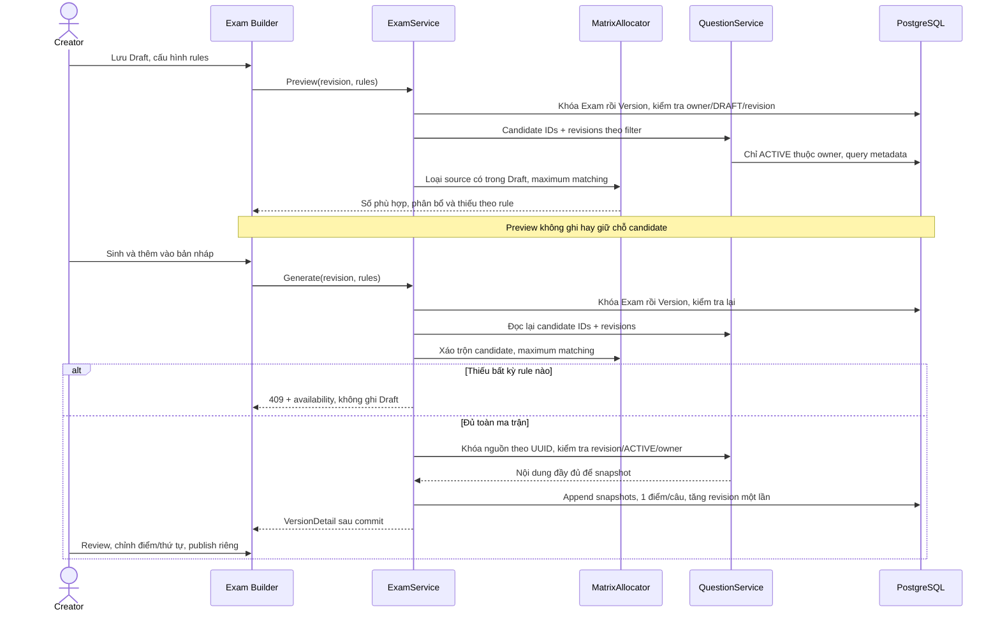

# F10 — Sinh đề theo ma trận

F10 thực hiện UC-EXAM-08 trên nền snapshot/versioning F09. Hai API nằm dưới
`/api/v1/exam-versions/{id}`: `POST /generation/preview` và `POST /generation`.
Contract đầy đủ ở [OpenAPI](../api/openapi.yaml); giao diện ở `features/exam/matrix-generator.tsx`.

## Luồng và ranh giới module

Exam gọi public service của Question, không truy cập entity/repository của Bank. Candidate query
chỉ lấy ID/revision; nội dung/đáp án chỉ được đọc cho những nguồn đã chọn, qua cơ chế khóa F09.
Preview cũng khóa Exam/Version để đọc nhất quán với save/publish, nhưng không thay timestamp/revision.

## Phân bổ và giới hạn

- Category dùng trường hiện có, trim rồi so khớp chính xác không phân biệt hoa thường.
  Category/difficulty/type kết hợp AND; null/blank category hoặc filter không có nghĩa là tất cả.
- Quantity là JSON integer 1–500; từ chối string và số thập phân, không cho Jackson tự cắt lẻ.
  Tối đa 50 rule, tổng 500 câu/lần để giới hạn số slot và độ sâu đường tăng.
- Mỗi quantity tạo số slot tương ứng; cạnh nối slot với candidate phù hợp. Thuật toán đường tăng
  có thể chuyển candidate của slot cũ để nhường câu cho rule hẹp. Không dùng greedy theo số candidate.
- Mỗi candidate chỉ thuộc một slot. Duyệt slot theo thứ tự rule; khi thiếu, rule trước được ưu tiên.
  Preview duyệt candidate theo UUID; generate xáo trộn thứ tự trước matching. Không cam kết mọi
  cách phân bổ khả thi có xác suất bằng nhau.
- `candidateCount` tính độc lập sau loại source cũ; `allocatedCount` xét toàn bộ ma trận;
  `missingCount = requested - allocatedCount`. Chỉ generate khi mọi missingCount bằng 0.
- Độ phức tạp phụ thuộc số slot và cạnh candidate; không thêm engine/dependency hoặc lưu template.

## Tính nguyên tử, retry và snapshot

Generate kiểm tra đủ trước khi ghi. Dùng chung helper append với thêm câu thủ công: khóa toàn bộ
nguồn theo UUID, xác nhận owner/ACTIVE/revision, rồi mới tạo snapshot. Nguồn đổi sau query trả conflict;
transaction rollback cả Exam/Version. Câu mới nối cuối theo rule, BigDecimal.ONE; câu và điểm cũ giữ nguyên.
Unique `(version_id, source_question_id)` và revision F09 tiếp tục bảo vệ dữ liệu.

Generate/save/publish đều khóa Exam rồi Version nên cùng revision chỉ một mutation thành công.
Retry với revision cũ không thêm lần hai. UI chặn gửi trùng; nếu mất response, đọc lại VersionDetail,
cho Creator đối chiếu rồi quay về Builder. Không tự retry với revision vừa đọc. Preview chỉ là thông tin
tại thời điểm đọc; generate luôn truy vấn lại. Archived Exam vẫn cho biên soạn theo F09.

Không có migration hoặc thay auth. Endpoints giữ bearer, ACTIVE user/CREATOR/owner; ADMIN không tự có
CREATOR. Người khác nhận 404, Published nhận 409. Snapshot chứa đáp án chỉ trả cho Creator sở hữu,
không dùng response này cho Participant.

## Giao diện và kiểm chứng

Kế thừa Master, semantic tokens, native dialog và auth in-memory. Đã tra UI/UX Pro Max về lỗi form/focus
và Next.js client boundary. Tra cứu Tailwind responsive không có kết quả phù hợp sau một lần thử lại;
dùng Master/workflow Learnova. Không thêm UI library, mock fallback hoặc thay auth strategy.

Các kiểm chứng F10:

- Unit allocator: pool rời nhau/rỗng, rule hẹp bị rule rộng chiếm câu, rule trùng/giao nhau thiếu;
  so maximum matching với exhaustive oracle trên 200 đồ thị nhỏ.
- Integration PostgreSQL/Redis: filter/owner/ACTIVE/source cũ; preview không ghi; thiếu rollback cả
  câu/revision/timestamp; snapshot; validate/role/Published; generate đua generate/save/publish.
- Test khóa nguồn dùng connection giữ khóa, đợi PostgreSQL xác nhận generate bị block, rồi sửa/archive
  nguồn; xác minh rollback toàn Draft thay vì chỉ thử race theo timing ngẫu nhiên.
- E2E API thật: preview → generate → review/save/publish, thiếu sau preview, mất response,
  stale revision, dirty Draft, keyboard/focus, responsive, landscape, reduced motion và zoom.

Kết quả chạy thực tế được ghi tại phần bàn giao F10 trong [kế hoạch V1](../plans/v1-feature-implementation-plan.md).
