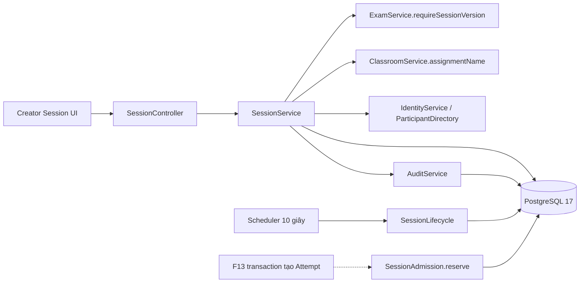
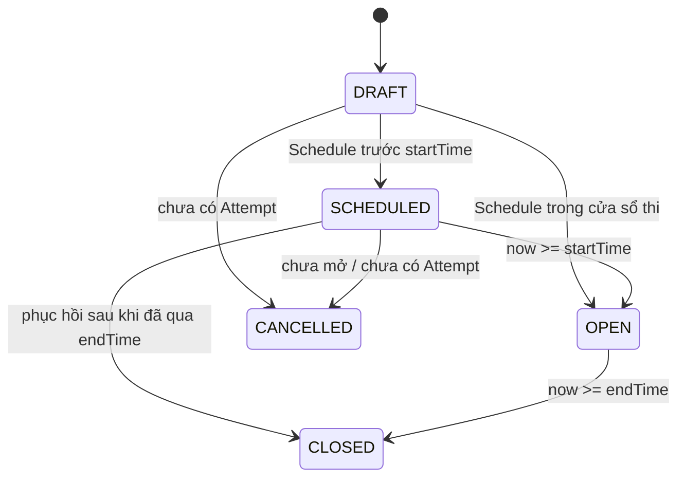

# F11 — Exam Session, assignment và lifecycle

F11 triển khai UC-SESSION-01..07. Session dùng một published ExamVersion; nội dung và
điểm câu hỏi vẫn thuộc snapshot F09. `passingScore` và policy tổ chức thuộc Session.

## Module và dữ liệu

- Migration V9: `exam_sessions`, `session_class_assignments`, `session_individual_assignments`.
  Foreign key giữ liên kết với Exam/Version/Class/User, không có hard-delete lịch sử.
- Timestamp UTC với precision microsecond; input có timezone. Điểm `numeric(30,10)` /
  `BigDecimal`, JSON string để không mất precision qua JavaScript.
- PUBLIC không có target; CLASS/INDIVIDUAL có 1–500 target ID riêng biệt. CLASS chỉ lớp
  owner quản lý; INDIVIDUAL chỉ User ACTIVE, onboarding hoàn tất, có PARTICIPANT.
- CLASS kiểm tra membership ACTIVE hiện tại. Số được giao hợp nhất theo userId khi có
  nhiều lớp; PUBLIC trả `null`, không coi toàn bộ User là danh sách được giao.
- SessionViews dùng JDBC read projections cho tên, tổng điểm và count; không expose
  entity/repository của module khác. List giới hạn tối đa 100 Session mỗi trang.

## State và quyền sửa

| State hiệu lực | Sửa | Cancel | Gia hạn |
|---|---|---|---|
| DRAFT, chưa Attempt | Toàn bộ cấu hình | Có | Không |
| SCHEDULED, chưa Attempt | Cấu hình; start mới phải ở tương lai; end chỉ qua gia hạn | Có | Có |
| OPEN hoặc đã Attempt | Chỉ tên, nếu chưa CLOSED/CANCELLED | Không | Chỉ SCHEDULED/OPEN |
| CLOSED/CANCELLED | Không | Không | Không |

Schedule yêu cầu endTime còn ở tương lai, revalidate version/Exam và targets. Mặc định
`SUMMARY + AFTER_SESSION_END`. Result policy bị khóa cùng fairness config. Duration có
thể dài hơn cửa sổ: deadline mỗi Attempt tương lai lấy min(duration deadline, endTime).

Archive Exam ngăn tạo, đổi sang version đó và Schedule mới; không hủy kỳ thi đã lên
lịch. Đọc và sửa cấu hình hợp lệ của Session đang trỏ cùng version không cần unarchive.

## Transaction, scheduler và contract F13

- Session mutation khóa hàng `FOR UPDATE`, kiểm tra revision và đọc server time sau
  khi có khóa. Session → Exam là thứ tự khóa khi cần kiểm tra version mới/Schedule;
  các thao tác Exam không khóa Session. Archive và chọn version dùng cùng khóa Exam.
- Request tính state hiệu lực từ thời gian, kể cả list/filter; không cần scheduler đã
  ghi OPEN/CLOSED. Scheduler quét tối đa 100 candidate mỗi lượt, mỗi Session một transaction,
  mặc định 10 giây (`learnova.session.lifecycle-delay-ms`). Chạy lại là an toàn; restart
  xử lý những row đến hạn. Lỗi DB từng row được log bằng ID và thử lại lượt sau.
- Create, update, Schedule, Cancel, Extend ghi audit cùng transaction. Extend chỉ tăng
  endTime, lưu old/new timestamp; không truy cập hay cập nhật deadline Attempt.
- `SessionAdmission.reserve` là API Java nội bộ, không có HTTP endpoint. Bắt buộc caller
  đã mở transaction ghi; kiểm tra role/account, khóa Session, state và assignment,
  ghi `firstAttemptAt` và trả version/deadline/maxAttempts/shuffle cho F13.
- F13 phải gọi contract trong transaction tạo Attempt, kiểm tra lượt/duplicate và lưu
  Attempt trước commit. Nếu thất bại phải rollback toàn bộ. `firstAttemptAt` không
  được reset khi submit/expire và không nhận từ client. Resume không gọi reserve.
- Admission lock và dấu đầu tiên đã test ở boundary; F11 chưa có bảng/API Attempt.
  Double-start, cancel-vs-Start HTTP và giữ deadline của Attempt persisted thuộc F13.

## UI và giới hạn

List/new/detail/edit tại `/creator/sessions`; wizard sáu bước bám Screen Flow. Các form
dùng API client in-memory token và primitive có sẵn. UI/UX Pro Max đã được tra cứu cho
multi-step form, Next.js và Tailwind; giữ Master, không thêm thư viện hay override riêng.

Save-and-Schedule lưu Draft trước, giữ ID nếu Schedule lỗi. Conflict cho đối chiếu
server và giữ input đến khi người dùng chọn thay. Sau lỗi mạng khi create chưa biết ID,
UI không tự retry POST; người dùng cần kiểm tra danh sách trước khi tạo lại.

Related Sessions nối từ Exam và Classroom; link Upcoming trên danh sách lớp lọc
SCHEDULED. Participant discovery, Attempt, Result, Monitoring, Notification thuộc các
feature sau; không mock count, kết quả hoặc link chức năng chưa có.

Kiểm chứng và giới hạn môi trường được ghi tại checklist F11 trong kế hoạch V1.
