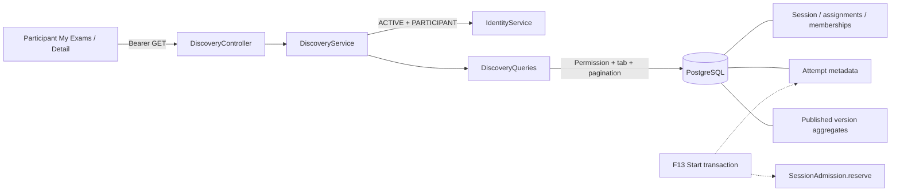

# F12 — Participant exam discovery

## Ranh giới

F12 triển khai discovery và lịch sử metadata thật. Migration V10 đặt nền bảng `attempts`;
chưa có production API ghi Attempt. Start/resume/answers/shuffle thuộc F13, finalize/grading
thuộc F14, policy trả điểm/kết quả thuộc F15. Các CTA tương ứng disabled với nhãn “Sắp có”.
Không có mock fallback hoặc dữ liệu seed trong production.

## Query và bảo mật

- Ba GET API dưới `/api/v1/participant/exam-sessions`: list, `/{id}` và `/{id}/attempts`.
  Security cho phép GET authenticated; service kiểm tra account và role hiện tại từ database.
- Quyền xem là assignment PUBLIC/CLASS ACTIVE/INDIVIDUAL hoặc đã có Attempt của chính mình.
  DRAFT/CANCELLED không hiển thị; detail không tồn tại/không có quyền cùng trả 404.
- `EXISTS` tránh trùng Session khi cùng tham gia nhiều lớp. Query count và page cùng read-only
  REPEATABLE_READ transaction; server time lấy một lần cho list/detail. Không serialize JPA entity.
- Projection chỉ lấy metadata, số câu và tổng điểm cấu hình. Không đọc snapshot JSONB và
  không trả earned score, pass/fail, đáp án, explanation, danh sách lớp/người được assign.
- Description lấy từ metadata Exam hiện tại, không phải nội dung snapshot đã publish.
- Không thêm service dependency Session → Attempt; dedicated SQL read projection được phép join
  dữ liệu liên module như các projection F11. F13 vẫn gọi SessionAdmission trong transaction ghi.

## Tabs và khả năng thao tác

| Tab | Điều kiện | Thứ tự, sau đó ID tăng |
|---|---|---|
| AVAILABLE | canStart hoặc canContinue | endTime tăng |
| UPCOMING | assignment hiện tại + effective SCHEDULED | startTime tăng |
| COMPLETED | có SUBMITTED/EXPIRED/GRADED | completion gần nhất giảm |
| EXPIRED | effective CLOSED + quyền xem | endTime giảm |

Completion dùng submittedAt, fallback deadline. Các tab có thể giao nhau. Mỗi Attempt đều
chiếm một lượt. `canStart` yêu cầu assignment hiện tại, OPEN, còn lượt và không có IN_PROGRESS.
`canContinue` yêu cầu IN_PROGRESS của chính mình với `now < deadline`, không cần membership
hiện tại. IN_PROGRESS quá hạn không tự đổi trạng thái khi đọc, không cho bắt đầu mới trước
khi finalize; F14 chịu trách nhiệm finalize. Gia hạn Session không đổi deadline đã lưu.

Lý do không khả dụng ưu tiên: IN_PROGRESS quá deadline → mất assignment → chưa mở → đã đóng
→ hết lượt. ActiveAttemptId là ID bài IN_PROGRESS, kể cả quá hạn; UI dùng canContinue, không
suy luận quyền từ ID. Không gửi result ID/link trước F15.

## Nền dữ liệu và giao diện

V10 giữ metadata tối thiểu, FK Participant và cặp Session/ExamVersion, unique số lượt theo
Participant/Session, partial unique một IN_PROGRESS. Không cascade delete lịch sử. F13 bổ sung
answers/order và dùng khóa Session cùng admission để cấp số lượt, chống race và ghi firstAttemptAt.

UI dùng Master hiện có, không cần override. Route shell là Server Component; authenticated
query ở client dùng access token in-memory. Tab/page nằm trong URL, có pagination, retry và
refetch khi tab browser visible/focus. AbortController loại phản hồi cũ khi đổi query.
Không dùng browser clock tính khả năng Start/Continue. Nút chưa triển khai có nhãn “Sắp có”,
không tạo link tới route thiếu. Lịch sử metadata hiển thị ngay tại Session detail.

## Kiểm chứng

Integration tests dùng PostgreSQL 17/Redis Testcontainers, clock kiểm soát được: phân quyền,
biên thời gian, overlap tabs, hết lượt, remove/rejoin membership, history isolation, constraints,
migration V9→V10 và không lộ dữ liệu nhạy cảm. Browser suite `npm run test:discovery` dùng API thật.
Fixture controller chỉ ở test classpath, cần `learnova.test.discovery=true`; không đóng gói production.
Nghiệm thu luồng thực sự tạo/resume/grading/result tiếp tục ở F13–F15.
