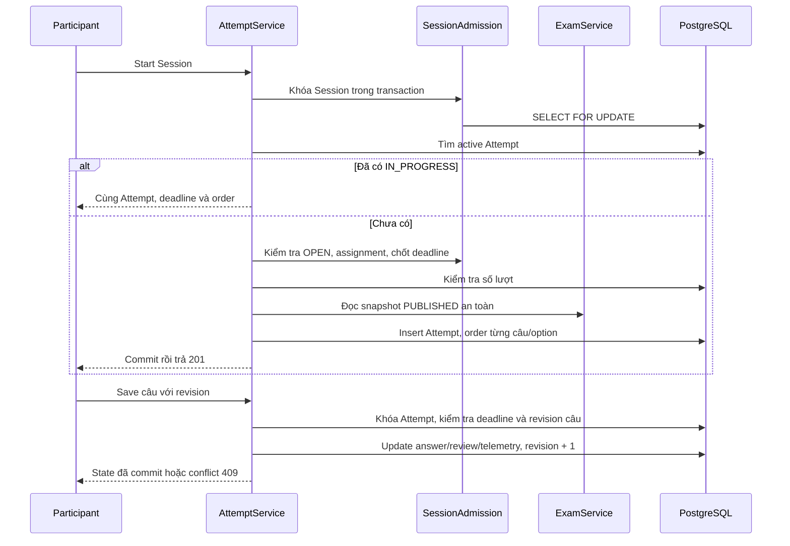

# F13 — Start, resume, stable shuffle và autosave

## Phạm vi và contract

UC-PARTEXAM-07, UC-ATTEMPT-01..06 và UC-SYSTEM-01. Participant ACTIVE có thể bắt đầu,
khôi phục và sửa bài còn hạn. F14 mới bổ sung submit, auto-finalize và grading; F13 hết
hạn khóa sửa, trả metadata với `canEdit=false`, không tự đổi status hoặc trả kết quả.

- `POST /api/v1/exam-sessions/{id}/attempts`: 201 mới, 200 cùng IN_PROGRESS khi retry.
- `GET /api/v1/attempts/{id}`: state đã lưu, thứ tự cố định, deadline và serverTime.
- `PUT /api/v1/attempts/{id}/answers/{questionId}`: thay state một câu bằng revision mong đợi.

Account/role được kiểm tra trên cả ba API, owner trên read/save. Start tìm bài đang làm
trước khi kiểm tra assignment mới; gỡ membership không làm mất quyền resume/save.
PUBLIC vẫn yêu cầu login. API làm bài dùng DTO riêng không có explanation, correct answer,
tolerance, điểm hoặc grading metadata. Bài không editable có `questions=[]`.

## Transaction và dữ liệu

Module Attempt phụ thuộc contract SessionAdmission, ExamService và IdentityService;
Session discovery tiếp tục đọc projection metadata, không phụ thuộc ngược AttemptService.
Khóa Session tuần tự hóa Start cùng cancel/configuration/extend; lỗi rollback luôn dấu
`firstAttemptAt`. Unique active Attempt và số lượt của V10 vẫn là hàng rào DB.
Save khóa Attempt trước khi đọc clock/state, tạo cùng điểm đồng bộ để F14 finalize sử dụng.

V11 thêm `attempt_answers`: FK kép bảo đảm câu và Attempt cùng ExamVersion; unique vị trí;
option_order JSONB, answer JSONB, review, revision riêng câu, active_time_ms và saved_at.
Thứ tự được lưu một lần; TRUE_FALSE luôn dùng boolean Đúng/Sai, không có option shuffle.
Snapshot nội dung vẫn thuộc ExamVersion bất biến. Không đọc lại Question Bank.
Metadata F12 nâng cấp được backfill bằng thứ tự gốc, answer rỗng, telemetry/saved_at null;
không giả định có shuffle hoặc lịch sử tương tác trước F13.

## Autosave và UI

Route `/participant/attempts/[attemptId]` dùng auth guard với layout tập trung, không sidebar.
Master và override Exam Taking giữ typography, tokens, keyboard và responsive hiện có.

- Input local, bản saved và trạng thái queue tách riêng. Numeric debounce 500 ms;
  lựa chọn/review gửi ngay, chuyển câu flush. Từng câu chỉ có một request đang gửi.
- Coalesce giữ input mới nhất; acknowledgement cũ không đánh dấu input mới Saved.
- Retry transient tối đa ba lần sau request đầu, chờ 1/2/4 giây, giữ nguyên payload/revision.
  Lỗi validation không retry tự động khi tab lấy lại focus; telemetry không khởi động lại
  queue đã failed. Người làm sửa nội dung hoặc bấm thử lại để gửi tiếp.
  Request timeout sau 10 giây. Sau mất response, conflict dẫn tới đọc lại; nếu answer/review
  đã khớp thì xác nhận và lấy telemetry server, kể cả khi server đã cap giá trị này.
  Nếu answer/review khác thì hiển thị local/server, yêu cầu chọn bản, không tự ghi đè
  với revision mới. Input mới phát sinh trong lúc đối chiếu vẫn giữ dirty để lưu tiếp.
- Refetch định kỳ 30 giây, khi focus/visible/online; không ghi đè dirty state.
  Countdown dựa serverTime + thời gian đơn điệu, không giảm biến đếm mù mỗi giây.
  GET 403/404 hiển thị forbidden/not-found và khóa sửa; lỗi mạng có thông báo riêng.
- Telemetry chỉ đếm câu đang xem khi visible và focus, gửi mỗi 15 giây/chuyển câu.
  Tổng tích lũy không giảm, server cap theo elapsed Attempt; retry không cộng trùng.
  Dữ liệu ước lượng, có thể thiếu hoặc lệch khi nhiều tab; không dùng chấm điểm/anti-cheat.
- Không lưu answer vào localStorage/IndexedDB. beforeunload chỉ cảnh báo, không bảo đảm
  lưu khi đóng tab. Auth vẫn dùng access token memory và refresh cookie hiện có.

## Kiểm chứng

Backend integration bao phủ Start đồng thời, maxAttempts, khóa Session, deadline, snapshot,
membership, bốn loại answer, revision concurrent, ownership, payload an toàn và V10→V11.
Frontend unit kiểm tra queue/race/retry/conflict; browser dùng HTTP/backend/PostgreSQL/Redis
thật cho Start, bốn loại câu, reload, mất mạng, hai tab và responsive.

Lệnh: backend `mvnw.cmd -B verify`; frontend `npm run lint`, `npm run typecheck`, `npm test`,
`npm run build`, `npm run test:attempt`, `npm run test:discovery` và regression liên quan.
Kết quả thực chạy ghi trong [kế hoạch V1](../plans/v1-feature-implementation-plan.md).
