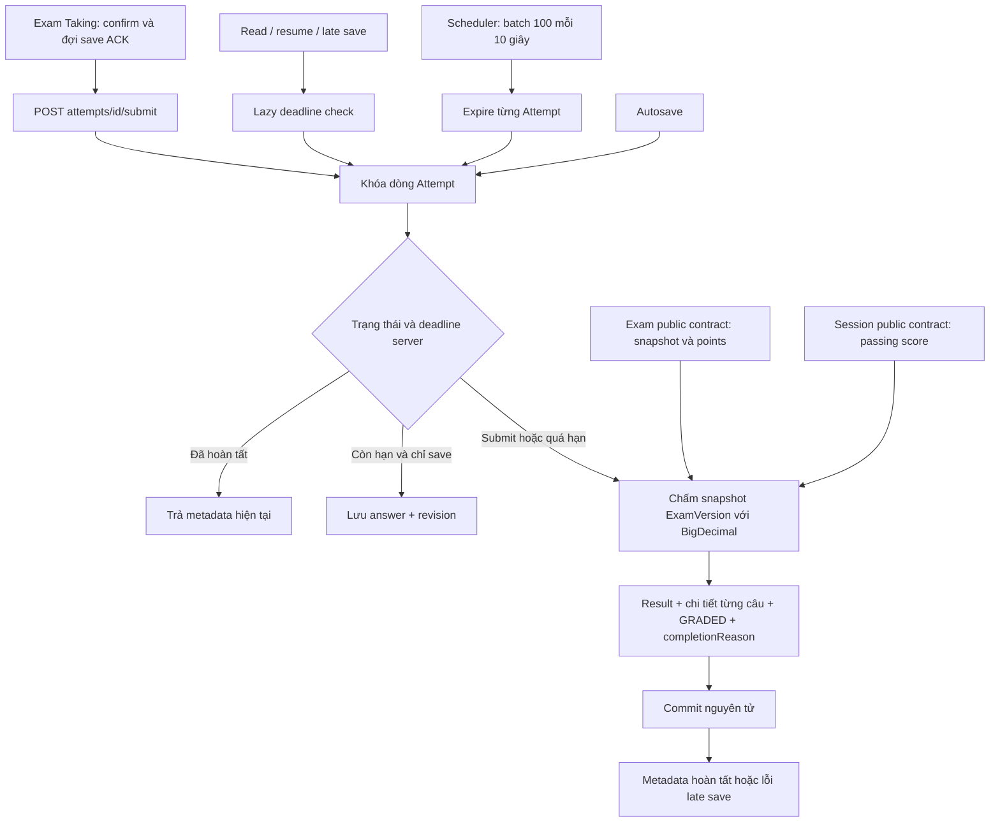

# F14 — Submit, auto-finalize và automatic grading

## Ranh giới

F14 hoàn tất bài và lưu kết quả; API/UI xem điểm, release policy và best score thuộc F15.
Participant chỉ nhận metadata trạng thái, không có raw score, pass/fail, đáp án hoặc explanation.
Không thêm broker, dependency hay grading strategy framework.

## Transaction và concurrency

- AttemptRepository dùng JDBC trên transaction Spring hiện có. Mọi save/finalize đều
  khóa cùng dòng bằng `FOR UPDATE OF a`; đọc trạng thái và Clock sau khi có khóa.
- Submit, lazy expiration và scheduler gọi AttemptFinalization. Một transaction lưu
  Result, chi tiết và trạng thái GRADED; lỗi rollback toàn bộ. Retry không chấm lại.
- Save dùng TransactionTemplate: khi quá hạn, finalize rồi trả outcome rỗng. Sau commit
  mới ném ATTEMPT_DEADLINE_PASSED; không để exception làm rollback kết quả vừa chấm.
- Start giữ thứ tự khóa Session → Attempt. Nếu gặp active Attempt quá hạn, finalize và
  trả lại bài đó; không tạo lượt mới trong cùng request. Finalize không khóa ngược Session.
- Scheduler phân trang keyset `(deadline,id)`, cutoff cố định từng lượt quét. Mỗi bài một
  transaction; lỗi được log bằng ID/loại lỗi, không log answers/SQL parameter. Lượt sau retry.
  Không cần browser hoặc in-memory queue nên tự xử lý backlog sau restart.
- Result có PK attempt_id; chi tiết có PK attempt_id/question_id và FK tới answer snapshot.
  Migration V12 không sửa lịch sử hoặc tạo kết quả giả cho metadata cũ.

## Chấm điểm và thời gian

- SINGLE_CHOICE/TRUE_FALSE exact match; MULTIPLE_CHOICE exact-set; numeric absolute
  tolerance inclusive. Answer bỏ trống = 0. Points lấy từ published ExamVersion.
- Dùng BigDecimal và PostgreSQL numeric không ép scale ở Result. Pass/fail so sánh raw
  score; formatter dùng hai chữ số HALF_UP, chưa expose trong HTTP F14.
- completionReason = PARTICIPANT_SUBMIT hoặc DEADLINE_REACHED; submit tại deadline
  là hết giờ. submittedAt là thời điểm submit được chấp nhận hoặc deadline nếu expired;
  gradedAt là thời gian xử lý. Không kéo dài deadline khi gia hạn Session.

## Client và phục hồi

Dialog tóm tắt answered/unanswered/review. Sau confirm chốt telemetry, khóa edit,
drain save đang chạy và input coalesce, chỉ submit khi ACK đủ. Save lỗi/conflict quay
lại xử lý. Submit timeout phải read authoritative; chưa đọc được giữ unknown và khóa
submit. Response cũ không chuyển GRADED về IN_PROGRESS. Timer không tự tuyên bố hoàn tất.

Khi server xác nhận, dừng retry save, focus heading và hiển thị lý do kết thúc.
Chỉ có nút về kỳ thi; result policy/navigation dành cho F15. Không thêm offline storage.

## Kiểm chứng

Unit kiểm tra bốn loại grading, tolerance và rounding/raw pass-fail. Integration dùng
PostgreSQL 17/Redis kiểm tra race, rollback/retry, lazy-save commit, ownership, membership,
scheduler không cần browser và migration V10→V12. Browser chạy API thật; không mock
response nghiệp vụ, chỉ trì hoãn/chặn mạng để kiểm tra mất response và autosave.

Lệnh: backend `mvnw.cmd -B verify`; frontend lint/typecheck/test/build,
`npm run test:attempt`, `npm run test:discovery`, `npm run test:session` và production suite.
