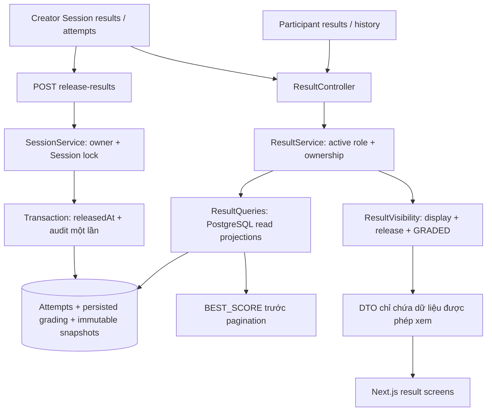

# F15 — Result visibility, history và best score

F15 bổ sung read API trong module `attempt`, dùng kết quả persisted của F14 và snapshot
ExamVersion. Không chấm lại khi đọc và không tham chiếu đáp án hiện tại trong Question Bank.
`SessionService.releaseResults` sở hữu write command công bố vì Session sở hữu policy.

## Policy và dữ liệu trả về

- Actor phải ACTIVE và có đúng role. ADMIN không tự có quyền Creator/Participant.
- Participant chỉ đọc Attempt của mình, kể cả đã bị xóa khỏi lớp. Creator chỉ đọc
  kết quả Session do mình sở hữu; không xem đáp án của lượt IN_PROGRESS.
- `HIDDEN` luôn ẩn điểm. `IMMEDIATE` cần GRADED; `AFTER_SESSION_END` so sánh Clock máy
  chủ với endTime hiện tại; `MANUAL` cần resultsReleasedAt đã được lưu.
- DTO khi không được xem không có `result`, `summary`, `questions`; history cũng bỏ
  `bestResult` và `bestAttemptId`, tránh tiết lộ tương quan điểm giữa các lượt.
- SCORE_ONLY trả điểm/thang điểm/pass-fail. SUMMARY thêm số câu đúng/sai/chưa trả lời
  và thời gian từ startedAt đến submittedAt. DETAILED thêm snapshot, câu trả lời đã lưu,
  đáp án, explanation và điểm từng câu, theo thứ tự shuffle của Attempt.
- Điểm là chuỗi decimal chính xác. Pass/fail lấy từ kết quả đã chấm, không tính lại
  bằng số thực ở frontend. Câu chưa trả lời không được tính vào incorrectCount.
- Submit/resume/discovery tiếp tục trả metadata an toàn của F14, không thêm điểm.
  Dashboard và notification chưa triển khai (F20/F18); khi thêm dữ liệu kết quả phải
  dùng cùng điều kiện ResultVisibility, không đọc raw score rồi chỉ ẩn ở UI.
- Security filter đặt Cache-Control no-store. Frontend chỉ giữ response trong memory,
  bỏ response cũ khi refetch và refresh khi focus trở lại; không có mock fallback.

## History, best score và công bố

- History phân trang theo Session; count bao gồm mọi lượt. Best chỉ lấy GRADED có
  persisted result, raw_score lớn nhất trên toàn bộ lịch sử trước pagination.
- Hòa điểm chọn submittedAt sớm hơn, rồi UUID tăng dần để thứ tự ổn định. Không xóa lượt
  thấp điểm. completedAt là lần nộp gần nhất, không nhất thiết là lượt best.
- Creator thấy hợp của Participant đang được giao (CLASS/INDIVIDUAL) và người có Attempt
  lịch sử. PUBLIC chỉ có người đã bắt đầu. Danh sách mọi Attempt phân trang riêng.
- V13 thêm `results_released_at` vào Session. Manual release lấy khóa Session giống
  cấu hình/gia hạn; ghi timestamp và RESULT_MANUALLY_RELEASED cùng transaction. Retry
  trả timestamp cũ, không thêm audit. DRAFT/CANCELLED và policy khác MANUAL bị từ chối.
- Công bố áp dụng cho toàn Session, gồm lượt được chấm sau đó. HIDDEN vẫn ẩn; không có
  thu hồi công bố trong V1. Gia hạn trước endTime dời mốc AFTER_SESSION_END đến endTime mới.

## UI và contract

Routes: `/participant/results`, `/participant/results/[attemptId]`,
`/creator/sessions/[sessionId]/results`,
`/creator/sessions/[sessionId]/results/[attemptId]`.
Đi từ submit completion, history của discovery hoặc Session detail; API chi tiết nằm
trong [OpenAPI](../api/openapi.yaml).

UI kế thừa Master, dùng card responsive, label trạng thái, loading/empty/error/retry,
pagination và modal xác nhận công bố có Escape/return-focus. Tra cứu UI/UX Pro Max:
`loading empty error` (ux), `client server components` (nextjs), `responsive layout`
(html-tailwind). Query `responsive table` không có kết quả; dùng hướng layout chung
và card hiện có, không thêm design override hoặc dependency.

Kiểm thử tập trung ở `AttemptIntegrationTests` (12 tổ hợp policy, JSON không rò rỉ,
ownership, best score, snapshot, membership removal, extension, concurrent release),
suite Playwright `npm run test:result` dùng backend/PostgreSQL/Redis thật.
