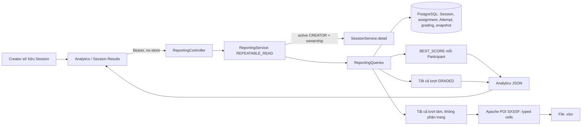

# F17 — Reporting, Question Analytics và Excel export

Triển khai ngày 07/10/2026. UC-REPORT-01..03. Không thêm schema, dependency hoặc job.

## Mẫu và công thức

- Điểm: một lượt GRADED cao nhất mỗi Participant; hòa điểm chọn submittedAt sớm nhất,
  sau đó id. Average/highest/lowest dùng raw score; pass rate dùng passed của lượt đó.
  Chưa có người được chấm: số lượng 0, các chỉ số điểm/tỷ lệ là null.
- Phân bố: 10 khoảng phần trăm tổng điểm, `[0,10)`, …, `[90,100]`. Mỗi Participant
  chỉ nằm trong một khoảng, kể cả khi có nhiều lượt. Không suy ra pass/fail ở frontend.
- Completion: số người có ít nhất một lượt SUBMITTED/EXPIRED/GRADED chia cho hợp
  của người hiện được giao và người từng có Attempt. CLASS dùng membership ACTIVE;
  UNION khử trùng giữa các lớp và lịch sử. PUBLIC không có mẫu số hữu hạn nên tỷ lệ null.
  Mẫu số bằng 0 cũng trả null. Một người làm lại vẫn được tính hoàn thành nếu đã hoàn tất lượt trước.
- Question: toàn bộ lượt GRADED, không chỉ best. Mỗi câu gắn với id của snapshot trong
  ExamVersion của Session. Đúng lấy persisted grading; sai là không đúng và có answer;
  chưa trả lời là optionIds rỗng và booleanValue/numericValue null. `false` và `0` vẫn là answer.
- Thời gian: average của active_time_ms không null, không âm, không vượt thời gian từ
  startedAt đến min(submittedAt, deadline), có savedAt trong khoảng làm bài. Giá trị 0
  hợp lệ; không có mẫu trả null. Trả timedSampleCount riêng, không dùng missing như 0.
  Telemetry do browser cung cấp, F13 đã clamp phía server; chỉ có ý nghĩa tham khảo.
- Các tỷ lệ trả theo phần trăm, làm tròn 2 chữ số; average score 4 chữ số. SQL numeric
  và Java BigDecimal giữ precision tính toán. UI format theo locale vi-VN.

## API và quyền

`GET /api/v1/exam-sessions/{id}/analytics` và `GET .../{id}/export` yêu cầu tài khoản
hoạt động có CREATOR và sở hữu Session. Role PARTICIPANT/ADMIN đơn lẻ không đủ;
foreign owner nhận 404. Dùng SessionExceptionHandler cho lỗi cùng contract.
Creator được xem snapshot và kết quả dù Participant đang bị HIDDEN/chờ release.
Không thay đổi API Participant hoặc result visibility policy.

Một request đọc trong REPEATABLE_READ để tổng quan, câu hỏi và assignment nhất quán.
Không lưu cache; header no-store. Chỉ đọc DB, không truy cập Question Bank hiện tại.

## Excel

Một hàng cho mỗi Attempt, gồm cả IN_PROGRESS hoặc chưa chấm. Cột điểm/count/pass-fail
chưa có kết quả để trống; best score của Participant lặp lại trên các hàng. Người chưa
có Attempt không tạo hàng. Workbook không có Attempt vẫn có header.

13 cột: Participant, Email, Attempt Number, Best Score, Raw Score, Correct, Incorrect,
Unanswered, Started At (UTC), Submitted At (UTC), Duration (seconds), Pass/Fail, Status.
Timestamp là text ISO-8601 UTC; duration dựa timestamp máy chủ. Text được ghi bằng
CellType.STRING, không gọi setCellFormula, nên dấu `=`, `+`, `-`, `@` không chạy công thức.
Điểm và counts là ô số. Excel có giới hạn precision số của chính định dạng/client;
backend vẫn tính báo cáo bằng numeric/BigDecimal.

SXSSF giữ cửa sổ 100 hàng, đóng workbook để dọn temporary file; tách sheet khi đạt giới
hạn 1.048.576 hàng. File cuối trả byte array; chưa benchmark export cực lớn hoặc nhiều
export đồng thời. Không thêm background export/storage khi chưa có use case thực tế.

## UI và thiết kế

Route `/creator/sessions/[sessionId]/analytics`; link từ Session detail và Results.
Sidebar Báo cáo mở `/creator/reports`, dùng SessionList/API hiện có để chọn kỳ thi.
Xuất Excel có ở cả Analytics và Results, dùng API client blob hiện có với refresh token
flow chung. Có busy/error/retry; không phụ thuộc phân trang Results.

Kế thừa Master, không cần override. UI/UX Pro Max: tra cứu chart và Next.js; chọn bar chart
10 khoảng theo thứ tự điểm với nhãn/số hiển thị trực tiếp, không dùng hover hoặc màu làm
nguồn thông tin duy nhất. Gợi ý box plot/scatter không phù hợp. Tra web cho kết quả native,
Tailwind không có kết quả sau lần tra lại; áp dụng Master và HTML semantic hiện có.
Không thêm chart dependency. Trang là Server Component, phần API/auth và tương tác là client.

Bảng có caption, th scope, vùng cuộn ngang có tên và keyboard focus; snapshot mở bằng
details/summary. Loading, empty, forbidden/not-found và lỗi mạng dùng primitive chung.
Các mẫu thống kê và trạng thái thiếu dữ liệu hiển thị rõ, không có mock fallback.

## Kiểm chứng

Backend fixture kiểm tra best score không bị nhân theo lượt, pass rate, distribution,
correct/incorrect/unanswered, thời gian thiếu/không hợp lệ, snapshot không đổi khi sửa bank,
completion khi xóa membership và mẫu số 0, HTTP ownership/role, Excel typed cells và lượt chưa chấm.
Browser suite Results gồm F15 và F17, dùng backend/PostgreSQL/Redis thật, kiểm tra navigation,
snapshot keyboard, tải file, offline/retry, viewport 375/768/1024/1440 và 640x450, reduced motion.
Kết quả chạy thực tế được ghi trong kế hoạch F17; chưa kiểm chứng CI remote hoặc tải lớn.
