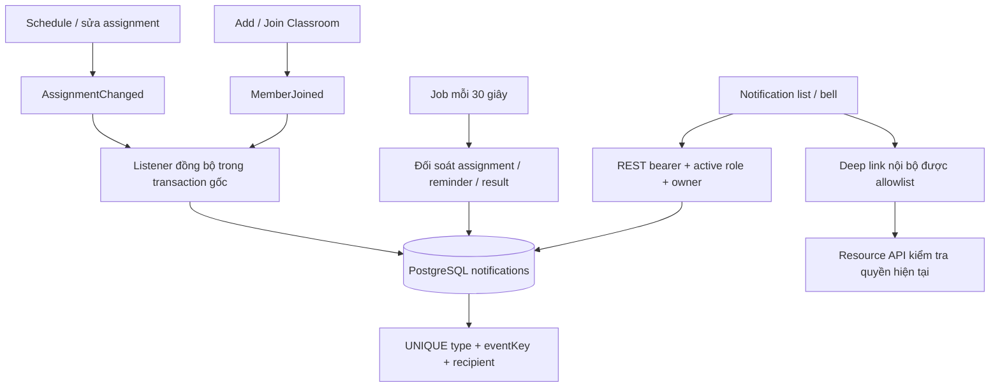

# F18 — In-app notifications

UC-NOTI-01..03; phụ thuộc Classroom F06, Session F11 và Result F15.

## Persistence và transaction

Migration V15 thêm `notifications` và `exam_sessions.scheduled_at`. Notification không
tham chiếu cascade-delete tới resource. FK recipient bảo toàn lịch sử. Index phục vụ
list theo `(recipient_id, created_at DESC, id DESC)` và unread count.

SessionService publish `AssignmentChanged` sau JPA flush. ClassroomService publish
`MemberJoined` sau flush membership. Listener dùng `Propagation.MANDATORY`, không async:
notification và nghiệp vụ commit/rollback cùng nhau. Join chỉ đối soát assignment của
người vừa tham gia; Schedule/update giới hạn theo Session. Module nguồn không phụ thuộc
service notification; notification nhận immutable event qua Spring ApplicationEvent.
Không có broker hoặc outbox.

Job dùng một transaction, đối soát persisted state; nếu lỗi DB sẽ rollback và retry chu kỳ
sau. `INSERT ... ON CONFLICT DO NOTHING` cùng unique constraint chống retry/race giữa job
và request hoặc nhiều instance. Không dùng check-then-insert trong Java. Result batch tối
đa 500 bản ghi mới/chu kỳ; anti-join bỏ các notification đã có để không bị kẹt trang đầu.

## Trigger và khóa chống trùng

| Type | Người nhận và thời điểm | Event key |
|---|---|---|
| EXAM_ASSIGNED | Active/onboarded PARTICIPANT được giao INDIVIDUAL hoặc thuộc ít nhất một lớp ACTIVE, khi Schedule/update hoặc mới đủ điều kiện trước endTime | Session ID |
| EXAM_REMINDER | Còn được giao, chưa bắt đầu; từ mốc startTime − 24h tới trước startTime | Session ID |
| RESULT_RELEASED | Chủ Attempt GRADED, active/onboarded PARTICIPANT và availability AVAILABLE | Attempt ID |
| CLASS_JOINED | Participant vừa được thêm/join và Creator chủ lớp (trùng user chỉ một thông báo) | Membership ID + thời điểm activation |

Một người thuộc nhiều lớp chỉ nhận một assignment/reminder mỗi Session. Leave/rejoin
không gửi lại assignment; activation mới có CLASS_JOINED mới. Retry membership ACTIVE
không tạo event. Mở thông báo cũ sau khi bị remove vẫn phải qua resource authorization.

PUBLIC không có broadcast assignment/reminder; vẫn thông báo kết quả cho đúng chủ Attempt.
DRAFT/CANCELLED/đã hết endTime không tạo assignment mới. Reminder bỏ qua cancelled,
removed, tài khoản khóa/mất role và kỳ thi đã bắt đầu. Schedule ở/sau mốc nhắc không
nhắc bù: cần `scheduledAt <= startTime − 24h` và assignment được ghi **trước** mốc nhắc.
Người được thêm muộn chỉ nhận assignment. Job trễ/restart được xử lý trong cửa sổ còn lại.
Nếu đổi startTime, dùng thời gian hiện tại nhưng vẫn tối đa một reminder mỗi Session.
Các Session có sẵn trước migration lấy migration time làm scheduledAt, không đoán thời
điểm quá khứ để gửi reminder bù.

Result predicate được kiểm tra bằng ma trận đối chiếu ResultVisibility: HIDDEN luôn bỏ;
IMMEDIATE sau chấm; AFTER_SESSION_END khi backend time >= endTime; MANUAL sau release.
Mỗi Attempt chỉ một notification, kể cả chấm sau release. Không gửi score, correct answer,
explanation hay thông tin kỹ thuật trong payload. Khi nâng cấp, các kết quả cũ đã đủ điều kiện nhưng chưa
có notification cũng được đối soát theo batch; createdAt là thời điểm tạo thông báo. Result và reminder có độ trễ mặc định
tối đa khoảng một chu kỳ 30 giây khi DB hoạt động và batch chưa đầy.

## API và giao diện

- `GET /api/v1/notifications?page=0&size=20&unreadOnly=false`: owner-only, newest first.
- `GET /api/v1/notifications/unread-count`: toàn bộ notification của user, không chỉ trang.
- `POST /api/v1/notifications/{id}/read`: idempotent, giữ readAt đầu tiên; foreign/missing 404.
- `POST /api/v1/notifications/read-all`: idempotent, chỉ owner; notification insert sau
  statement snapshot vẫn chưa đọc.

Access JWT, active/onboarded PARTICIPANT hoặc CREATOR, kiểm tra DB hiện tại. ADMIN đơn
thuần không có quyền nghiệp vụ. API chỉ nhận bearer, không xác thực bằng cookie; giữ
CSRF cho auth endpoints như trước. Pagination 0-based, size 1–100, contract OpenAPI.

`/notifications` dùng Master hiện có: card responsive, icon Lucide, nhãn Đã đọc/Chưa đọc,
checkbox lọc, phân trang, loading/empty/error/retry, báo lỗi mutation và chỉ đổi trạng thái
khi server xác nhận. Mở nội dung và đánh dấu đã đọc là hai action riêng.
Chuông trong shell poll count mỗi 30 giây khi tab visible; refresh khi focus/online,
sau mark-read, và khi đổi user. Lỗi count ẩn badge, không giả định count bằng 0.
Link được whitelist theo type + UUID ở client; backend sinh route cố định. Không truyền
URL arbitrary vào router. UI không tự cấp quyền tài nguyên.

Đã tra skill UI/UX Pro Max cho contextual live badge và Next.js client boundary.
Hai query Tailwind không có kết quả phù hợp; dùng Master cùng quy tắc responsive chung,
không áp gợi ý chưa được xác minh. Page giữ server composition, interaction dùng client
API với access token in-memory. Không thêm dependency.

## Giới hạn và kiểm chứng

Job assignment/reminder hiện đọc projection toàn bộ tập assignment đang hoạt động;
phù hợp quy mô monolith V1 hiện tại, chưa benchmark tập người dùng cực lớn. Assignment
notification có thể chậm một chu kỳ ở race join/schedule hoặc khôi phục role/tài khoản.
Không bảo đảm delivery tức thì qua WebSocket; không triển khai email.

Test tích hợp dùng PostgreSQL/Redis thật và mutable backend clock: ownership, auth,
pagination, idempotent read/all-read, rollback, nhiều lớp, late assignment, reminder
boundary, PUBLIC, cancelled/removed/locked, ma trận display/release policy và concurrent
jobs. Browser test dùng API thật cho assignment/result/class, read failure/retry,
pagination, empty/offline, deep link, keyboard và responsive.

Kết quả local ngày 07/10/2026: backend `mvnw.cmd -B verify` 191/191 test pass;
frontend lint/typecheck/build, 105 unit test và 2 browser F18 pass. Review ảnh 375/1440px;
browser kiểm tra thêm 768/1024/640×450, keyboard và reduced motion. OpenAPI parse 74 paths,
650 internal references. Chưa chạy CI remote, load benchmark hay toàn bộ screen reader.
