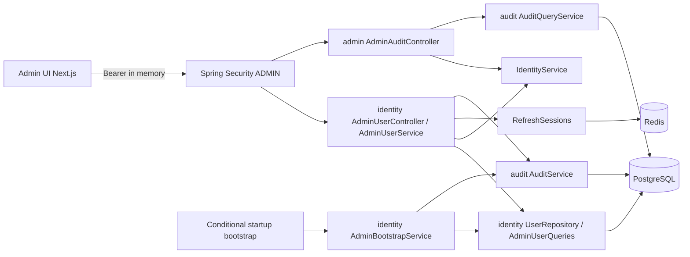
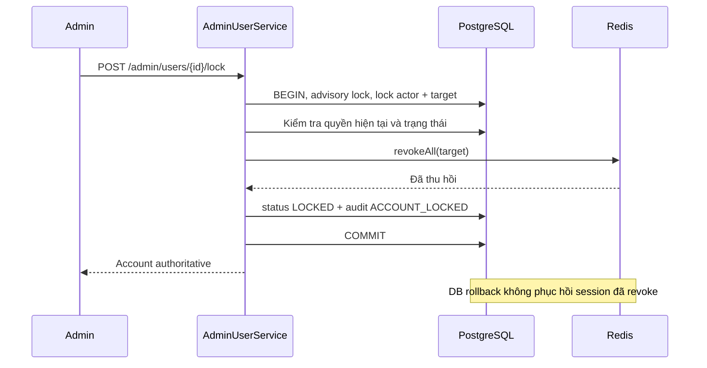

# F19 — Admin User Management và Audit UI

## Phạm vi và contract

UC-ADMIN-01..06, 08. Ba route `/admin/users`, `/admin/users/[userId]`,
`/admin/audit-logs` dùng API thật; thống kê dashboard thuộc F20.
HTTP contract: [OpenAPI](../api/openapi.yaml).

| API | Hành vi |
|---|---|
| `GET /api/v1/admin/users` | Search email/tên không phân biệt hoa thường, substring literal; filter role/status; phân trang |
| `GET /api/v1/admin/users/{id}` | Profile an toàn, roles, status, createdAt, onboardingCompleted |
| `POST .../{id}/lock` | ACTIVE → LOCKED, revoke refresh sessions, audit |
| `POST .../{id}/unlock` | LOCKED → ACTIVE, yêu cầu login lại, audit |
| `PUT .../{id}/roles` | Thay thế tập PARTICIPANT/CREATOR; bảo toàn ADMIN |
| `GET /api/v1/admin/audit-logs` | Lọc actorUserId/action/targetType/targetId/from/to; chỉ đọc |

Spring Security yêu cầu bearer có ADMIN; application kiểm tra account ACTIVE,
đã onboarding và role ADMIN hiện tại trong DB. ADMIN không suy ra PARTICIPANT/CREATOR.
Không dùng cookie để authorize API quản trị. API dùng bearer nên không yêu cầu CSRF;
cookie endpoints `/auth/**` vẫn giữ bảo vệ CSRF hiện có.

User sort `createdAt DESC, id DESC`; audit sort `occurredAt DESC, id DESC`.
Pagination dùng PageQuery/PageResponse hiện có (20 mặc định, tối đa 100).
Date range dùng `from <= occurredAt < to`, ISO-8601 có timezone; `from >= to` bị từ chối.
Actor/target là ID chính xác, không tự join thông tin identity vào audit lịch sử.
Không lưu lastLoginAt hiện tại nên UI không giả trường này.

## Tổ chức module

Quản trị User nằm trong identity vì module này sở hữu User, roles, credentials và
session. Module admin chỉ điều phối read audit với authorization; audit không phụ
thuộc identity. Query projection JDBC không expose JPA entity. Không thêm dependency.
V16 chỉ thêm index theo createdAt, status và role; không sửa migration cũ.

## Mutation, concurrency và bảo toàn lịch sử

- Admin mutation dùng PostgreSQL advisory transaction lock `190019`, rồi khóa actor
  và target User. Các mutation quản trị được tuần tự hóa, tránh hai Admin đồng thời
  khóa lẫn nhau; actor đã bị khóa không thể tiếp tục dùng JWT cũ cho Admin API.
- Không tự khóa chính mình. Không cho chuyển DISABLED bằng lock/unlock.
- Roles request chỉ chứa `roles`, tối đa hai role nghiệp vụ không trùng, không null.
  ADMIN trong request và field lạ bị reject. ADMIN đã có được giữ nguyên; tài khoản
  thường phải giữ ít nhất một role. Role thay thế là tập đầy đủ, không phải toggle.
  User chưa onboarding phải hoàn tất bước đó trước khi Admin sửa roles.
- Cùng trạng thái/tập role thì trả dữ liệu hiện tại, không ghi audit mới.
  Thay đổi thật ghi `ACCOUNT_LOCKED`, `ACCOUNT_UNLOCKED`, `ROLE_CHANGED` cùng transaction.
- Không delete User, identities, membership, question, exam, attempt, answer hay result.
  Đổi role không chuyển ownership và không viết lại lịch sử.
- Lock/unlock revoke tất cả refresh session trước khi commit trạng thái. Login local,
  Google session issuance và refresh giữ cùng row lock User khi kiểm tra ACTIVE và
  cấp/rotate session; không có cửa sổ tạo session mới vượt qua account lock.
- Redis không nằm trong PostgreSQL transaction: lỗi Redis ngăn DB commit; nếu revoke
  đã thành công nhưng DB/audit rollback, session vẫn bị thu hồi. Đây là fail-closed,
  người dùng có thể phải đăng nhập lại dù trạng thái tài khoản chưa đổi.
- V1 giữ JWT TTL 900 giây. Không thêm denylist access JWT. API có kiểm tra account/quyền
  hiện tại có thể chặn ngay; Start Attempt tiếp tục kiểm tra ACTIVE. Role claims được
  cập nhật khi refresh/login; không giả rằng mọi JWT đã phát hành bị thay đổi tức thì.

## Bootstrap ADMIN khi vận hành

Mặc định **tắt**. Không có endpoint bootstrap, email/password mặc định hay tự nâng role
tài khoản đăng ký sẵn. Chạy qua startup runner với các biến môi trường backend:

| Biến | Giá trị cần cung cấp |
|---|---|
| `ADMIN_BOOTSTRAP_ENABLED` | `true` cho lần khởi tạo có chủ đích |
| `ADMIN_BOOTSTRAP_EMAIL` | Email hợp lệ, được normalize lower/strip |
| `ADMIN_BOOTSTRAP_PASSWORD` | Secret riêng, 12–128 Unicode code points, không toàn khoảng trắng |
| `ADMIN_BOOTSTRAP_DISPLAY_NAME` | Tên 1–100 Unicode code points sau strip |

1. Trên database chưa có ADMIN, cấp các biến qua cơ chế secret/config của môi trường
   chạy backend; không nhập password vào command argument, log hoặc commit `.env`.
2. Khởi động backend. Runner tạo User ACTIVE chỉ có ADMIN và LOCAL identity hash theo
   PasswordEncoder hiện có; audit `ADMIN_BOOTSTRAPPED` có actor System, cùng transaction.
3. Đăng nhập bằng tài khoản đã cấu hình. Tắt `ADMIN_BOOTSTRAP_ENABLED`, gỡ password
   bootstrap khỏi cấu hình và khởi động lại theo quy trình vận hành của môi trường.

Thiếu/sai cấu hình làm startup thất bại bằng thông báo cố định không chứa secret.
Advisory lock bảo vệ nhiều instance startup đồng thời. Chạy lại với đúng email đã có
ADMIN là no-op: không đổi password, tên, roles hoặc status, không audit trùng.
Nếu email thuộc User thường, hoặc đã có ADMIN khác, runner từ chối; không dùng cơ chế
này để cấp ADMIN bổ sung, reset mật khẩu hoặc mở khóa. Các việc đó thuộc vận hành có
kiểm soát riêng, chưa có UI/API trong F19.

## Audit và metadata

Audit lưu immutable theo ứng dụng, không có update/delete API. Null actor biểu diễn
Hệ thống. Actor/target/timestamp/action luôn được giữ theo record đã ghi. Metadata
response dùng allowlist riêng cho từng action:

- Roles/status trước và sau; version/revision; số dòng import.
- ID User/membership và membership status cho thay đổi lớp.
- oldEndTime/newEndTime cho gia hạn Session.
- Action không có metadata được công bố trả `{}`.

Field lạ trong dữ liệu cũ hoặc field mới chưa được duyệt không tự xuất hiện trong API.
Không có password, token, raw entity, request body, đáp án hoặc join code trong UI.

## UI/UX

Kế thừa [Master](../../design-system/learnova/MASTER.md), không cần override mới.
Tra cứu UI/UX Pro Max: `keyboard focus confirmation dialog` (ux),
`client server components` (nextjs), `responsive table forms` (html-tailwind, không có
match), sau đó `responsive layout` có hướng dẫn padding/breakpoint phù hợp web.
Đọc tài liệu Next.js đi kèm package cho server/client boundary và Link; giữ page shell
ở server, authenticated interaction ở client với token in-memory.

- Toolbar form có label; filter/page nằm trên URL, giữ khi reload/back/forward.
- Table ở viewport rộng, card trên mobile/tablet; ID/email/action dài được wrap.
- Native dialog có focus trap, Escape, trả focus về trigger; khóa nút khi đang gửi.
- Roles/status chỉ báo thành công sau API xác nhận; lỗi mạng giữ lỗi và không giả saved.
- Audit chỉ đọc, metadata qua native details; date input dùng múi giờ trình duyệt,
  chuyển ISO timestamp khi gửi. Mốc đến là exclusive và được giải thích ngay tại form.
- Loading/empty/error/forbidden/not-found, retry, semantic tokens, reduced motion kế
  thừa Master. Không mock fallback, không thêm ADMIN checkbox.

## Kiểm chứng và giới hạn

Test mới `AdminIntegrationTests` dùng PostgreSQL 17/Redis Testcontainers: startup
bootstrap và chống takeover, auth/role isolation, pagination/search, role tampering,
lock/unlock/revoke, concurrent auth-vs-lock, idempotency, audit rollback và metadata
allowlist. `AttemptIntegrationTests` bổ sung bảo toàn một Attempt đã chấm khi khóa,
đổi role rồi mở khóa. Browser suite `npm run test:admin` dùng backend thật và bootstrap
credential ngẫu nhiên chỉ trong môi trường test.

Kết quả chạy cụ thể được ghi ở [kế hoạch V1](../plans/v1-feature-implementation-plan.md).
Chưa đo tải production hoặc kiểm thử screen reader thực. Search substring có thể scan
User; pagination và index giảm chi phí list/filter nhưng không thay thế benchmark.
Advisory lock quản trị đơn giản, phù hợp V1; không dùng nó cho các mutation nghiệp vụ khác.
