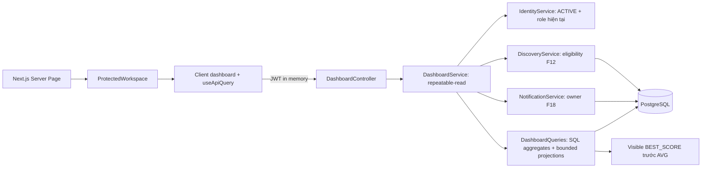

# F20 — Dashboard ba workspace

## Phạm vi và read model

`/participant`, `/creator`, `/admin` dùng ba API GET tương ứng
`/api/v1/{workspace}/dashboard`. Dashboard nằm trong module `reporting`, là read model,
không tạo domain/entity mới. Không thêm migration, cache, dependency hay job.

Service kiểm tra account ACTIVE và role hiện tại; ADMIN không bao hàm PARTICIPANT/CREATOR.
Principal quyết định actor, client không gửi ownerId. API trả `Cache-Control: no-store`;
transaction read-only REPEATABLE_READ giữ cùng snapshot persistence cho các widget.
DashboardQueries join dữ liệu qua JDBC, không truy cập entity/repository nội bộ module khác.
DiscoveryService tái sử dụng nguyên eligibility/capability của F12, gồm resume Attempt còn
hạn khi membership đã bị remove. State Session hiệu lực dùng giờ backend, không đợi scheduler.

## Semantics thống kê

- Participant: available/upcoming/completed dùng count và preview F12; in-progress còn
  deadline và Session không CANCELLED, sắp hết hạn trước. Hoàn thành gần đây chỉ chứa
  metadata, không chứa điểm kết quả chưa release. Notification chỉ của actor.
- Kết quả Participant: chỉ GRADED, mode khác HIDDEN và policy đã cho phép (IMMEDIATE,
  AFTER_SESSION_END với `now >= endTime`, MANUAL với releasedAt khác null). SQL lọc trước
  window/aggregate và LIMIT. Test đối chiếu toàn ma trận với ResultVisibility.
- Một Session đóng góp đúng một BEST_SCORE: raw score cao nhất; hòa điểm chọn submittedAt
  sớm hơn rồi ID. Điểm trung bình = AVG(bestRawScore / totalScore × 100), mỗi Session có
  trọng số bằng nhau, làm tròn numeric PostgreSQL 2 chữ số. Không có kết quả trả null,
  không giả điểm 0. Decimal qua HTTP là string; frontend chỉ hiển thị.
- Recent Results Participant là tối đa 5 BEST_SCORE được phép xem, sắp theo thời điểm
  hoàn tất của chính lượt tốt nhất; tổng số Session nhìn thấy tính trên toàn bộ dữ liệu.
- Creator: tổng Question/Exam bao gồm archived, phân bố Question theo DRAFT/ACTIVE/ARCHIVED.
  Active Session là SCHEDULED/OPEN có start <= now < end; upcoming là start > now.
  Người tham gia đếm distinct toàn bộ người đang được giao CLASS/INDIVIDUAL (trừ assignment
  của Session CANCELLED) hợp với người đã có Attempt trong các Session thuộc Creator.
  Có thể gồm assignment của DRAFT; người đã có history được giữ dù bị remove/lock.
  PUBLIC chỉ đóng góp người thực tế có Attempt. Không cộng role PARTICIPANT toàn hệ thống.
- Creator recent Exam theo updatedAt; recent Result là 5 lượt GRADED mới nhất thuộc
  Session của Creator, gồm kết quả chưa công bố cho Participant như F15.
- Admin: tổng User theo identity, role đếm độc lập và có thể chồng lấp; tổng Exam gồm archived,
  tổng Session gồm mọi state. “Tài khoản ACTIVE” chỉ account status, không phải online/last login.

Mỗi danh sách tối đa 5 mục; count aggregate không bị giới hạn theo preview. Người dùng
mở Xem tất cả tới danh sách hiện có để xem đầy đủ. Không nhận filter/pagination ở API dashboard.

## UI và kiểm chứng

Áp dụng Master F02, không cần override mới. Đã tra UI/UX Pro Max theo web keyboard/focus,
Next.js client data boundary và Tailwind responsive padding. Dùng token màu, LinkButton,
Badge, Skeleton và QueryState hiện có; page giữ Server Component, dữ liệu auth trong Client
Component, mỗi role có màn hình riêng. Card số liệu dùng tabular figures; empty state từng
section, request lỗi có retry, 403 hiển thị forbidden. Refetch khi quay lại tab và nút Làm mới.
Multi-role dùng switcher của shell, giữ nguyên session; children được key theo user ID.

Không dùng mock fallback. Kiểm thử backend có ma trận policy, BEST_SCORE/khác thang điểm,
null/0, role/account/ownership, membership removal, mốc deadline/start/end, giới hạn preview,
notification owner và dedup audience. Browser suite `npm run test:dashboard` dùng backend,
PostgreSQL/Redis thật, kiểm tra release/resume/switch/reload, deep link, empty/error/retry,
responsive 375/768/1024/1440px, viewport thấp và reduced motion.

## Giới hạn

Không phải realtime dashboard; reload/focus/Làm mới lấy snapshot mới. Discovery hiện chạy
count + bounded projection cho mỗi tab; read model không hydrate toàn bộ danh sách nhưng
SQL vẫn phải scan/aggregate tập khớp. Chưa benchmark dữ liệu production lớn. Không có
trend/time-series hoặc online-presence Admin trong F20. Kiểm chứng screen reader thực và
CI remote được bàn giao trong phạm vi F21.
