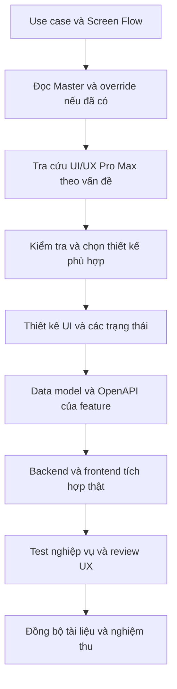

# Learnova — Workflow UI/UX Pro Max

## 1. Mục đích và nguồn quyết định

Learnova dùng [UI/UX Pro Max](../../.agents/skills/ui-ux-pro-max/SKILL.md) để thiết kế, xây dựng và review giao diện web trên Next.js App Router, React, TypeScript và Tailwind CSS.

Nguồn nghiệp vụ và kế hoạch:

- [Business Requirements](../requirements/business-requirements.md): scope và business rule.
- [Use Cases](../requirements/use-cases.md): actor, luồng chính và ngoại lệ.
- [Screen Flow](../requirements/screen-flow.md): màn hình, route, navigation và UI state.
- [OpenAPI](../api/openapi.yaml): HTTP contract giữa frontend/backend.
- [Kế hoạch V1](../plans/v1-feature-implementation-plan.md): dependency và nghiệm thu F01–F21.

Kết quả tra cứu skill là gợi ý, không phải requirement tự động được chấp thuận. Kiểm tra domain/category, kết quả ưu tiên và mức phù hợp với sản phẩm assessment trước khi sử dụng. Không tự thêm course, payment, AI hoặc thay đổi authentication, grading, authorization và result policy để phù hợp một mẫu UI.

F02 đã chốt theme sáng xanh dương và Plus Jakarta Sans hỗ trợ tiếng Việt tại
[Master](../../design-system/learnova/MASTER.md); app shell được mô tả trong
[kiến trúc F02](f02-frontend-foundation.md).

## 2. Quy trình theo từng feature



1. Đọc use case, route, role, business state và contract liên quan; xem code và package version thực tế.
2. Xác định phạm vi thiết kế: màn hình mới, component, lỗi UX hay review. Đọc design system hiện có trước khi tìm phong cách mới.
3. Chọn chế độ tra cứu nhỏ nhất giải quyết vấn đề. Query ngắn, một mục tiêu chính; không chứa dữ liệu cá nhân hoặc secret.
4. Kiểm tra gợi ý có phù hợp Learnova và nền tảng web. Nếu kết quả trống/lệch, thử lại một lần với query hẹp hơn; nếu vẫn không phù hợp, ghi rõ dùng hướng dẫn chung thay vì lưu kết quả chưa kiểm chứng.
5. Thiết kế loading, empty, validation, forbidden, network error và trạng thái nghiệp vụ. Mock chỉ dùng để review UI trước khi API sẵn sàng, tách khỏi luồng production.
6. Hoàn thiện data model, OpenAPI, backend và frontend của feature theo dependency. Không cần dựng toàn bộ 39 màn hình trước khi tích hợp backend.
7. Chạy kiểm tra phù hợp, review UX và đồng bộ tài liệu. Backend vẫn quyết định quyền, deadline, state và dữ liệu kết quả được phép trả.

## 3. Công cụ tra cứu local

Chạy từ root repository. Windows dùng Python 3; script chỉ dùng standard library và dữ liệu local, không cần cài npm/pip package để sử dụng skill.

```powershell
python --version
python -B -X utf8 .agents/skills/ui-ux-pro-max/scripts/search.py "keyboard focus modal" --domain ux -n 3
python -B -X utf8 .agents/skills/ui-ux-pro-max/scripts/search.py "client server components" --stack nextjs -n 3
python -B -X utf8 .agents/skills/ui-ux-pro-max/scripts/search.py "responsive layout" --stack html-tailwind -n 3
```

`-B` tránh tạo bytecode cache; `-X utf8` giúp xuất tiếng Việt ổn định trên Windows. Nếu thiếu Python, không tự cài phần mềm hệ thống: báo người dùng theo hướng dẫn skill. Nếu người dùng chọn không cài, dùng Quick Reference và ghi rõ chưa chạy CLI.

Chọn query theo công việc:

| Công việc | Chế độ |
|---|---|
| Chốt hướng thiết kế toàn sản phẩm ở F02 | `--design-system` |
| Focus, form error, accessibility hoặc interaction cụ thể | `--domain ux` |
| Server/Client Components và hướng dẫn Next.js | `--stack nextjs` |
| Layout responsive và styling Tailwind | `--stack html-tailwind` |
| Biểu đồ cho reporting | `--domain chart` |

Đọc phạm vi áp dụng và phiên bản của kết quả. Dataset có thể khác phiên bản trong `package.json`; không coi nó là bằng chứng API framework hiện tại. Giữ Next.js layout/static composition ở server và authenticated interaction ở client phù hợp với access token in-memory. Không chuyển auth sang BFF chỉ vì một gợi ý tra cứu.

Không áp dụng đơn vị native như pt/dp, haptics hoặc Dynamic Type làm yêu cầu web. Kiểm tra web bằng CSS px, keyboard, browser zoom và responsive viewport. Không tự cài thư viện UI/icon/chart hoặc mở rộng scope dark mode chỉ vì kết quả đề xuất.

## 4. Design system ở F02

Master đã được tạo ở F02. Override chỉ tạo khi feature có khác biệt thực sự;
F02 chưa có override trong `pages/`:

```text
design-system/learnova/MASTER.md
design-system/learnova/pages/<screen-name>.md
```

Master ghi quyết định toàn sản phẩm: typography hỗ trợ tiếng Việt, semantic color tokens, spacing, layout, component states, icon consistency, motion và accessibility. Quy tắc riêng cho Exam Taking hoặc Monitoring chỉ đặt trong override khi có khác biệt thực sự.

Quy trình tạo: tra cứu không ghi file trước, review kết quả theo requirement, sau đó mới lưu. Ví dụ khởi đầu tại root repository:

```powershell
python -B -X utf8 .agents/skills/ui-ux-pro-max/scripts/search.py "assessment dashboard accessible" --design-system -p "Learnova" -f markdown
```

Chỉ sau khi đã kiểm tra kết quả phù hợp, dùng cùng query đã kiểm chứng để persist:

```powershell
python -B -X utf8 .agents/skills/ui-ux-pro-max/scripts/search.py "assessment dashboard accessible" --design-system --persist -p "Learnova" --output-dir "."
```

Nếu query ví dụ không phù hợp, không persist nó; dùng query đã được kiểm tra lại. `--output-dir "."` chỉ đúng khi đang ở root repository. Không dùng `--force` để ghi đè file đã có mà chưa đọc và có authorization tương ứng.

Thứ tự đọc khi triển khai màn hình:

1. Đọc `MASTER.md` nếu đã tồn tại.
2. Đọc override đúng màn hình nếu đã tồn tại; override chỉ ưu tiên cho phần thiết kế được mô tả riêng.
3. Phần còn lại kế thừa Master. Business rule, screen flow và API contract không bị override bởi design system.

Không tạo hàng loạt file override rỗng. CSS variables/Tailwind tokens và component thực tế được triển khai ở F02 theo quyết định đã chốt; tài liệu Master không thay thế code.

## 5. Giao việc và nghiệm thu UI

Mỗi task UI cần nêu feature/use case, actor, route, business state, dữ liệu được phép thấy, action, navigation và contract đã có. Đọc Master/override nếu tồn tại, chỉ tra cứu các vấn đề liên quan rồi triển khai trong phạm vi task.

Checklist cho feature có giao diện:

- [ ] Bám screen flow, role và API; không thêm feature từ template hoặc gợi ý skill.
- [ ] Dùng semantic tokens và component nhất quán với Master/override đã chốt.
- [ ] Form có label và lỗi liên kết field; icon button có accessible name; status không chỉ biểu đạt bằng màu.
- [ ] Keyboard hoạt động, focus nhìn thấy và không bị sticky UI che; dialog có focus management; reorder có cách thay thế drag.
- [ ] Responsive ở viewport nhỏ, tablet và desktop; browser zoom không làm mất action hoặc nội dung quan trọng.
- [ ] Kiểm tra contrast của text/control và các state trên theme thực tế được triển khai.
- [ ] Tôn trọng reduced motion; animation không chặn thao tác hoặc quyết định business state.
- [ ] Exam Taking giữ timer, autosave state, navigation và Submit dễ truy cập; không báo Saved trước khi backend xác nhận.
- [ ] Không đưa đáp án đúng vào active Attempt hoặc kết quả chưa được policy cho phép; không có mock fallback trong luồng thật.
- [ ] Chạy lint/build và test hành vi phù hợp khi sửa code; ghi rõ kiểm tra đã chạy và giới hạn chưa kiểm chứng.

Thay đổi chỉ gồm tài liệu cần kiểm tra liên kết, encoding, tính nhất quán và diff; không bắt buộc chạy build ứng dụng. Hướng dẫn agent local có thể bị Git ignore; tài liệu workflow này và README giữ hướng dẫn dùng chung có thể version-control.
