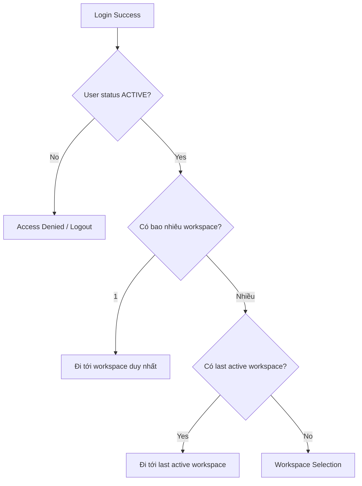
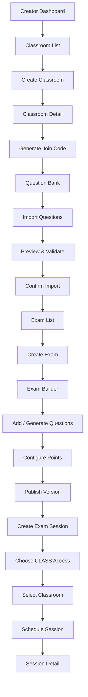
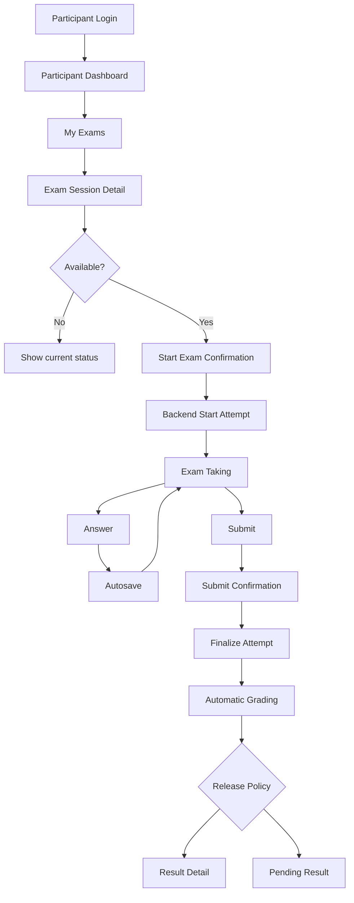

# Learnova - Screen Flow

> Phiên bản: V1  
> Nguồn chính: `business-requirements.md` và `use-cases.md`  
> Định hướng: **Online Assessment & Examination Platform**  
> Role chính thức: **PARTICIPANT**, **CREATOR**, **ADMIN**

---

# 1. Mục đích tài liệu

Tài liệu này chuyển Business Requirements và Use Cases của Learnova thành:

- Danh sách màn hình.
- Route đề xuất.
- Luồng điều hướng.
- Điều kiện truy cập màn hình.
- Trạng thái màn hình theo business state.
- Action chính trên từng màn hình.
- Quan hệ giữa các màn hình.
- Mapping từ Use Case sang Screen.

Tài liệu này là cầu nối giữa:

```text
business-requirements.md
        ↓
use-cases.md
        ↓
screen-flow.md
        ↓
UI/UX Pro Max: thiết kế UI theo feature
        ↓
ERD
        ↓
OpenAPI
        ↓
Implementation
```

`screen-flow.md` không thay thế Business Requirements hoặc Use Case.

Áp dụng [workflow UI/UX Pro Max](../architecture/ui-ux-workflow.md) theo từng feature và dependency trong [kế hoạch V1](../plans/v1-feature-implementation-plan.md).

Nếu UI cần thêm một flow làm thay đổi business rule, phải cập nhật tài liệu nghiệp vụ tương ứng.

---

# 2. Nguyên tắc thiết kế Screen Flow

## 2.1. Một User có thể có nhiều role

Một User có thể đồng thời có:

```text
PARTICIPANT
CREATOR
```

Do đó UI không được thiết kế theo kiểu:

```text
1 account = 1 loại giao diện cố định
```

Mà sử dụng khái niệm:

```text
Workspace
```

Ví dụ:

```text
Participant Workspace
Creator Workspace
Admin Workspace
```

Một User có nhiều role có thể chuyển Workspace mà không cần logout/login lại.

---

## 2.2. Business state quyết định UI action

Frontend có thể ẩn/disable button để UX rõ hơn.

Nhưng:

> Backend vẫn là source of truth về authorization và business rule.

Ví dụ:

```text
ExamVersion = PUBLISHED
```

UI không hiển thị Edit Content.

Nhưng backend vẫn phải từ chối request sửa trực tiếp nếu client cố gọi API.

---

## 2.3. Không tạo màn hình từ gợi ý thiết kế nếu không có Use Case

Ví dụ không tự thêm:

```text
Courses
Lessons
Certificates
Marketplace
Chat
Forum
Payment
AI Tutor
```

vì không thuộc Learnova V1.

---

## 2.4. Route trong tài liệu là đề xuất frontend

Route có thể điều chỉnh khi triển khai Next.js nhưng nên giữ cấu trúc logic tương đương.

---

# 3. App Structure tổng thể

```text
Guest
│
├── Login
├── Register
└── Google Authentication
        ↓
Authenticated User
        ↓
Workspace Resolution
        ├── Participant Workspace
        ├── Creator Workspace
        └── Admin Workspace
```

Shared authenticated features:

```text
Profile
Notifications
Workspace Switcher
Logout
```

---

# 4. Route Map đề xuất

## Trạng thái triển khai sau F03

F02 tạo nền tảng UI; F03 kết nối Local auth thật tại `/login`, `/register` và `/workspaces`.
Các entry `/participant`, `/creator`, `/admin`, `/profile`, `/notifications` chờ auth bootstrap;
không có phiên hợp lệ chuyển Login, lỗi mạng có retry, thiếu role hiển thị forbidden.
Sau auth, màn hình nghiệp vụ chưa triển khai giữ “Tính năng đang được hoàn thiện”.

`/dev/workspace-preview` chỉ chạy development, production trả HTTP 404. Preview có
fixture gắn nhãn rõ, chọn tập role/workspace/UI state; không tạo token hoặc gọi API nghiệp vụ.
Shell dùng sidebar từ 1024px, drawer trên màn hình nhỏ, switcher chỉ có các role được cấp;
ADMIN không tự có PARTICIPANT/CREATOR. Trong preview, thiếu role hiển thị forbidden.
Mục nghiệp vụ chưa có được disable kèm “Sắp có”; Monitoring/Reports chưa có route riêng.
F03 kết nối User thật, switch workspace theo roles; không thay business rule.

Chi tiết: [kiến trúc F02](../architecture/f02-frontend-foundation.md),
[Design system Master](../../design-system/learnova/MASTER.md).

## 4.1. Authentication

| Route | Screen |
|---|---|
| `/login` | Login |
| `/register` | Register |
| `/auth/google/callback` | Google Auth Processing |
| `/onboarding/roles` | Role Onboarding |
| `/auth/link-account` | Link Existing Account |

---

## 4.2. Participant Workspace

| Route | Screen |
|---|---|
| `/participant` | Participant Dashboard |
| `/participant/exams` | My Exams |
| `/participant/exams/[sessionId]` | Exam Session Detail |
| `/participant/attempts/[attemptId]` | Exam Taking |
| `/participant/results` | Exam History / Results |
| `/participant/results/[attemptId]` | Result Detail |
| `/participant/classes` | My Classes |
| `/participant/classes/join` | Join Classroom |

---

## 4.3. Creator Workspace

| Route | Screen |
|---|---|
| `/creator` | Creator Dashboard |
| `/creator/questions` | Question Bank |
| `/creator/questions/new` | Create Question |
| `/creator/questions/[questionId]` | Question Detail |
| `/creator/questions/[questionId]/edit` | Edit Question |
| `/creator/questions/import` | Import Questions |
| `/creator/classes` | Classroom List |
| `/creator/classes/new` | Create Classroom |
| `/creator/classes/[classId]` | Classroom Detail |
| `/creator/exams` | Exam List |
| `/creator/exams/new` | Create Exam |
| `/creator/exams/[examId]` | Exam Detail / Version History |
| `/creator/exams/[examId]/versions/[versionId]/edit` | Exam Builder |
| `/creator/sessions` | Exam Session List |
| `/creator/sessions/new` | Create Exam Session |
| `/creator/sessions/[sessionId]` | Exam Session Detail |
| `/creator/sessions/[sessionId]/edit` | Edit Exam Session |
| `/creator/sessions/[sessionId]/monitor` | Realtime Monitoring |
| `/creator/sessions/[sessionId]/results` | Session Results |
| `/creator/sessions/[sessionId]/analytics` | Session Analytics |

---

## 4.4. Admin Workspace

| Route | Screen |
|---|---|
| `/admin` | Admin Dashboard |
| `/admin/users` | User Management |
| `/admin/users/[userId]` | User Detail |
| `/admin/audit-logs` | Audit Log |

---

## 4.5. Shared Authenticated Routes

| Route | Screen |
|---|---|
| `/profile` | Profile |
| `/notifications` | Notifications |

---

# 5. Global Navigation

## 5.1. Participant Navigation

```text
Dashboard
My Exams
Results
My Classes
Notifications
Profile
```

---

## 5.2. Creator Navigation

```text
Dashboard
Question Bank
Exams
Exam Sessions
Classes
Monitoring
Reports
Notifications
Profile
```

`Monitoring` có thể dẫn tới danh sách Session đang `OPEN`.

`Reports` có thể dẫn tới Session Results / Analytics.

---

## 5.3. Admin Navigation

```text
Dashboard
Users
Audit Logs
Profile
```

---

# 6. Workspace Switcher

Hiển thị khi User có nhiều hơn một role hợp lệ.

Ví dụ:

```text
Current Workspace: Creator

Switch to:
- Participant
```

Nếu User có:

```text
PARTICIPANT + CREATOR
```

thì switch trực tiếp.

Nếu User chỉ có một role:

- Không cần bắt buộc hiển thị Workspace Switcher.

Nếu có `ADMIN`, Admin Workspace chỉ hiển thị khi User thực sự có role đó.

---

# 7. Flow sau Login



Quyết định UI:

- Nếu User có nhiều role, ưu tiên nhớ Workspace gần nhất.
- Không yêu cầu chọn role mỗi lần đăng nhập.

F03 dùng `/workspaces` khi chưa có preference hợp lệ. Preference lưu theo User ID,
chỉ giữ workspace, không lưu token. `returnTo` chỉ chấp nhận route nội bộ phù hợp roles;
reject URL ngoài, dot segments và encoded traversal. API vẫn quyết định authorization.
Đăng ký thành công chuyển `/login?registered=1`, không tự login.
User menu có logout và logout-all với xác nhận; lỗi thu hồi server được hiển thị rõ và có retry.
Các POST auth phối hợp Web Locks giữa tabs; reload bootstrap bằng refresh cookie.

Đây là quyết định UX, không thay đổi business role.

---

# 8. Authentication Screens

F04 cung cấp Google Login qua backend. Action Google đọc trạng thái cấu hình từ API;
khi backend chưa bật, hiển thị disabled cùng thông báo chưa cấu hình. Không có mock fallback.

# 8.1. Login Screen

**Route**

```text
/login
```

**Actor**

```text
Guest
```

**Use Case**

```text
UC-AUTH-02
UC-AUTH-03
```

**Thành phần chính**

```text
Logo Learnova

Email
Password

[Login]

[Continue with Google]

Create account
```

**Action**

### Login local

```text
Input credentials
        ↓
Submit
        ↓
Success
        ↓
Workspace Resolution
```

### Google

```text
Continue with Google
        ↓
Google OAuth
        ↓
Callback
```

**Error State**

```text
Invalid email/password
Account locked
Account disabled
Network error
```

Không tiết lộ quá chi tiết thông tin gây account enumeration.

---

# 8.2. Register Screen

**Route**

```text
/register
```

**Actor**

```text
Guest
```

**Use Case**

```text
UC-AUTH-01
```

**Fields**

```text
Display Name
Email
Password
Confirm Password
```

**Role Selection**

UI wording nên thân thiện hơn enum:

```text
Bạn muốn sử dụng Learnova để làm gì?

○ Làm bài kiểm tra
○ Tạo và tổ chức bài kiểm tra
○ Cả hai
```

Mapping:

```text
Làm bài
→ PARTICIPANT

Tạo đề
→ CREATOR

Cả hai
→ PARTICIPANT + CREATOR
```

Không hiển thị option:

```text
ADMIN
```

**Flow**

```text
Register
   ↓
Success
   ↓
Login
```

V1 có thể redirect về Login sau đăng ký.

---

# 8.3. Google Auth Processing

**Route**

```text
/auth/google/callback
```

Không phải màn hình business chính.

Hiển thị state ngắn:

```text
Signing you in...
```

Flow:

```text
Google Callback
        ↓
Existing linked identity?
        ├── Yes → Auth session → App
        └── No
             ↓
        Email already exists?
        ├── Yes → Link Existing Account
        └── No → Role Onboarding
```

Backend nhận OAuth callback riêng tại `/api/v1/auth/google/callback`, sau đó redirect
về route frontend này. Frontend đọc flow tạm; nếu không còn flow, dùng shared refresh
để nhận Learnova access token. Không đọc token/identity từ URL. Identity đã có nhưng
chưa onboarding tiếp tục Role Onboarding, chưa được cấp session.
Callback lỗi có thông báo an toàn, action đăng nhập Google lại và về Local Login.

---

# 8.4. Role Onboarding

**Route**

```text
/onboarding/roles
```

**Khi sử dụng**

Google User mới chưa chọn role.

**Nội dung**

```text
Bạn muốn dùng Learnova để:

[ Làm bài kiểm tra ]
[ Tạo và tổ chức bài kiểm tra ]
[ Cả hai ]
```

Sau khi chọn:

```text
Save roles
   ↓
Create/complete account
   ↓
Workspace
```

Reload đọc lại pending flow từ server; chọn role không cấp ADMIN. Hiển thị loading/error
và nút Hủy; hết hạn thì yêu cầu đăng nhập lại. Lỗi mất response có action tải lại trạng thái.

---

# 8.5. Link Existing Account

**Route**

```text
/auth/link-account
```

**Khi sử dụng**

Google email trùng Local account nhưng chưa link.

**Mục tiêu**

Không tự động link identity.

**Flow**

```text
Google identity recognized
        ↓
Existing local email
        ↓
Thông báo account đã tồn tại
        ↓
Verify current account
        ↓
Confirm Link
        ↓
Google Identity linked
        ↓
Continue
```

UI cần tránh gây hiểu nhầm rằng tạo tài khoản mới.

Bước đầu hiển thị email từ flow server và ô mật khẩu Local. Xác minh thành công chuyển
sang màn xác nhận riêng, chưa tạo identity. Reload giữ bước xác nhận khi flow còn hiệu lực.
Chỉ nút “Xác nhận liên kết Google” mới link. Có Hủy, lỗi cạnh field và error summary nhận
focus. Giới hạn 5 lần xác minh mỗi flow, TTL 10 phút; flow mới thay thế flow tạm cũ.

---

# 9. Shared Authenticated Shell

Các Workspace sử dụng App Shell chung:

```text
Sidebar / Navigation
Topbar
Workspace Switcher
Notification Button
User Menu
Main Content
```

Topbar có thể gồm:

```text
Workspace Name
Notification Bell
Avatar
```

User Menu:

```text
Profile
Switch Workspace
Logout
```

---

# 10. Profile Screen

**Route**

```text
/profile
```

**Actor**

```text
Participant
Creator
Admin
```

**Use Case**

```text
UC-USER-01
UC-USER-02
UC-USER-03
```

**Sections**

```text
Personal Information
Roles
Security
```

Editable V1:

```text
displayName
avatarUrl
```

Read-only:

```text
email
roles
status
```

Actions:

```text
Save Profile
Change Password
Logout All Devices
```

Email change không có trong V1.

F05: `/profile` tải hồ sơ bằng API thật, có loading và lỗi kèm nút thử lại. Form chỉ báo
đã lưu sau response thành công, đồng bộ tên/avatar trên workspace. URL ảnh lỗi dùng chữ cái
đầu tên; URL chỉ tải tại browser, không gửi qua image optimizer phía server.

Form có lỗi tại field và error summary được focus, giữ dữ liệu khi mạng lỗi. Tên dài 1–100
Unicode code point; avatar HTTPS hoặc để trống để xóa. Không hỗ trợ upload ảnh trong V1.

Chỉ hiển thị Change Password khi backend trả `hasLocalIdentity=true`; Google-only hiển thị
giải thích. Yêu cầu mật khẩu hiện tại, mật khẩu mới 12–128 Unicode code point và xác nhận khớp.
Thành công xóa các ô password, giữ phiên hiện tại và thông báo thu hồi refresh session khác.
Không tự retry đổi mật khẩu khi mất response; hiển thị hướng dẫn khi chưa xác nhận kết quả.

Logout All Devices mở hộp thoại xác nhận, hỗ trợ Hủy/Escape và trả focus về nút mở.
Thành công trở về login; thất bại không báo đã thu hồi phiên thành công.

---

# 11. Notifications Screen

**Route**

```text
/notifications
```

**Actor**

```text
Participant
Creator
```

**Use Case**

```text
UC-NOTI-01
UC-NOTI-02
UC-NOTI-03
```

**List Item**

```text
Icon
Title
Message
Created At
Read / Unread
```

Actions:

```text
Mark as Read
Mark All as Read
Open related resource
```

Ví dụ navigation:

```text
EXAM_ASSIGNED
→ Exam Session Detail

RESULT_RELEASED
→ Result Detail

CLASS_JOINED
→ Classroom
```

---

# 12. Participant Workspace

# 12.1. Participant Dashboard

**Route**

```text
/participant
```

**Use Cases**

Dashboard tổng hợp từ Exam, Attempt, Result, Notification.

**Widgets**

```text
Upcoming Exams
Available Exams
In-progress Attempt
Recently Completed
Recent Results
Average Score
Notifications
```

**Primary Actions**

```text
Continue Exam
Start Exam
View Result
View All Exams
Join Class
```

**Flow**

```text
Dashboard
├── Available Exam → Exam Detail
├── In-progress Attempt → Exam Taking
├── Result → Result Detail
└── Join Class → Join Classroom
```

---

# 12.2. My Exams

**Route**

```text
/participant/exams
```

**Use Cases**

```text
UC-PARTEXAM-01
UC-PARTEXAM-02
UC-PARTEXAM-03
UC-PARTEXAM-04
UC-PARTEXAM-05
```

**Tabs**

```text
Available
Upcoming
Completed
Expired
```

Optional:

```text
All
```

Mỗi card/row:

```text
Exam Title
Creator
Start Time
End Time
Duration
Attempts Used / Max Attempts
Access Type
Status
```

Primary action phụ thuộc trạng thái:

| State | Action |
|---|---|
| Available + no active attempt | Start Exam |
| Available + active attempt | Continue |
| Upcoming | View Details |
| Completed | View Result / Details |
| Expired | View Details |

---

# 12.3. Exam Session Detail - Participant

**Route**

```text
/participant/exams/[sessionId]
```

**Use Case**

```text
UC-PARTEXAM-06
UC-PARTEXAM-07
```

**Hiển thị**

```text
Exam Title
Description
Creator
Start Time
End Time
Duration
Question Count
Total Score
Passing Score
Max Attempts
Attempts Used
Access Type
Session Status
```

Không hiển thị:

```text
Correct Answer
Question content đầy đủ trước khi Attempt bắt đầu nếu business chưa yêu cầu preview
```

**Primary CTA**

Theo state:

```text
Start Exam
Continue Exam
View Result
Unavailable
```

**Start Confirmation Dialog**

Trước khi bắt đầu có thể hiển thị:

```text
Duration
Deadline rule
Max Attempts
Autosave notice
Submit notice
```

Button:

```text
Cancel
Start Now
```

Backend vẫn re-check toàn bộ rule khi Start.

---

# 12.4. Exam Taking Screen

**Route**

```text
/participant/attempts/[attemptId]
```

Đây là màn hình quan trọng nhất của Participant.

**Use Cases**

```text
UC-ATTEMPT-01
UC-ATTEMPT-02
UC-ATTEMPT-03
UC-ATTEMPT-04
UC-ATTEMPT-05
UC-ATTEMPT-06
UC-ATTEMPT-07
```

## Layout đề xuất

```text
┌─────────────────────────────────────────────────────┐
│ Exam Title          Saving...       Time: 32:14     │
├───────────────────────────────────────┬─────────────┤
│                                       │ Navigator   │
│ Question 12 / 40                      │ 1  2  3  4  │
│                                       │ 5  6  7 ... │
│ Question Content                      │             │
│                                       │ Legend      │
│ Options / Numeric Input               │ Answered    │
│                                       │ Review      │
│ [Mark for Review]                     │ Unanswered  │
│                                       │             │
│ [Previous]                [Next]      │ [Submit]    │
└───────────────────────────────────────┴─────────────┘
```

## Header

```text
Exam Title
Autosave status
Server-derived countdown
```

## Question Navigator states

```text
Current
Answered
Unanswered
Marked for Review
```

Không xem màu sắc là business rule.

## Autosave State

```text
Idle
Saving...
Saved
Save failed - retrying
```

## Reload Flow

```text
Reload
  ↓
Auth refresh nếu cần
  ↓
Fetch active Attempt
  ↓
Restore:
- answers
- review marks
- question order
- option order
- deadline
```

## Security Rule

Active Attempt API không được trả:

```text
correctAnswer
isCorrect
explanation
```

## Deadline reached

```text
Timer = 0
   ↓
Disable further answer edits
   ↓
System finalize
   ↓
Redirect Finalization State
```

Không phụ thuộc timer frontend để xác định thực tế hết giờ.

---

# 12.5. Submit Confirmation Dialog

Không cần route riêng.

Khi Participant bấm Submit:

```text
Submit Exam?
```

Hiển thị:

```text
Answered: 35
Unanswered: 3
Marked for Review: 2
```

Actions:

```text
Continue Exam
Submit
```

Sau Confirm:

```text
Submit Request
    ↓
Submitting...
    ↓
Success
```

Button Submit phải disabled trong request.

Tuy nhiên backend vẫn phải idempotent.

---

# 12.6. Finalization State

Sau khi submit/auto-finalize:

```text
Your exam has been submitted.
```

Điều hướng phụ thuộc Result Release Policy.

### IMMEDIATE

```text
View Result
```

### AFTER_SESSION_END

```text
Result will be available after session ends.
Back to My Exams
```

### MANUAL

```text
Result has not been released yet.
Back to My Exams
```

---

# 12.7. Results / Exam History

**Route**

```text
/participant/results
```

**Use Case**

```text
UC-RESULT-03
```

Table/Card:

```text
Exam
Session
Completed Date
Attempts
Best Score
Pass/Fail
Result Availability
```

Actions:

```text
View Result
View Exam Details
```

Nếu chưa release:

```text
Pending Release
```

---

# 12.8. Result Detail

**Route**

```text
/participant/results/[attemptId]
```

**Use Case**

```text
UC-RESULT-02
```

Màn hình render theo `resultDisplayMode`.

### HIDDEN

Không cho vào Result Detail có nội dung.

State:

```text
Result is not available.
```

### SCORE_ONLY

```text
Score
Pass / Fail
```

### SUMMARY

```text
Score
Pass / Fail
Correct
Incorrect
Unanswered
Duration
Attempt Number
```

### DETAILED

Thêm:

```text
Question
Your Answer
Correct Answer
Explanation
Points
```

Backend quyết định dữ liệu nào được trả.

Frontend không tự suy ra correct answer từ dữ liệu cũ.

---

# 13. Participant Classroom Screens

# 13.1. My Classes

**Route**

```text
/participant/classes
```

**Use Case**

```text
UC-CLASS-10
UC-CLASS-11
```

Card:

```text
Class Name
Creator
Joined At
Upcoming Exams
```

Action:

```text
View
Leave Class
```

Class detail có thể dùng Drawer/Detail state trong cùng page V1 nếu dữ liệu đơn giản.

Không bắt buộc tạo route class detail riêng cho Participant.

F06 dùng dialog xem thông tin lớp và dialog xác nhận rời lớp; danh sách có phân trang,
chỉ hiển thị membership ACTIVE. Upcoming Exams được bổ sung khi tích hợp Session ở F11–F12,
không hiển thị số liệu giả hoặc số 0 khi tính năng chưa có.

---

# 13.2. Join Classroom

**Route**

```text
/participant/classes/join
```

**Use Case**

```text
UC-CLASS-09
```

Input:

```text
Join Code
```

Flow:

```text
Enter Code
  ↓
Validate
  ↓
Show Class Summary
  ↓
Join
  ↓
Success
```

Errors:

```text
Invalid code
Expired
Revoked
```

Đã tham gia là trạng thái thành công, không phải lỗi: hiển thị link về My Classes.
Thay đổi mã nhập sẽ xóa preview cũ; khi xác nhận join, backend kiểm tra lại mã.
Membership REMOVED có thể tham gia lại bằng mã còn hợp lệ.

---

# 14. Creator Workspace

# 14.1. Creator Dashboard

**Route**

```text
/creator
```

**Widgets**

```text
Total Questions
Total Exams
Active Sessions
Total Participants
Upcoming Sessions
Recent Exams
Recent Results
Question Bank Statistics
```

Quick Actions:

```text
Create Question
Import Questions
Create Exam
Create Session
Open Monitoring
```

Navigation:

```text
Active Session
→ Monitoring

Recent Exam
→ Exam Detail

Recent Result
→ Session Results
```

---

# 15. Creator Classroom Screens

# 15.1. Classroom List

**Route**

```text
/creator/classes
```

**Use Case**

```text
UC-CLASS-02
```

Hiển thị:

```text
Name
Active Participants
Join Code Status
Upcoming Sessions
Updated At
```

Actions:

```text
Create Class
Open Class
```

---

# 15.2. Create Classroom

**Route**

```text
/creator/classes/new
```

Fields:

```text
Name
Description
```

Flow:

```text
Create
  ↓
Class Detail
```

---

# 15.3. Classroom Detail

**Route**

```text
/creator/classes/[classId]
```

**Use Cases**

```text
UC-CLASS-03
UC-CLASS-04
UC-CLASS-05
UC-CLASS-06
UC-CLASS-07
UC-CLASS-08
```

Recommended tabs:

```text
Overview
Participants
Exam Sessions
```

F06 triển khai Tổng quan và Thành viên; sửa tên/mô tả ngay trong Tổng quan.
Exam Sessions và Upcoming Sessions trong danh sách lớp được tích hợp ở F11.
Danh sách lớp có tìm theo tên và phân trang. Danh sách thành viên có tìm tên/email,
lọc ACTIVE/REMOVED/tất cả và phân trang; F06 dùng card responsive thay bảng rộng.
Thêm Participant yêu cầu email đầy đủ, xác nhận thông tin tìm được rồi gửi userId.
Tạo lại/thu hồi mã có dialog xác nhận; chỉ owner thấy mã đang còn hiệu lực.

## Overview

```text
Name
Description
Join Code
Join Code Expiry
Participant Count
```

Actions:

```text
Edit Class
Regenerate Join Code
Revoke Join Code
```

## Participants

Table:

```text
Display Name
Email
Membership Status
Joined At
```

Actions:

```text
Add Participant
Remove Participant
```

### Add Participant Dialog

```text
Search by Email
  ↓
Select User
  ↓
Add
```

Backend receives `userId`.

### Remove Confirmation

Explain:

```text
Participant will lose permission to start new attempts from this class.
Historical attempts/results will be preserved.
An attempt already in progress can still be completed.
```

---

# 16. Question Bank Screens

# 16.1. Question Bank List

**Route**

```text
/creator/questions
```

**Use Cases**

```text
UC-QB-02
UC-QB-07
```

Toolbar:

```text
Search
Type Filter
Difficulty Filter
Tag Filter
Category Filter
Status Filter
```

Actions:

```text
Create Question
Import Excel
```

Table/Card:

```text
Content Preview
Type
Difficulty
Category
Tags
Status
Updated At
```

Row Action:

```text
View
Edit
Archive
Restore
```

Question chỉ thuộc current Creator.

---

# 16.2. Create Question

**Route**

```text
/creator/questions/new
```

**Use Case**

```text
UC-QB-01
```

Step không cần wizard bắt buộc.

Form thay đổi theo question type.

### Shared Fields

```text
Content
Type
Difficulty
Category
Tags
Explanation
Status
```

### SINGLE_CHOICE

```text
Options
Exactly one correct option
```

### MULTIPLE_CHOICE

```text
Options
One or more correct options
```

### TRUE_FALSE

```text
True / False
Correct Answer
```

### NUMERIC_ANSWER

```text
Correct Value
Tolerance
```

Actions:

```text
Save Draft
Save as Active
Cancel
```

---

# 16.3. Question Detail

**Route**

```text
/creator/questions/[questionId]
```

Hiển thị:

```text
Question Content
Options
Correct Answer
Explanation
Metadata
Status
```

Creator owner được xem Correct Answer.

Actions:

```text
Edit
Archive
Restore
```

---

# 16.4. Edit Question

**Route**

```text
/creator/questions/[questionId]/edit
```

Rule UI:

```text
Editing Question Bank will not modify already published Exam Versions.
```

Có thể hiển thị informational notice nếu Question từng được sử dụng.

---

# 17. Import Question Screens

# 17.1. Import Upload

**Route**

```text
/creator/questions/import
```

**Use Case**

```text
UC-QB-08
```

UI:

```text
Upload .xlsx
Download Template (nếu frontend/backend cung cấp template)
```

Sau upload:

```text
Parsing...
```

Không import thật ngay.

---

# 17.2. Import Preview

Có thể dùng cùng route với state/query thay vì route mới.

Ví dụ:

```text
/creator/questions/import?importId=...
```

**Use Cases**

```text
UC-QB-09
UC-QB-10
```

Summary:

```text
Total
Valid
Invalid
```

Table:

```text
Row
Question Preview
Type
Validation Status
Error Message
```

Actions:

```text
Cancel
Upload Another File
Confirm Import
```

Nếu có invalid row, UI phải hiển thị rõ.

Không tự bỏ qua lỗi mà không thông báo.

---

# 18. Exam Screens

# 18.1. Exam List

**Route**

```text
/creator/exams
```

**Use Case**

```text
UC-EXAM-02
```

Filters:

```text
ACTIVE
ARCHIVED
```

Table:

```text
Exam Name
Latest Version
Version Status
Question Count
Total Score
Sessions
Updated At
```

Actions:

```text
Create Exam
Open Exam
```

---

# 18.2. Create Exam

**Route**

```text
/creator/exams/new
```

**Use Case**

```text
UC-EXAM-01
```

Fields:

```text
Name
Description
```

On create:

```text
Exam
+
Version 1 DRAFT
```

Then redirect:

```text
Exam Builder
```

---

# 18.3. Exam Detail / Version History

**Route**

```text
/creator/exams/[examId]
```

**Use Cases**

```text
UC-EXAM-03
UC-EXAM-10
UC-EXAM-11
```

Sections:

```text
Exam Overview
Version History
Related Sessions
```

Version table:

```text
Version
Status
Questions
Total Score
Published At
```

Actions by version:

### DRAFT

```text
Edit Draft
```

### PUBLISHED

```text
View
Create New Version
```

Exam-level action:

```text
Archive Exam
```

Không có:

```text
Edit Published Version
```

---

# 18.4. Exam Builder

**Route**

```text
/creator/exams/[examId]/versions/[versionId]/edit
```

Chỉ dành cho:

```text
ExamVersion = DRAFT
```

**Use Cases**

```text
UC-EXAM-04
UC-EXAM-05
UC-EXAM-06
UC-EXAM-07
UC-EXAM-08
UC-EXAM-09
```

Recommended layout:

```text
Exam Header
Version Info
Total Questions
Total Score

Question List
├── Order
├── Question Preview
├── Type
├── Points
└── Remove

[Add from Question Bank]
[Generate by Rule]

[Save Draft]
[Publish]
```

---

# 18.5. Add Questions Drawer / Dialog

Không cần route riêng.

Filter Question Bank:

```text
Search
Type
Difficulty
Category
Tag
```

Chỉ Question:

```text
ACTIVE
owned by current Creator
```

Cho phép multi-select.

Action:

```text
Add Selected
```

---

# 18.6. Generate Questions by Rule

Có thể dùng Dialog hoặc Step panel trong Exam Builder.

Rule rows:

```text
Category / Topic
Difficulty
Question Type
Quantity
```

Flow:

```text
Configure Matrix
    ↓
Preview Candidate Availability
    ↓
Generate
    ↓
Selected Questions
    ↓
Review in Exam Builder
```

Nếu thiếu:

```text
Requested: 10 HARD Java
Available: 6
```

Không tạo âm thầm đề thiếu.

---

# 18.7. Points Configuration

Trong Exam Builder có thể:

```text
Edit points per question
```

Quick action:

```text
Distribute Total Score Evenly
```

UI tính:

```text
Total Score = SUM(points)
```

Không có field total score độc lập làm source of truth.

---

# 18.8. Publish Version Confirmation

Dialog:

```text
Publish Version 1?
```

Thông báo rõ:

```text
After publishing, this version cannot be edited.
To make changes later, create a new version.
```

Checks trước publish:

```text
Question count > 0
All points valid
Question snapshot valid
```

Actions:

```text
Cancel
Publish
```

Success:

```text
Exam Detail
```

---

# 19. Exam Session Screens

# 19.1. Session List

**Route**

```text
/creator/sessions
```

**Use Case**

```text
UC-SESSION-02
```

Tabs/Filters:

```text
All
Draft
Scheduled
Open
Closed
Cancelled
```

Table:

```text
Session Name
Exam
Version
Access Type
Start Time
End Time
Participants
Status
```

Actions:

```text
Create Session
Open Detail
Monitor (OPEN)
Results (has results)
```

---

# 19.2. Create Exam Session

**Route**

```text
/creator/sessions/new
```

Có thể thiết kế dạng Wizard vì nhiều config liên quan.

## Step 1 - Choose Exam Version

```text
Exam
Published Version
```

Chỉ chọn `PUBLISHED`.

## Step 2 - Schedule

```text
Start Time
End Time
Duration
Max Attempts
Passing Score
```

## Step 3 - Access

Chọn đúng một:

```text
PUBLIC
CLASS
INDIVIDUAL
```

### PUBLIC

Không chọn target list.

### CLASS

Chọn:

```text
1..N Classrooms
```

### INDIVIDUAL

Search/select:

```text
1..N Participants
```

## Step 4 - Exam Behavior

```text
Shuffle Questions
Shuffle Answers
```

## Step 5 - Result Policy

```text
Display Mode
Release Policy
```

Default:

```text
SUMMARY
AFTER_SESSION_END
```

## Step 6 - Review

Hiển thị toàn bộ config.

Action:

```text
Save Draft
Schedule
```

---

# 19.3. Session Detail

**Route**

```text
/creator/sessions/[sessionId]
```

**Use Case**

```text
UC-SESSION-03
```

Header:

```text
Session Name
Status
Exam + Version
```

Sections:

```text
Schedule
Access
Attempts
Result Policy
Configuration
Statistics
```

Actions phụ thuộc state.

---

# 19.4. Session State → UI Action Matrix

| Status | Edit | Cancel | Monitor | Results | Extend End Time |
|---|---:|---:|---:|---:|---:|
| DRAFT, no attempt | Yes | Yes | No | No | No |
| SCHEDULED, no attempt | Limited/Yes | Yes | No | No | Yes |
| OPEN | Critical config locked | No | Yes | Partial | Yes |
| CLOSED | No | No | No | Yes | No |
| CANCELLED | No | No | No | Historical only | No |

Backend vẫn quyết định cuối cùng.

Nếu đã có Attempt, luôn khóa Cancel và các cấu hình ảnh hưởng fairness,
kể cả khi state hiển thị là `DRAFT` hoặc `SCHEDULED`.

---

# 19.5. Edit Exam Session

**Route**

```text
/creator/sessions/[sessionId]/edit
```

UI phải disable/hide config không được sửa theo state.

Nếu Session đã có Attempt, hiển thị:

```text
Some settings are locked because participants have already started this session.
```

---

# 19.6. Cancel Session Dialog

Chỉ hiển thị action cho Session `DRAFT` hoặc `SCHEDULED` chưa có Attempt.
Backend vẫn kiểm tra lại điều kiện khi xác nhận. Hiển thị impact:

```text
This session will no longer be available.
This action will be audited.
```

Không cung cấp confirmation để hủy Session đã có Attempt hoặc đang `OPEN`.
Nếu state thay đổi trong lúc dialog mở, hiển thị lỗi backend và tải lại Session.

Actions:

```text
Keep Session
Cancel Session
```

---

# 19.7. Extend End Time Dialog

Fields:

```text
Current End Time
New End Time
Reason (optional UI field nếu cần audit context)
```

Rule:

```text
New End Time > Current End Time
```

Không cho rút ngắn qua action này.

Chỉ mở dialog cho Session `SCHEDULED` hoặc `OPEN`. Hiển thị rõ: gia hạn không
đổi deadline của Attempt đã bắt đầu và không mở lại Attempt hoàn tất.
Attempt mới và thời điểm công bố `AFTER_SESSION_END` dùng `endTime` mới.

---

# 20. Realtime Monitoring

**Route**

```text
/creator/sessions/[sessionId]/monitor
```

**Use Case**

```text
UC-MON-01
```

Chỉ có ý nghĩa chính khi:

```text
Session = OPEN
```

Layout:

```text
Session Header

Summary Cards:
Total
Not Started
In Progress
Submitted
Disconnected

Participant Table:
Name
Status
Answered / Total
Last Seen
```

Realtime events:

```text
CONNECTED
DISCONNECTED
STARTED
SUBMITTED
```

UI có thể update bằng WebSocket.

Refresh/reload phải fetch snapshot từ REST trước rồi tiếp tục realtime.

WebSocket không phải source of truth duy nhất.

---

# 21. Creator Results Screen

**Route**

```text
/creator/sessions/[sessionId]/results
```

**Use Case**

```text
UC-RESULT-01
UC-SESSION-08
UC-REPORT-03
```

Summary:

```text
Participants
Completed
Pass Rate
Average Score
Highest
Lowest
```

Table:

```text
Participant
Attempts
Best Score
Pass/Fail
Submitted At
Duration
```

Actions:

```text
View Attempts
Export Excel
Publish Results
```

`Publish Results` chỉ hiển thị khi:

```text
resultReleasePolicy = MANUAL
```

và chưa publish.

---

# 22. Session Analytics Screen

**Route**

```text
/creator/sessions/[sessionId]/analytics
```

**Use Cases**

```text
UC-REPORT-01
UC-REPORT-02
```

Sections:

## Score Overview

```text
Average Score
Highest Score
Lowest Score
Pass Rate
Completion Rate
```

## Score Distribution

Chart.

## Question Analytics

Table:

```text
Question
Correct Rate
Incorrect Rate
Unanswered Rate
Average Answer Time
```

Action:

```text
Open Question Detail / Snapshot View
```

Analytics phải gắn với:

```text
Exam Version + Session
```

không sử dụng Question Bank current state làm dữ liệu lịch sử.

---

# 23. Admin Workspace

# 23.1. Admin Dashboard

**Route**

```text
/admin
```

Widgets:

```text
Total Users
Total Participants
Total Creators
Total Exams
Active Users
```

Quick Actions:

```text
Open User Management
Open Audit Logs
```

---

# 23.2. User Management

**Route**

```text
/admin/users
```

**Use Cases**

```text
UC-ADMIN-01
UC-ADMIN-02
UC-ADMIN-03
```

Toolbar:

```text
Search email/displayName
Role Filter
Status Filter
```

Table:

```text
Display Name
Email
Roles
Status
Created At
```

Actions:

```text
View
Lock
Unlock
```

---

# 23.3. User Detail

**Route**

```text
/admin/users/[userId]
```

**Use Cases**

```text
UC-ADMIN-04
UC-ADMIN-05
UC-ADMIN-06
```

Sections:

```text
Profile
Roles
Status
Account Metadata
```

Role Management:

```text
PARTICIPANT
CREATOR
```

Không hiển thị normal action:

```text
Grant ADMIN
```

Security Actions:

```text
Lock Account
Unlock Account
```

Lock confirmation phải nêu:

```text
Current refresh sessions will be revoked.
Historical exam data will remain.
```

---

# 23.4. Audit Log

**Route**

```text
/admin/audit-logs
```

**Use Case**

```text
UC-ADMIN-08
```

Filters:

```text
Action
Actor
Target Type
Date Range
```

Rows:

```text
Timestamp
Actor
Action
Target
Metadata Summary
```

Các action tiêu biểu:

```text
ROLE_CHANGED
ACCOUNT_LOCKED
ACCOUNT_UNLOCKED
EXAM_VERSION_PUBLISHED
EXAM_ARCHIVED
SESSION_CREATED
SESSION_CANCELLED
SESSION_END_TIME_EXTENDED
RESULT_MANUALLY_RELEASED
```

---

# 24. Global Error / System States

Các state này không phải business screen độc lập nhưng phải có trong UI.

## 24.1. Loading

Dùng Skeleton/Loading phù hợp.

Không render fake business data trong production state.

---

## 24.2. Empty State

Ví dụ Question Bank:

```text
You haven't created any questions yet.

[Create Question]
[Import Excel]
```

Exam List:

```text
No exams yet.

[Create Exam]
```

---

## 24.3. 403 Forbidden

```text
You do not have permission to access this page.
```

Không chỉ redirect âm thầm gây khó hiểu.

---

## 24.4. 404

Resource không tồn tại hoặc không thuộc phạm vi truy cập.

---

## 24.5. Session Expired

Nếu refresh thất bại:

```text
Your session has expired.
Please sign in again.
```

Redirect Login.

---

## 24.6. Network Error

Đặc biệt Exam Taking:

- Không giả vờ Saved nếu save thất bại.
- Hiển thị trạng thái rõ.
- Retry hợp lý.
- Answer local UI có thể giữ tạm trong memory để retry, nhưng backend persisted state là source of truth.

---

# 25. Screen Authorization Matrix

| Screen Group | Guest | Participant | Creator | Admin |
|---|---:|---:|---:|---:|
| Login/Register | Yes | Redirect | Redirect | Redirect |
| Participant Workspace | No | Yes | Nếu có Participant role | Nếu có Participant role |
| Creator Workspace | No | Nếu có Creator role | Yes | Nếu có Creator role |
| Admin Workspace | No | No | No | Yes |
| Profile | No | Yes | Yes | Yes |
| Notifications | No | Yes | Yes | Optional |
| Exam Taking | No | Yes | Nếu có Participant role | Nếu có Participant role |
| Creator Question Bank | No | No | Yes | Chỉ nếu cũng có Creator |
| Admin User Management | No | No | No | Yes |

Role là additive.

Không suy luận:

```text
ADMIN automatically has every Creator/Participant business role
```

Nếu Admin cũng cần tham gia/tạo đề, account phải có role tương ứng.

---

# 26. Business State → Screen Behavior

# 26.1. Question Status

| Status | Edit | Use in new Exam | Archive | Restore |
|---|---:|---:|---:|---:|
| DRAFT | Yes | No/Not recommended until ACTIVE | Yes | No |
| ACTIVE | Yes | Yes | Yes | No |
| ARCHIVED | No/Controlled | No | No | Yes |

---

# 26.2. Exam Version Status

| Status | Edit Content | Publish | Create Session | Create New Version |
|---|---:|---:|---:|---:|
| DRAFT | Yes | Yes | No | No |
| PUBLISHED | No | No | Yes | Yes |

---

# 26.3. Attempt Status

| Status | Answer | Autosave | Submit | View Result |
|---|---:|---:|---:|---:|
| IN_PROGRESS | Yes, before deadline | Yes | Yes | No |
| SUBMITTED | No | No | Idempotent response | Policy dependent |
| EXPIRED | No | No | No | Policy dependent |
| GRADED | No | No | No | Policy dependent |

---

# 26.4. Result Release

| Release Policy | Before Condition | After Condition |
|---|---|---|
| IMMEDIATE | Result unavailable while attempt active | Available after finalize |
| AFTER_SESSION_END | Hidden before endTime | Available after endTime |
| MANUAL | Hidden until Creator publish | Available after publish |

Sau đó `resultDisplayMode` quyết định mức chi tiết.

---

# 27. End-to-End Flow 1 - Creator tạo kỳ thi cho Classroom



---

# 28. End-to-End Flow 2 - Participant tham gia và làm bài



---

# 29. End-to-End Flow 3 - Realtime Monitoring

```text
Creator
  ↓
Session Detail
  ↓
Open Monitoring
  ↓
REST initial snapshot
  ↓
WebSocket connection
  ↓
Participant events update table
  ↓
Session closes
  ↓
Results
  ↓
Analytics
```

---

# 30. End-to-End Flow 4 - Tạo version mới

```text
Exam Detail
   ↓
Published Version 1
   ↓
Create New Version
   ↓
Version 2 DRAFT
   ↓
Edit Questions
   ↓
Publish
   ↓
Version 2 PUBLISHED
```

Version 1 vẫn tồn tại và Session cũ vẫn trỏ Version 1.

---

# 31. End-to-End Flow 5 - Manual Result Release

```text
Creator creates Session
   ↓
resultReleasePolicy = MANUAL
   ↓
Participants complete attempts
   ↓
Automatic Grading
   ↓
Results stored but hidden
   ↓
Creator opens Session Results
   ↓
Publish Results
   ↓
Participant receives RESULT_RELEASED notification
   ↓
Participant opens Result
```

---

# 32. Screen → Use Case Mapping

| Screen | Use Case chính |
|---|---|
| Login | UC-AUTH-02, UC-AUTH-03 |
| Register | UC-AUTH-01 |
| Role Onboarding | UC-AUTH-03 |
| Link Existing Account | UC-AUTH-03 |
| Profile | UC-USER-01, 02, 03 |
| Notifications | UC-NOTI-01, 02, 03 |
| Participant Dashboard | Participant summary use cases |
| My Exams | UC-PARTEXAM-01..05 |
| Exam Detail | UC-PARTEXAM-06, 07 |
| Exam Taking | UC-ATTEMPT-01..07 |
| Results | UC-RESULT-02, 03 |
| My Classes | UC-CLASS-09..11 |
| Creator Dashboard | Creator summary |
| Classroom List | UC-CLASS-01..03 |
| Classroom Detail | UC-CLASS-04..08 |
| Question Bank | UC-QB-01..07 |
| Import Questions | UC-QB-08..10 |
| Exam List | UC-EXAM-01..03 |
| Exam Detail | UC-EXAM-03, 10, 11 |
| Exam Builder | UC-EXAM-04..09 |
| Session List | UC-SESSION-01..03 |
| Session Detail/Edit | UC-SESSION-03..07 |
| Monitoring | UC-MON-01 |
| Session Results | UC-RESULT-01, UC-SESSION-08, UC-REPORT-03 |
| Analytics | UC-REPORT-01, 02 |
| Admin Users | UC-ADMIN-01..06 |
| Audit Logs | UC-ADMIN-08 |

---

# 33. Main Screen Inventory

## Guest

```text
1. Login
2. Register
3. Google Auth Processing
4. Role Onboarding
5. Link Existing Account
```

## Shared

```text
6. Profile
7. Notifications
```

## Participant

```text
8. Participant Dashboard
9. My Exams
10. Exam Session Detail
11. Exam Taking
12. Results / Exam History
13. Result Detail
14. My Classes
15. Join Classroom
```

## Creator

```text
16. Creator Dashboard
17. Classroom List
18. Create Classroom
19. Classroom Detail
20. Question Bank
21. Create Question
22. Question Detail
23. Edit Question
24. Import Questions
25. Exam List
26. Create Exam
27. Exam Detail / Version History
28. Exam Builder
29. Exam Session List
30. Create Exam Session
31. Exam Session Detail
32. Edit Exam Session
33. Realtime Monitoring
34. Session Results
35. Session Analytics
```

## Admin

```text
36. Admin Dashboard
37. User Management
38. User Detail
39. Audit Log
```

Tổng cộng khoảng:

```text
39 main screens
```

Một số flow con được triển khai bằng:

```text
Dialog
Drawer
Tab
Wizard Step
```

thay vì tạo route riêng.

---

# 34. Dialog / Drawer Inventory

Không tính là main screens.

```text
Start Exam Confirmation
Submit Confirmation
Add Participant
Remove Participant Confirmation
Regenerate Join Code Confirmation
Archive Question Confirmation
Restore Question Confirmation
Add Questions to Exam
Generate Questions by Rule
Publish Exam Version Confirmation
Cancel Session Confirmation
Extend End Time
Publish Result Confirmation
Lock User Confirmation
Unlock User Confirmation
Role Change Confirmation
Logout All Devices Confirmation
```

---

# 35. Nhóm thiết kế UI theo feature

Không dựng toàn bộ 39 màn hình cùng lúc hoặc chờ UI hoàn tất mới tích hợp backend.

Dùng UI/UX Pro Max theo [workflow UI/UX](../architecture/ui-ux-workflow.md). Các nhóm dưới đây tổ chức công việc thiết kế; thứ tự triển khai thực tế theo dependency F01–F21. Dashboard chỉ là bố cục ở F02, dữ liệu tổng hợp được hoàn thiện ở F20; Classroom triển khai ở F06 trước CLASS assignment.

## Nhóm UI-1 - App Foundation (F02; dữ liệu Dashboard ở F20)

```text
Login
Register
Authenticated App Shell
Workspace Switcher
Participant Dashboard
Creator Dashboard
```

Mục tiêu:

- Chốt visual language.
- Sidebar.
- Topbar.
- Typography.
- Card.
- Table.
- Form.
- Responsive layout.
- Design system Master, semantic tokens và quy tắc accessibility dành cho web.

---

## Nhóm UI-2 - Question Bank (F07–F08)

```text
Question Bank
Create/Edit Question
Import Excel
Import Preview
```

---

## Nhóm UI-3 - Exam Builder (F09–F10)

```text
Exam List
Exam Detail
Exam Builder
Generate Rule
Publish Flow
```

---

## Nhóm UI-4 - Exam Session (F11)

```text
Session List
Create Session Wizard
Session Detail
```

---

## Nhóm UI-5 - Participant Exam Flow (F12–F15)

```text
My Exams
Exam Detail
Exam Taking
Submit Flow
Result
```

Đây là phase cần ưu tiên polish nhất.

---

## Nhóm UI-6 - Monitoring & Analytics (F16–F17)

```text
Realtime Monitoring
Session Results
Analytics
```

---

## Nhóm UI-7 - Classroom / Admin / Notifications / Profile (F06 / F19 / F18 / F05)

```text
Classrooms
Admin
Notifications
Profile
```

---

# 36. Giao việc UI với UI/UX Pro Max

Mỗi task UI cần chỉ rõ feature/use case, actor, route, phạm vi thiết kế hoặc tích hợp API. Đọc [skill](../../.agents/skills/ui-ux-pro-max/SKILL.md) và [workflow UI/UX](../architecture/ui-ux-workflow.md).

```text
Đọc design-system/learnova/MASTER.md nếu đã tồn tại.
Đọc override đúng màn hình trong pages/ nếu đã tồn tại.
Tra cứu UX và stack Next.js/Tailwind theo vấn đề cụ thể.
Kiểm tra kết quả phù hợp Learnova trước khi sử dụng hoặc lưu.
Bám Screen Flow, business state và API contract.
Dùng PARTICIPANT / CREATOR terminology.
Mock chỉ dùng cho thiết kế; tích hợp API thật khi hoàn chỉnh feature.
Không tự thêm business feature hoặc quyết định auth/schema/grading từ gợi ý UI.
```

Mỗi màn hình được thiết kế dựa trên:

```text
Screen Purpose
Actor
Business State
Data visible
Actions
Navigation
Empty State
Error State
```

Không chỉ prompt:

```text
Create an exam dashboard
```

vì thiếu actor, business state, contract và tiêu chí nghiệm thu của feature.

---

# 37. Screen Flow Review Checklist

Trước khi chốt UI, kiểm tra mỗi screen:

```text
[ ] Có Use Case tương ứng?
[ ] Đúng Actor?
[ ] Đúng role terminology?
[ ] Button có đúng business state?
[ ] Không expose Correct Answer khi đang thi?
[ ] Published Version không có Edit?
[ ] Result đúng policy?
[ ] Session state có khóa config?
[ ] Error state tồn tại?
[ ] Empty state tồn tại?
[ ] Loading state tồn tại?
[ ] Mobile/responsive không làm mất primary action?
[ ] Dùng semantic tokens nhất quán với Master/override đã chốt?
[ ] Keyboard/focus, contrast và reduced motion đã được kiểm tra trên web?
```

---

# 38. Những điểm không được UI tự quyết định

Frontend không tự quyết định:

```text
User có quyền Session hay không
Session đã OPEN/CLOSED thật hay chưa
Attempt còn thời gian hay không
Attempt còn lượt hay không
Result đã được release hay chưa
Correct Answer có được xem không
Exam Version có được sửa không
Role có hợp lệ không
```

Frontend chỉ render dựa trên state backend trả về.

---

# 39. Demo Screen Flow chính

Flow dùng khi demo portfolio:

```text
Creator Login
   ↓
Creator Dashboard
   ↓
Create Classroom
   ↓
Generate Join Code

Participant Login
   ↓
Join Classroom

Creator
   ↓
Question Bank
   ↓
Import Excel
   ↓
Preview
   ↓
Confirm

Creator
   ↓
Create Exam
   ↓
Exam Builder
   ↓
Generate Questions
   ↓
Configure Points
   ↓
Publish Version

Creator
   ↓
Create Session
   ↓
CLASS Access
   ↓
Schedule

Participant
   ↓
My Exams
   ↓
Exam Detail
   ↓
Start
   ↓
Exam Taking
   ↓
Autosave

Creator
   ↓
Realtime Monitoring

Participant
   ↓
Submit

System
   ↓
Automatic Grading

Session Ends
   ↓
Participant Result

Creator
   ↓
Results
   ↓
Analytics
   ↓
Export Excel
```

Đây là flow nên được ưu tiên đảm bảo UI mượt và nhất quán nhất.

---

# 40. Bước tiếp theo sau Screen Flow

Sau khi `screen-flow.md` được review:

```text
1. Chốt navigation + screen inventory
2. Theo dependency F01–F21, hoàn thành nền tảng cần thiết
3. F02: tra cứu UI/UX Pro Max, kiểm tra và lưu design system Master
4. F02: dựng App Shell và component chung theo design system
5. Với từng feature: đọc use case + Master + override nếu có
6. Thiết kế UI và các state; dùng mock tách biệt khi cần review
7. Hoàn thiện Data Model + OpenAPI của feature
8. Triển khai backend và tích hợp frontend với API thật
9. Test nghiệp vụ, review UX, cập nhật tài liệu và nghiệm thu
10. Chuyển sang feature tiếp theo theo dependency
```

---

# 41. Tóm tắt

Learnova V1 có ba Workspace:

```text
PARTICIPANT
CREATOR
ADMIN
```

Screen Flow tập trung vào:

```text
Authentication
        ↓
Question / Classroom Management
        ↓
Exam Builder + Versioning
        ↓
Exam Session
        ↓
Participant Attempt
        ↓
Realtime Monitoring
        ↓
Automatic Grading
        ↓
Result Release
        ↓
Analytics
```

UI phải phản ánh đúng Business State và không thay thế authorization/business validation phía backend.
